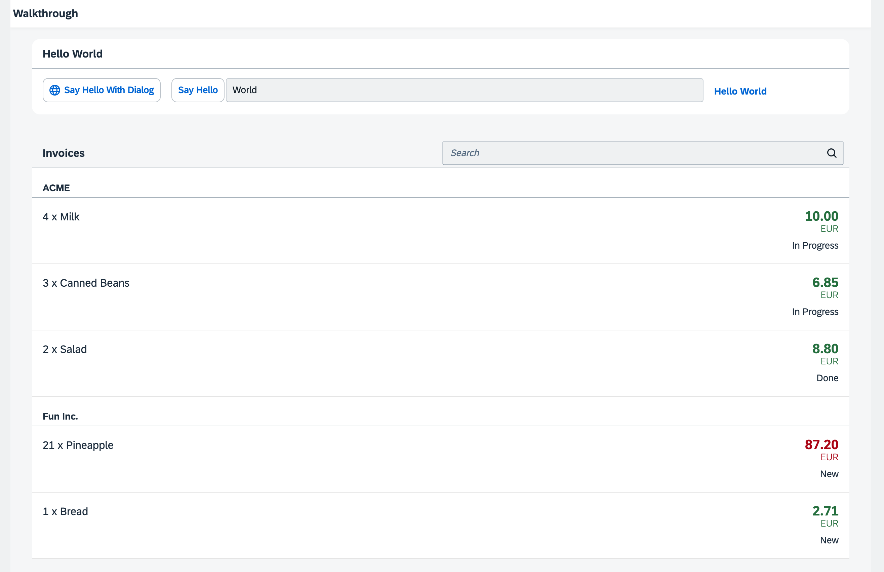

<!-- loio86bbe132b9924c8496b70824af94a209 -->

# Step 24: Sorting and Grouping \(TypeScript\)

To make our list of invoices even more user-friendly, we sort it alphabetically instead of just showing the order from the data model. Additionally, we introduce groups and add the company that ships the products so that the data is easier to consume.


## Preview

  
  
**The list is now sorted and grouped by the shipping company**




<a name="loio86bbe132b9924c8496b70824af94a209__section_sxl_41l_syb"/>

## Coding

You can view all files at [OpenUI5 TypeScript Walkthrough - Step 24: Sorting and Grouping](https://github.com/sap-samples/ui5-typescript-walkthrough/tree/main/steps/24) and [download the solution as a zip file](https://sap-samples.github.io/ui5-typescript-walkthrough/ui5-typescript-walkthrough-step-24.zip).


<a name="loio86bbe132b9924c8496b70824af94a209__section_txl_41l_syb"/>

## webapp/view/InvoiceList.view.xml

We add a declarative sorter to the binding syntax of the list control. We transform the simple binding syntax to the object notation, specify the path to the data, and now add an additional `sorter` property. In the path of the sorter, we specify that the invoice items should be sorted by product name, and SAPUI5 will take care of the rest.

```xml
<mvc:View
   controllerName="ui5.walkthrough.controller.InvoiceList"
   xmlns="sap.m"
   xmlns:mvc="sap.ui.core.mvc">
   <List
      id="invoiceList"
      class="sapUiResponsiveMargin"
      width="auto"
      items="{
         path : 'invoice>/Invoices',
         sorter : {
            path : 'ProductName' 
         }
      }" >
      ...
   </List>
</mvc:View>
```

By default, the sorting is ascending, but you could also add a property `descending` with the value `true` inside the sorter property to change the sorting order.

If we run the app now we can see a list of invoices sorted by the name of the products.


## webapp/view/InvoiceList.view.xml

We modify the view and and change the sorter so the path addresses the `ShipperName` data field instead of `ProductName`. This groups the invoice items by the shipping company. In addition, we set the sorter attribute `group` to `true`.

As with the sorter, no further action is required. The list and the data binding features of SAPUI5 will do the trick to display group headers automatically and categorize the items in the groups.

```xml
<mvc:View
    controllerName="ui5.walkthrough.controller.InvoiceList"
    xmlns="sap.m"
    xmlns:mvc="sap.ui.core.mvc">
    <List
        id="invoiceList"
        headerText="{i18n>invoiceListTitle}"
        class="sapUiResponsiveMargin"
        width="auto"
        items="{
            path : 'invoice>/Invoices',
            sorter : {
                path : 'ShipperName',
                group : true
            }

        }">
        ...
    </List>
</mvc:View>
```

We could define a custom group header factory if we wanted by setting the `groupHeaderFactory` property, but the result looks already fine.

**Related Information**  


[API Reference: `sap.ui.model.Sorter`](https://ui5.sap.com/#/api/sap.ui.model.Sorter)

[Sample: List - Grouping](https://ui5.sap.com/#/entity/sap.m.List/sample/sap.m.sample.ListGrouping)

