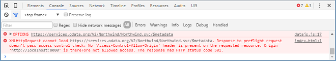

<!-- loio44062441f3bd4c67a4f665ae362d1109 -->

# Step 25: Remote OData Service

So far we have worked with local JSON data, but now we will access a real OData service to visualize remote data.


In the real world, data often resides on remote servers and is accessed via an OData service. We will add a data source configuration to the manifest and replace the JSONModel type for our `invoice` model with the publicly available Northwind OData service to visualize remote data. You will be surprised how little needs to be changed in order to make this work!

> ### Note:  
> If you cannot get it to run, don't worry too much, the remaining steps will also work with the local JSON data you have used so far. In [Step 26: Mock Server Configuration](step-26-mock-server-configuration-bae9d90.md), you will learn how to simulate a back-end system to achieve a similar working scenario. However, you should at least read this chapter about remote OData services to learn about non-local data sources.


## Preview

   
  
<a name="loio44062441f3bd4c67a4f665ae362d1109__fig_r1j_pst_mr"/>Products from the OData invoices test service are now shown within our app

  


## Coding

You can view and download all files at [Walkthrough - Step 25](https://ui5.sap.com/#/entity/sap.m.tutorial.walkthrough/sample/sap.m.tutorial.walkthrough.25).

```js
{
	"_version": "1.21.0",
	"sap.app": {
		...
		"applicationVersion": {
			"version": "1.0.0"
		},
		"dataSources": {
			"invoiceRemote": {
				"uri": "https://services.odata.org/V2/Northwind/Northwind.svc/",
				"type": "OData",
				"settings": {
					"odataVersion": "2.0"
				}
			}
		}
	},
	"sap.ui": {
		...
	},
	"sap.ui5": {
		...
		"models": {
			"i18n": {
				"type": "sap.ui.model.resource.ResourceModel",
				"settings": {
					"bundleName": "sap.ui.demo.walkthrough.i18n.i18n",
					"supportedLocales": [
						""
					],
					"fallbackLocale": ""
				}
			},
			"invoice": {
				"dataSource": "invoiceRemote"
			}
		},
		"resources": {
		...
```

In the `sap.app` section of the descriptor file, we add a data source configuration. With the `invoiceRemote`, key we specify a configuration object that allows automatic model instantiation. We specify the type of the service \(`OData`\) and the model version \(`2.0`\). In this step, we want to use the publicly available Northwind OData service located at `https://services.odata.org/V2/Northwind/Northwind.svc/`. Therefore, the URI points to the official Northwind OData service.

> ### Note:  
> In order to avoid the Cross-Origin Resource Sharing problem described below, the typical procedure is to maintain only a path, e.g. `/V2/Northwind/Northwind.svc/`, in the `URI` property of the data source. This, however, also makes the usage of a proxy necessary if the actual OData server resides at a different address.

In the `models` section, we replace the content of the `invoice` model. This key is still used as model name when the model is automatically instantiated during the component initialization. However, the `invoiceRemote` value of the `dataSource` key is a reference to the data source section that we specified above. This configuration allows the component to retrieve the technical information for this model during the start-up of the app.

Our component now automatically creates an instance of `sap.ui.model.odata.v2.ODataModel` according to the settings we specified above, and makes it available as a model named `invoice`. When you use the `invoiceRemote` data source, the `ODataModel` fetches the data from the real Northwind OData service. The invoices we receive from the Northwind OData service have identical properties as the JSON data we used previously \(except for the `status` property, which is not available in the Northwind OData service\).

> ### Note:  
> If you want to have a default model on the component, you can change the name of the model to an empty string in the descriptor file. Automatically instantiated models can be retrieved by calling `this.getModel` in the component. In the controllers of component-based apps you can call `this.getView().getModel()` to get the automatically instantiated model. For retrieving a named model you have to pass on the model name defined in the descriptor file to `getModel`, that is, in the component you would call `this.getModel("invoice")` to get our automatically generated `invoice` model that we defined in the descriptor.

You can now try to run the app and see what happens - we will see an error related to our new configuration in the console:

   
  
<a name="loio44062441f3bd4c67a4f665ae362d1109__fig_jyf_f1k_c5"/>Violations of the same-origin policy in Google Chrome

  

Due to the so called same-origin policy, browsers deny AJAX requests to service endpoints in case the service endpoint has a different domain/subdomain, protocol, or port than the app. The browser refuses to connect to a remote URL directly for security reasons. Depending on your development environment you have different options to overcome this restriction. For more information, see [Request Fails Due to Same-Origin Policy \(Cross-Origin Resource Sharing - CORS\)](../04_Essentials/request-fails-due-to-same-origin-policy-cross-origin-resource-sharing-cors-5bb388f.md).

**Related Information**  


[OData Home Page](http://www.odata.org/)

[API Reference: `sap.ui.model.odata.v2.ODataModel`](https://ui5.sap.com/#/api/sap.ui.model.odata.v2.ODataModel)

[First-Aid Kit](../04_Essentials/first-aid-kit-dfe4f79.md "This section contains the most common issues that you might face when developing SAPUI5 apps and how to solve them.")

[Request Fails Due to Same-Origin Policy \(Cross-Origin Resource Sharing - CORS\)](../04_Essentials/request-fails-due-to-same-origin-policy-cross-origin-resource-sharing-cors-5bb388f.md)

