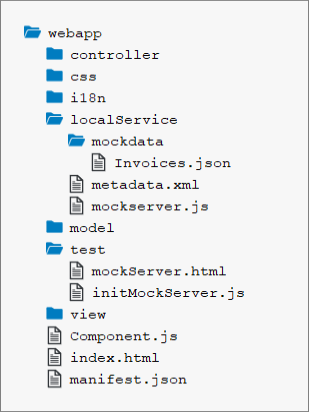

<!-- loiobae9d90d2e9c4206889368f04edab508 -->

# Step 26: Mock Server Configuration

We just ran our app against a real service, but for developing and testing our app we do not want to rely on the availability of the “real” service or put additional load on the system where the data service is located.

This system is the so-called back-end system that we will now simulate with an SAPUI5 feature called mock server. It serves local files, but it simulates a back-end system more realistically than just loading the local data. We will also change the model instantiation part so that the model is configured in the descriptor and instantiated automatically by SAPUI5. This way, we do not need to take care of the model instantiation in the code.


## Preview

  
  
**The list of invoices is now served by the Mock Server**


## Coding

You can view and download all files at [Walkthrough - Step 26](https://ui5.sap.com/#/entity/sap.m.tutorial.walkthrough/sample/sap.m.tutorial.walkthrough.26).

  
  
**Folder Structure for this Step**



The folder structure of our app project is clearly separating test and productive files after this step. The new `test` folder now contains a new HTML page `mockServer.html` which will launch our application in test mode without calling the real service.

The new `localService` folder contains a `metadata.xml` service description file for OData, the `mockserver.js` file that simulates a real service with local data, and the `mockdata` subfolder that contains the local test data \(`Invoices.json`\).


## webapp/test/mockServer.html \(New\)

```html
<!DOCTYPE html>
<html>
<head>
	<meta charset="utf-8">
	<title>SAPUI5 UI5 Walkthrough - Mockserver Test Page</title>
	<script
		id="sap-ui-bootstrap"
		src="../resources/sap-ui-core.js"
		data-sap-ui-theme="sap_horizon"
		data-sap-ui-compat-version="edge"
		data-sap-ui-async="true"
		data-sap-ui-on-init="module:ui5/walkthrough/test/initMockServer"
		data-sap-ui-resource-roots='{
			"ui5.walkthrough": "../"
		}'>
	</script>
</head>
<body class="sapUiBody" id="content">
	<div data-sap-ui-component data-name="ui5.walkthrough" data-id="container" data-settings='{"id" : "walkthrough"}'></div>

</body>
</html>
```

We copy the `index.html` to a separate file in the `webapp/test` folder and name it `mockServer.html`. We will now use this file to run our app in test mode with mock data loaded from a JSON file. Test pages should not be placed in the application root folder but in a subfolder called `test` to clearly separate productive and test coding.

From this point on, you have two different entry pages: One for the real “connected” app \(`index.html`\) and one for local testing \(`mockServer.html`\). You can freely decide if you want to do the next steps on the real service data or on the local data within the app.

We modify the `mockServer.html` file and change the page title to distinguish it from the productive start page. In the bootstrap, the `data-sap-ui-resource-roots` property is also changed. The namespace now points to the folder above \(`"../"`\), because the `mockServer.html` file is now in a subfolder of the `webapp` folder. Instead of loading the app component directly, we now call a script `initMockServer.js`.


<a name="loiobae9d90d2e9c4206889368f04edab508__section_oxn_5zr_yfb"/>

## webapp/test/initMockServer.js \(New\)

```js
sap.ui.define([
	"../localService/mockserver"
], (mockserver) => {
	"use strict";

	// initialize the mock server
	mockserver.init();

	// initialize the embedded component on the HTML page
	sap.ui.require(["sap/ui/core/ComponentSupport"]);
});

```

The first dependency is a file called `mockserver.js` that will be located in the `localService` folder later.

The `mockserver` depencency that we are about to implement is our local test server. Its `init` method is immediately called before we load the component. This way we can catch all requests that would go to the "real" service and process them locally by our test server when launching the app with the `mockServer.html` file. The component itself does not "know" that it will now run in test mode.


## webapp/localService/mockdata/Invoices.json \(New\)

```js
[
  {
	"ProductName": "Pineapple",
	"Quantity": 21,
	"ExtendedPrice": 87.2,
	"ShipperName": "Fun Inc.",
	"ShippedDate": "2015-04-01T00:00:00",
	"Status": "A"
  },
  {
	"ProductName": "Milk",
	"Quantity": 4,
	"ExtendedPrice": 10,
	"ShipperName": "ACME",
	"ShippedDate": "2015-02-18T00:00:00",
	"Status": "B"
  },
  {
	"ProductName": "Canned Beans",
	"Quantity": 3,
	"ExtendedPrice": 6.85,
	"ShipperName": "ACME",
	"ShippedDate": "2015-03-02T00:00:00",
	"Status": "B"
  },
  {
	"ProductName": "Salad",
	"Quantity": 2,
	"ExtendedPrice": 8.8,
	"ShipperName": "ACME",
	"ShippedDate": "2015-04-12T00:00:00",
	"Status": "C"
  },
  {
	"ProductName": "Bread",
	"Quantity": 1,
	"ExtendedPrice": 2.71,
	"ShipperName": "Fun Inc.",
	"ShippedDate": "2015-01-27T00:00:00",
	"Status": "A"
  }
]
```

The `Invoices.json` file is similar to our previous file in the `webapp` folder. Just copy the content and remove the outer object structure with the key `invoices` so that the file consists of one flat array of invoice items. This file will automatically be read by our server later in this step.

Remove the old `Invoices.json` file from the `webapp` folder, it is no longer used.


## webapp/localService/metadata.xml \(New\)

```xml
<edmx:Edmx Version="1.0" xmlns:edmx="http://schemas.microsoft.com/ado/2007/06/edmx">
	<edmx:DataServices m:DataServiceVersion="1.0" m:MaxDataServiceVersion="3.0"
			xmlns:m="http://schemas.microsoft.com/ado/2007/08/dataservices/metadata">
		<Schema Namespace="NorthwindModel" xmlns="http://schemas.microsoft.com/ado/2008/09/edm">
			<EntityType Name="Invoice">
				<Key>
					<PropertyRef Name="ProductName"/>
					<PropertyRef Name="Quantity"/>
					<PropertyRef Name="ShipperName"/>
				</Key>
				<Property Name="ShipperName" Type="Edm.String" Nullable="false" MaxLength="40" FixedLength="false"
							Unicode="true"/>
				<Property Name="ProductName" Type="Edm.String" Nullable="false" MaxLength="40" FixedLength="false"
							Unicode="true"/>
				<Property Name="Quantity" Type="Edm.Int16" Nullable="false"/>
				<Property Name="ExtendedPrice" Type="Edm.Decimal" Precision="19" Scale="4"/>
				<Property Name="Status" Type="Edm.String" Nullable="false" MaxLength="1" FixedLength="false"
							Unicode="true"/>
			</EntityType>
		</Schema>
		<Schema Namespace="ODataWebV2.Northwind.Model" xmlns="http://schemas.microsoft.com/ado/2008/09/edm">
			<EntityContainer Name="NorthwindEntities" m:IsDefaultEntityContainer="true" p6:LazyLoadingEnabled="true"
					xmlns:p6="http://schemas.microsoft.com/ado/2009/02/edm/annotation">
				<EntitySet Name="Invoices" EntityType="NorthwindModel.Invoice"/>
			</EntityContainer>
		</Schema>
	</edmx:DataServices>
</edmx:Edmx>

```

The metadata file contains information about the service interface and does not need to be written manually. It can be accessed directly from the “real” service by calling the service URL and adding `$metadata` at the end \(e.g. in our case `http://services.odata.org/V2/Northwind/Northwind.svc/$metadata`\). The mock server will read this file to simulate the real OData service, and will return the results from our local source files in the proper format so that it can be consumed by the app \(either in XML or in JSON format\).

For simplicity, we have removed all content from the original Northwind OData metadata document that we do not need in our scenario. We have also added the `status` field to the metadata since it is not available in the real Northwind service.


## webapp/localService/mockserver.js \(New\)

```js
sap.ui.define([
	"sap/ui/core/util/MockServer"
], (MockServer) => {
	"use strict";

	return {
		init() {
			// create
			const oMockServer = new MockServer({
				rootUri: sap.ui.require.toUrl("ui5/walkthrough") + "/V2/Northwind/Northwind.svc/"
			});

			const oUrlParams = new URLSearchParams(window.location.search);

			// configure mock server with a delay
			MockServer.config({
				autoRespond: true,
				autoRespondAfter: oUrlParams.get("serverDelay") || 500
			});

			// simulate
			const sPath = sap.ui.require.toUrl("ui5/walkthrough/localService");
			oMockServer.simulate(sPath + "/metadata.xml", sPath + "/mockdata");

			// start
			oMockServer.start();
		}
	};
});

```

Now that we have added the OData service description file `metadata.xml` file, we can write the code to initialize the mock server which will then simulate any OData request to the real Northwind server.

We load the standard SAPUI5 `MockServer` module as a dependency and create a helper object that defines an `init` method to start the server. This method is called before the component initialization in the `mockServer.html` file above. The `init` method creates a `MockServer` instance with the same URL as the real service calls.

The URL in the `rootUri` configuration parameter has to point to the same URL as defined in the `uri` property of the data source in the `manifest.json` descriptor file. In the `manifest.json`, UI5 automatically interprets a relative URL as being relative to the application namespace. In the JavaScript code, you can ensure this by using the `sap.ui.require.toUrl` method. The `sap/ui/core/util/MockServer` then catches every request to the real service and returns a response. Next, we set two global configuration settings that tell the server to respond automatically and introduce a delay of 500 ms to imitate a typical server response time. Otherwise, we would have to call the respond method on the `MockServer` manually to simulate the call.

To simulate a service, we can simply call the `simulate` method on the `MockServer` instance with the path to our newly created `metadata.xml`. This will read the test data from our local file system and set up the URL patterns that will mimic the real service.

Finally, we call start on `oMockServer`. From this point, each request to the URL pattern `rootUri` will be processed by the `MockServer`. If you switch from the `index.html` file to the `mockServer.html` file in the browser, you can now see that the test data is displayed from the local sources again, but with a short delay. The delay can be specified with the URI parameter `serverDelay`.

This approach is perfect for local testing, even without any network connection. This way your development does not depend on the availability of a remote server, i.e. to run your tests.

Try calling the app with the `index.html` file and the `mockServer.html` file to see the difference. If the real service connection cannot be made, for example when there is no network connection, you can always fall back to the local test page.


<a name="loiobae9d90d2e9c4206889368f04edab508__section_lfx_4dg_tyb"/>

## package.json

For easier local development, we adjust the `start` script in the `package.json` to open `mockServer.html` instead of `index.html`:

```
{
  "name": "ui5.walkthrough",
  "version": "1.0.0",
  "description": "The UI5 walkthrough application",
  "scripts": {
      "start": "ui5 serve -o test/mockServer.html"
  },
  "devDependencies": {
    "@ui5/cli": "^3",
    "ui5-middleware-simpleproxy": "^3"
  }
}

```


## Conventions

-   The `webapp/test` folder contains non-productive code only.

-   Mock data and the script to start the `MockServer` are stored in the `webapp/localService` folder.

-   The script to start the `MockServer` is called `mockserver.js`.


**Related Information**  


[Mock Server](../04_Essentials/mock-server-69d3cbd.md "A mock server mimics one or more back-end services. It is used to simplify integration testing and to decouple UI development from service development. By using a mock server you can develop and test the UI even if the service in the back end is incomplete or unstable.")

[API Reference: `sap.ui.core.util.MockServer`](https://ui5.sap.com/#/api/sap.ui.core.util.MockServer)

[Create a Northwind Destination](../05_Developing_Apps/create-a-northwind-destination-3a16c7a.md "Configure a destination in the SAP BTP Cockpit in order to bypass the same-origin policy of the browser.")

