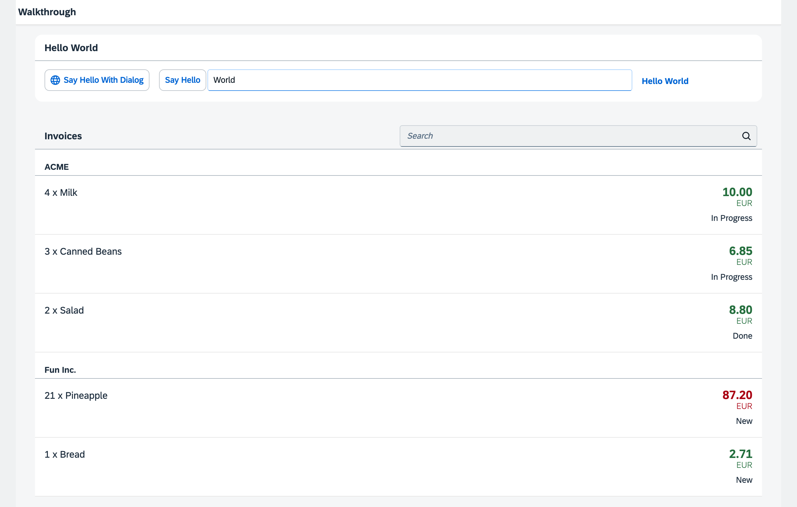
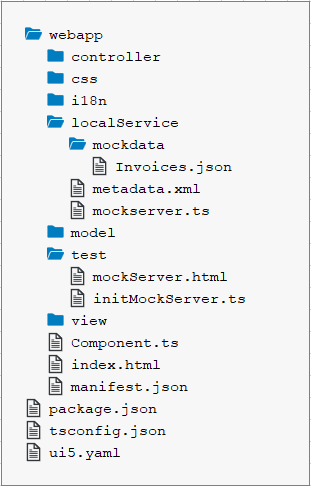

<!-- loio3e1c64fd34e247afaf468a92414ed722 -->

# Step 26: Mock Server Configuration \(TypeScript\)

We just ran our app against a real service, but for developing and testing our app we do not want to rely on the availability of the “real” service or put additional load on the system where the data service is located.

This system is the so-called back-end system that we will now simulate with an SAPUI5 feature called mock server. It serves local files, but it simulates a back-end system more realistically than just loading the local data. We will also change the model instantiation part so that the model is configured in the descriptor and instantiated automatically by SAPUI5. This way, we do not need to take care of the model instantiation in the code.


## Preview

  
  
**The list of invoices is now served by the Mock Server**




## Coding

You can view all files at [OpenUI5 TypeScript Walkthrough - Step 26: Mock Server Configuration](https://github.com/sap-samples/ui5-typescript-walkthrough/tree/main/steps/26) and [download the solution as a zip file](https://sap-samples.github.io/ui5-typescript-walkthrough/ui5-typescript-walkthrough-step-26.zip).

  
  
**Folder Structure for this Step**



The folder structure of our app project is clearly separating test and productive files after this step. The new `test` folder now contains a new HTML page `mockServer.html` which will launch our application in test mode without calling the real service.

The new `localService` folder contains a `metadata.xml` service description file for OData, the `mockserver.js` file that simulates a real service with local data, and the `mockdata` subfolder that contains the local test data \(`Invoices.json`\).


<a name="loio3e1c64fd34e247afaf468a92414ed722__section_yfy_x11_4zb"/>

## webapp/localService/metadata.xml \(New\)

We create a new `localService` folder in the `webapp` folder and add a new `metadata.xml` file to it.

The metadata file contains information about the service interface and does not need to be written manually. It can be accessed directly from the “real” service by calling the service URL and adding `$metadata` at the end \(e.g. in our case `http://services.odata.org/V2/Northwind/Northwind.svc/$metadata`\).

For simplicity, we remove all content from the original Northwind OData metadata document that we do not need in our scenario. We also added the `status` field to the metadata, since it is not available in the real Northwind service.

```xml
<edmx:Edmx Version="1.0" xmlns:edmx="http://schemas.microsoft.com/ado/2007/06/edmx">
	<edmx:DataServices m:DataServiceVersion="1.0" m:MaxDataServiceVersion="3.0"
			xmlns:m="http://schemas.microsoft.com/ado/2007/08/dataservices/metadata">
		<Schema Namespace="NorthwindModel" xmlns="http://schemas.microsoft.com/ado/2008/09/edm">
			<EntityType Name="Invoice">
				<Key>
					<PropertyRef Name="ProductName"/>
					<PropertyRef Name="Quantity"/>
					<PropertyRef Name="ShipperName"/>
				</Key>
				<Property Name="ShipperName" Type="Edm.String" Nullable="false" MaxLength="40" FixedLength="false"
							Unicode="true"/>
				<Property Name="ProductName" Type="Edm.String" Nullable="false" MaxLength="40" FixedLength="false"
							Unicode="true"/>
				<Property Name="Quantity" Type="Edm.Int16" Nullable="false"/>
				<Property Name="ExtendedPrice" Type="Edm.Decimal" Precision="19" Scale="4"/>
				<Property Name="Status" Type="Edm.String" Nullable="false" MaxLength="1" FixedLength="false"
							Unicode="true"/>
			</EntityType>
		</Schema>
		<Schema Namespace="ODataWebV2.Northwind.Model" xmlns="http://schemas.microsoft.com/ado/2008/09/edm">
			<EntityContainer Name="NorthwindEntities" m:IsDefaultEntityContainer="true" p6:LazyLoadingEnabled="true"
					xmlns:p6="http://schemas.microsoft.com/ado/2009/02/edm/annotation">
				<EntitySet Name="Invoices" EntityType="NorthwindModel.Invoice"/>
			</EntityContainer>
		</Schema>
	</edmx:DataServices>
</edmx:Edmx>

```


<a name="loio3e1c64fd34e247afaf468a92414ed722__section_s2p_mb1_4zb"/>

## webapp/localService/mockdata/Invoices.json \(New\)

Inside the `localService` folder, we create the new folder `mockdata`. The mock server determines the local source files with the appriopriate mock data by matching the entity set names defined in the `metadata.xml` file with the local source file names. As we want to simulate data specified in the metadata file in the entity set `Invoices`, we have to name our mockdata file `Invoices.json`.

We add the new file `Invoices.json` to our new folder and define one flat array with the following invoice items:

```
[
  {
	"ProductName": "Pineapple",
	"Quantity": 21,
	"ExtendedPrice": 87.2,
	"ShipperName": "Fun Inc.",
	"ShippedDate": "2015-04-01T00:00:00",
	"Status": "A"
  },
  {
	"ProductName": "Milk",
	"Quantity": 4,
	"ExtendedPrice": 10,
	"ShipperName": "ACME",
	"ShippedDate": "2015-02-18T00:00:00",
	"Status": "B"
  },
  {
	"ProductName": "Canned Beans",
	"Quantity": 3,
	"ExtendedPrice": 6.85,
	"ShipperName": "ACME",
	"ShippedDate": "2015-03-02T00:00:00",
	"Status": "B"
  },
  {
	"ProductName": "Salad",
	"Quantity": 2,
	"ExtendedPrice": 8.8,
	"ShipperName": "ACME",
	"ShippedDate": "2015-04-12T00:00:00",
	"Status": "C"
  },
  {
	"ProductName": "Bread",
	"Quantity": 1,
	"ExtendedPrice": 2.71,
	"ShipperName": "Fun Inc.",
	"ShippedDate": "2015-01-27T00:00:00",
	"Status": "A"
  }
]
```


<a name="loio3e1c64fd34e247afaf468a92414ed722__section_ddh_dc1_4zb"/>

## webapp/localService/mockserver.ts \(New\)

Now we can write the code to initialize the mock server, which will then simulate any OData request to the real Northwind server. For this we add a new file `mockserver.ts` to the `localService` folder.

We import the standard SAPUI5 `MockServer` module and create a helper object that defines an `init` method to start the server. The `init` method creates a `MockServer` instance with the same URL as the real service calls. The URL in the `rootUri` configuration parameter has to point to the same URL as defined in the `uri` property of the data source in the `manifest.json` descriptor file. In the `manifest.json`, SAPUI5 automatically interprets a relative URL as being relative to the application namespace. In the TypeScript code, you can ensure this by using the `sap.ui.require.toUrl` method. The `sap/ui/core/util/MockServer` then catches every request to the real service and returns a response.

Next, we set two global configuration settings that tell the server to respond automatically and introduce a delay of 500 ms to imitate a typical server response time. Otherwise, we would have to call the respond method on the `MockServer` manually to simulate the call. The delay can be specified with the URI parameter `serverDelay`.

To simulate a service, we can simply call the `simulate` method on the `MockServer` instance with the path to our newly created `metadata.xml`. This will read the test data from our local file system and set up the URL patterns that will mimic the real service.

Finally, we call the `start` method on the mock server. From this point, each request to the URL pattern `rootUri` will be processed by the mock server.

```js
import MockServer from "sap/ui/core/util/MockServer";
				
export default {

    init: function () {
        // create
        const mockServer = new MockServer({
            rootUri: sap.ui.require.toUrl("ui5/walkthrough/V2/Northwind/Northwind.svc/")
        });

        const urlParams = new URLSearchParams(window.location.search);

        // configure mock server with a delay
        MockServer.config({
            autoRespond: true,
            autoRespondAfter: parseInt(urlParams.get("serverDelay") || "500")
        });

        // simulate
        const path = sap.ui.require.toUrl("ui5/walkthrough/localService");
        mockServer.simulate(path + "/metadata.xml", path + "/mockdata");

        // start
        mockServer.start();
    }
};
```


<a name="loio3e1c64fd34e247afaf468a92414ed722__section_oxn_5zr_yfb"/>

## webapp/test/initMockServer.ts \(New\)

As a next step, we create a module that initializes our local mock server. For this, we add the new `test` folder to our `webapp` folder where we place the new `initMockServer.ts` file.

First, we call the `init` method of our local mock server, then we initialize the app component.

```js
import mockserver from "../localService/mockserver";

// initialize the mock server
mockserver.init();

// initialize the embedded component on the HTML page
import("sap/ui/core/ComponentSupport");
```


## webapp/test/mockServer.html \(New\)

Finally we create a new `mockServer.html` page in our `test` folder. We will use this file to run our app in test mode with our mock server loading mock data from out local `Invoices` JSON file. Test pages should not be placed in the application root folder but in a subfolder called `test` to clearly separate productive and test coding.

We copy the content of the `index.html` file to it and change the page title to distinguish it from the productive start page. We also need to change the `data-sap-ui-resource-roots` property. The namespace now points to the folder above \(\`"../"\`\), because the `mockServer.html` file is in a subfolder of the `webapp` folder. Also the bootstrap script to the SAPUI5 core library needs to be adapted this way.

We define that the HTML page now initializes the `initMockServer` module instead of the app component.

```html
<!DOCTYPE html>
<html>
<head>
	<meta charset="utf-8">
	<title>SAPUI5 UI5 Walkthrough - Mockserver Test Page</title>
	<script
		id="sap-ui-bootstrap"
		src="../resources/sap-ui-core.js"
		data-sap-ui-theme="sap_horizon"
		data-sap-ui-compat-version="edge"
		data-sap-ui-async="true"
		data-sap-ui-on-init="module:ui5/walkthrough/test/initMockServer"
		data-sap-ui-resource-roots='{
			"ui5.walkthrough": "../"
		}'>
	</script>
</head>
<body class="sapUiBody" id="content">
	<div data-sap-ui-component data-name="ui5.walkthrough" data-id="container" data-settings='{"id" : "walkthrough"}'></div>

</body>
</html>
```

When launching the app with the `mockServer.html` file, the `initMockServer` module is called, which first initializes our local mock server and only then our app component. This way we catch all requests that would go to the "real" service and process them locally by our mock server instead. The component itself does not "know" that it now runs in test mode.

If you switch from the `index.html` file to the `mockServer.html` file in the browser, you can now see that the test data is displayed from the local sources, but with a short delay as defined in our local mock server configuration.

This approach is perfect for local testing, even without any network connection. This way your development does not depend on the availability of a remote server, i.e. to run your tests.

From this point on, you have two different entry pages: One for the real “connected” app \(`index.html`\) and one for local testing \(`mockServer.html`\). You can freely decide if you want to do the next steps on the real service data or on the local data within the app. Try calling the app with the `index.html` file and the `mockServer.html` file to see the difference. If the real service connection cannot be made, for example when there is no network connection, you can always fall back to the local test page.


<a name="loio3e1c64fd34e247afaf468a92414ed722__section_lfx_4dg_tyb"/>

## package.json

If you prefer to continue with the local data, you should adjust the `start` script in the `package.json` to open `mockServer.html` instead of `index.html`:

```
{
  "name": "ui5.walkthrough",
  "version": "1.0.0",
  "description": "UI5 TypeScript Walkthrough",
  "scripts": {
      "start": "ui5 serve -o test/mockServer.html"
  },
  "devDependencies": {    
    "@types/openui5": "^1.120.0",
    "@ui5/cli": "^3.7.1",
    "typescript": "^5.2.2",	
    "ui5-middleware-livereload": "^3.0.2",
    "ui5-middleware-serveframework": "3.0.0",
    "ui5-middleware-simpleproxy": "^3.2.8",
    "ui5-tooling-transpile": "^3.2.7"
  }
}
```


## Conventions

-   The `webapp/test` folder contains non-productive code only.

-   Mock data and the script to start the `MockServer` are stored in the `webapp/localService` folder.

-   The script to start the `MockServer` is called `mockserver.js`.


**Related Information**  


[Mock Server](../04_Essentials/mock-server-69d3cbd.md "A mock server mimics one or more back-end services. It is used to simplify integration testing and to decouple UI development from service development. By using a mock server you can develop and test the UI even if the service in the back end is incomplete or unstable.")

[API Reference: `sap.ui.core.util.MockServer`](https://ui5.sap.com/#/api/sap.ui.core.util.MockServer)

[Create a Northwind Destination](../05_Developing_Apps/create-a-northwind-destination-3a16c7a.md "Configure a destination in the SAP BTP Cockpit in order to bypass the same-origin policy of the browser.")

