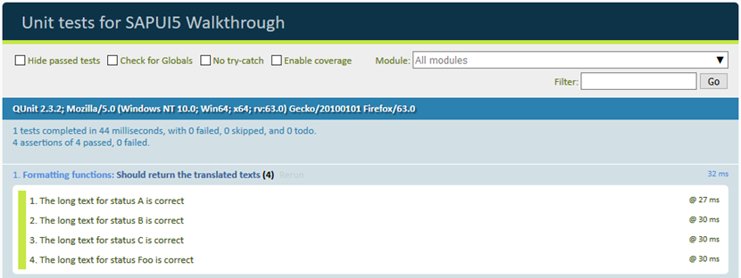
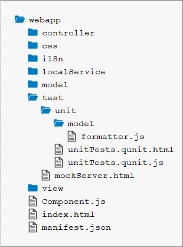

<!-- loioe1ce1de315994a02bf162f4b3b5a9f09 -->

# Step 27: Unit Test with QUnit

Now that we have a test folder in the app, we can start to increase our test coverage.

Actually, every feature that we added to the app so far, would require a separate test case. We have totally neglected this so far, so let’s add a simple unit test for our custom formatter function from Step 23. We will test if the long text for our status is correct by comparing it with the texts from our resource bundle.

> ### Note:  
> In this tutorial, we focus on a simple use case for the test implementation. If you want to learn more about QUnit tests, have a look at our [Testing Tutorial](testing-tutorial-291c912.md) tutorial, especially [Step 2: A First Unit Test](step-2-a-first-unit-test-b81736e.md).


## Preview

   
  
**A unit test for our formatters is now available**

  


## Coding

You can view and download all files at [Walkthrough - Step 27](https://ui5.sap.com/#/entity/sap.m.tutorial.walkthrough/sample/sap.m.tutorial.walkthrough.27).

   
  
**Folder Structure for this Step**

  

We add a new folder `unit` under the `test` folder and a `model` subfolder where we will place our formatter unit test. The folder structure matches the app structure to easily find the corresponding unit tests.


## webapp/test/unit/model/formatter.js

```js
/*global QUnit*/

sap.ui.define([
	"sap/ui/demo/walkthrough/model/formatter",
	"sap/ui/model/resource/ResourceModel"
], function (formatter, ResourceModel) {
	"use strict";

	QUnit.module("Formatting functions", {
		beforeEach: function () {
			this._oResourceModel = new ResourceModel({
				bundleUrl: sap.ui.require.toUrl("sap/ui/demo/walkthrough") + "/i18n/i18n.properties"
			});
		},
		afterEach: function () {
			this._oResourceModel.destroy();
		}
	});


	QUnit.test("Should return the translated texts", function (assert) {

		// Arrange
		// this.stub() does not support chaining and always returns the right data
		// even if a wrong or empty parameter is passed.
		var oModel = this.stub();
		oModel.withArgs("i18n").returns(this._oResourceModel);
		var oViewStub = {
			getModel: oModel
		};
		var oControllerStub = {
			getView: this.stub().returns(oViewStub)
		};

		// System under test
		var fnIsolatedFormatter = formatter.statusText.bind(oControllerStub);

		// Assert
		assert.strictEqual(fnIsolatedFormatter("A"), "New", "The long text for status A is correct");

		assert.strictEqual(fnIsolatedFormatter("B"), "In Progress", "The long text for status B is correct");

		assert.strictEqual(fnIsolatedFormatter("C"), "Done", "The long text for status C is correct");

		assert.strictEqual(fnIsolatedFormatter("Foo"), "Foo", "The long text for status Foo is correct");
	});

});
```

We create a new `formatter.js` file under `webapp/test/unit/model` where the unit test for the custom formatter is implemented. The `formatter` file that we want to test is loaded as a dependency. We also need a dependency to the `ResourceModel`, because we want to check if the translated texts are correct.

The formatter file just contains one QUnit module for our formatter function. It instantiates our `ResourceBundle` with the localized texts in the `beforeEach` function and destroys it again in the `afterEach` function. These functions are called before and after each test is executed.

Next is our unit test for the formatter function. In the implementation of the `statusText` function that we created in step 23 we access the `ResourceBundle` with the following queued call: `var resourceBundle = this.getView().getModel("i18n").getResourceBundle();`.

Since we do not want to test the controller, the view, or the model functionality, we first remove the dependencies by replacing these calls with empty hulls with the help of `SinonJS` and its stub method. This happens in the `Arrange` section of the unit test. SinonJS injects a stub method for all objects so we can simply call `this.stub()` to create a new stub for any behavior we need to mock.

Test stubs are functions with pre-programmed behavior. They support the full SinonJS test spy API in addition to methods which can be used to alter the stub’s behavior. If this part is a bit confusing have a look at the official SinonJS documentation for test spies or ignore it for now, it will become clear later on.

Then we bind our stub to the `statusText` formatter by calling the `bind` function of JavaScript. The `this` pointer is now bound to our controller stub when the function is invoked using the variable `fnIsolatedFormatter` and we can still pass in arguments as we like. This happens in the "system under test" part of the test.

Finally we perform our assertions. We check each branch of the formatter logic by invoking the isolated formatter function with the values that we expect in the data model \(`A`, `B`, `C`, and everything else\). We strictly compare the result of the formatter function with the hard-coded strings that we expect from the resource bundle and give a meaningful error message if the test should fail. We hard-code the strings here to identify issues with the resource bundle properties. If a property was missing, the test would still be successful if we check against the real value \(that would be an empty string on both sides\) from the resource bundle.


<a name="loioe1ce1de315994a02bf162f4b3b5a9f09__section_gnt_54c_yfb"/>

## webapp/test/unit/unitTests.qunit.html \(New\)

```html
<!DOCTYPE html>
<html>
<head>
	<title>Unit tests for SAPUI5 Walkthrough</title>
	<meta charset="utf-8">

	<script
		id="sap-ui-bootstrap"
		src="https://sdk.openui5.org/resources/sap-ui-core.js"
		data-sap-ui-resourceroots='{
			"sap.ui.demo.walkthrough": "../../"
		}'
		data-sap-ui-async="true">
	</script>

	<link rel="stylesheet" type="text/css" href="https://sdk.openui5.org/resources/sap/ui/thirdparty/qunit-2.css">

	<script src="https://sdk.openui5.org/resources/sap/ui/thirdparty/qunit-2.js"></script>
	<script src="https://sdk.openui5.org/resources/sap/ui/qunit/qunit-junit.js"></script>
	<script src="https://sdk.openui5.org/resources/sap/ui/qunit/qunit-coverage.js"></script>
	<script src="https://sdk.openui5.org/resources/sap/ui/thirdparty/sinon.js"></script>
	<script src="https://sdk.openui5.org/resources/sap/ui/thirdparty/sinon-qunit.js"></script>

	<script src="unitTests.qunit.js"></script>
</head>
<body>
	<div id="qunit"/>
	<div id="qunit-fixture"/>
</body>
</html>

```

The so-called QUnit test suite is an HTML page that triggers all QUnit tests for the application. Most of it is generating the layout of the result page that you can see in the preview and we won’t further explain these parts but focus on the application parts instead.

Let’s start with the namespaces. Since we are now in the `webapp/test/unit` folder, we actually need to go up two levels to get the `src` folder again. This namespace can be used inside the tests to load and trigger application functionality.

First, we load some basic QUnit functionality via script tags. Other QUnit tests can be added here as well. Then the HTML page loads another script called `unitTests.qunit.js`, which we will create next. This script will execute our formatter.


<a name="loioe1ce1de315994a02bf162f4b3b5a9f09__section_hnt_54c_yfb"/>

## webapp/test/unit/unitTests.qunit.js \(New\)

```js
/* global QUnit */

QUnit.config.autostart = false;

sap.ui.getCore().attachInit(function () {
	"use strict";

	sap.ui.require([
		"sap/ui/demo/walkthrough/test/unit/model/formatter"
	], function () {
		QUnit.start();
	});
});

```

This script loads and executes our formatter. If we now open the `webapp/test/unit/unitTests.qunit.html` file in the browser, we should see our test running and verifying the formatter logic.


## Conventions

-   All unit tests are placed in the webapp/test/unit folder of the app.

-   Files in the test suite end with `*.qunit.html`.

-   The `unitTests.qunit.html` file triggers all unit tests of the app.

-   A unit test should be written for formatters, controller logic, and other individual functionality.

-   All dependencies are replaced by stubs to test only the functionality in scope.


**Related Information**  


[Unit Testing with QUnit](../04_Essentials/unit-testing-with-qunit-09d145c.md "QUnit is a powerful, easy-to-use JavaScript unit testing framework. It is used by the jQuery, jQuery UI and jQuery Mobile projects and is capable of testing any generic JavaScript code. It supports asynchronous tests out-of-the-box.")

[QUnit Home Page](https://qunitjs.com/)

[Sinon.JS Home Page](http://sinonjs.org/)

[Testing Tutorial](testing-tutorial-291c912.md "In this tutorial we will test application functionality with the testing tools that are delivered with SAPUI5. At different steps of this tutorial you will write tests using QUnit, OPA5, and the OData V2 mock server. Additionally, you will learn about testing strategies, Test Driven Development (TDD), and much more.")

