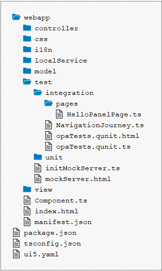

<!-- loio412f0b6fa5af4ba191241435b92b3f2d -->

# Step 28: Integration Test with OPA \(TypeScript\)

If we want to test interaction patterns or more visual features of our app, we can also write an integration test.

We haven’t thought about testing our interaction with the app yet, so in this step we will check if the dialog actually opens when we click the “Say Hello with Dialog” button. We can easily do this with OPA5, a feature of SAPUI5 that is easy to set up and is based on JavaScript and QUnit. Using integration and unit tests and running them consistently in a continuous integration \(CI\) environment, we can make sure that we don’t accidentally break our app or introduce logical errors in existing code.

> ### Note:  
> In this tutorial, we focus on a simple use case for the test implementation. If you want to learn more about OPA tests, have a look at our [Testing Tutorial](testing-tutorial-291c912.md) tutorial, especially [Step 6: A First OPA Test](step-6-a-first-opa-test-1b47457.md).


## Preview

  
  
**An OPA test opens the "Hello" dialog from step 16**


## Coding

You can view all files at [OpenUI5 TypeScript Walkthrough - Step 28: Integration Test with OPA](https://github.com/sap-samples/ui5-typescript-walkthrough/tree/main/steps/28) and [download the solution as a zip file](https://sap-samples.github.io/ui5-typescript-walkthrough/ui5-typescript-walkthrough-step-28.zip).

  
  
**Folder Structure for this Step**



We add a new folder `integration` below the `test` folder, where we put our new test cases. Page objects that help structuring such integration tests are put in the `pages` subfolder that we also create now.


<a name="loio412f0b6fa5af4ba191241435b92b3f2d__section_lbk_2l1_4zb"/>

## webapp/test/integration/pages/HelloPanelPage.ts \(New\)

We create a new `HelloPanelPage.ts` file under `webapp/test/integration/pages` where the OPA test for the main page is implemented. We define here the OPA test for our `HelloPanel` view.

A "page object" is a structuring element of OPA that encapsulates actions and assertions needed to describe the journey, which we'll come to in the next step. Typically, these are related to a view in the app, but there can also be stand-alone pages for browsers or common functionality. This page object relates to the `HelloPanel` view.

The implementation of the page object holds the helper functions we will need in our `journey`. We import the `sap.ui.test.OPA5` library and define a page object out of it.

In the actions section of the page object we define a function to click the "Hello" dialog button. This is done in OPA5 with a `waitFor` statement, it is basically a loop that checks for the conditions defined as parameters. If the conditions are met, the success callback is executed; if the test fails because the conditions have not been met, the text in the `errorMessage` property is displayed on the result page.

In the assertions section we define a `waitFor` statement that checks if a `sap.m.Dialog` control is existing in the DOM of the app. When the dialog has been found, the test is successful and we can immediately confirm by calling an `ok` statement with a meaningful message.

```js
import Opa5 from "sap/ui/test/Opa5";
import Press from "sap/ui/test/actions/Press";

const viewName = "ui5.walkthrough.view.HelloPanel";

export default class HelloPanelPage extends Opa5 {
	// Actions
	iPressTheSayHelloWithDialogButton() {
		return this.waitFor({
			id: "helloDialogButton",
			viewName,
			actions: new Press(),
			errorMessage: "Did not find the 'Say Hello With Dialog' button on the HelloPanel view"
		});
	}
	
	// Assertions
	iShouldSeeTheHelloDialog() {
		return this.waitFor({
			controlType: "sap.m.Dialog",
			success: function () {
				// we set the view busy, so we need to query the parent of the app
				Opa5.assert.ok(true, "The dialog is open");
			},
			errorMessage: "Did not find the dialog control"
		});
	}
};
```


## webapp/test/integration/NavigationJourney.js \(New\)

We create a new `NavigationJourney.ts` file under `webapp/test/integration/`.

A `journey` is another structuring element of OPA. It consists of a series of integration tests that belong to the same context, such as navigating through the app. Similar to the QUnit test implementation, OPA5 uses QUnit; that's why we first set up a QUnit module `Navigation` that will be displayed on our result page.

The function `opaTest` is the main aspect for defining integration tests with OPA. Its parameters define a test name and a callback function that gets executed with the following OPA5 helper objects to write meaningful tests that read like a user story.

-   `Given`

    On the given object we can call arrangement functions like `iStartMyUIComponent` to load our app component for integration testing.

-   `When`

    Contains custom actions that we can execute to get the application in a state where we can test the expected behavior.

-   `Then`

    Contains custom assertions that check a specific constellation in the application and the teardown function that removes our component again.


In our journey, we create a very simple test that starts the `MainPage` and loads our app. Then, we carry out the the actions we defined in our `MainPage` and expect that they will be executed successfully. Finally, we shut down the page again by calling the function `iTeardownMyApp` on the `MainPage`.

```js
import opaTest from "sap/ui/test/opaQunit";
import HelloPanelPage from "./pages/HelloPanelPage";

const onTheHelloPanelPage = new HelloPanelPage();

QUnit.module("Navigation");

opaTest("Should open the Hello dialog", function () {

	// Arrangements
	onTheHelloPanelPage.iStartMyUIComponent({
		componentConfig: {
			name: "ui5.walkthrough"
		}
	});
	
	// Actions
	onTheHelloPanelPage.iPressTheSayHelloWithDialogButton();
	
	// Assertions
	onTheHelloPanelPage.iShouldSeeTheHelloDialog();
	
	// Cleanup
	onTheHelloPanelPage.iTeardownMyApp();
});
```

As you can see, the test case reads like a user story; we actually do not need the implementation of the methods yet to understand the meaning of the test case. This approach is called "Behavior Driven Development" or simply BDD and is popular in "Agile Software Development".


<a name="loio412f0b6fa5af4ba191241435b92b3f2d__section_trf_xpc_yfb"/>

## webapp/test/integration/opaTests.qunit.ts \(New\)

We create a new `opaTests.qunit.ts` file under `webapp/test/integration/`.

We instruct QUnit to wait longer, allowing us to load our test files asynchronously. Then, we load the `NavigationJourney` and execute the test functions inside immediately.

```js
QUnit.config.autostart = false;

// import all your OPA tests here
void Promise.all([
	import("ui5/walkthrough/test/integration/NavigationJourney")
]).then(() => {
	QUnit.start();
});
```


<a name="loio412f0b6fa5af4ba191241435b92b3f2d__section_srf_xpc_yfb"/>

## webapp/test/integration/opaTests.qunit.html \(New\)

Finally, we create a new `opaTests.qunit.html` file under `webapp/test/integration/`.

This HTML page contains our test suite for all OPA tests of the app. We use the same namespace as for our application.

Then we load the basic QUnit functionality via script tags from SAPUI5 so that we can execute the test journey. In `data-sap-ui-onInit` we define that the module `opaTests.qunit` is loaded initially, which then again loads our `NavigationJourney`.

```html
<!DOCTYPE html>
<html>
<head>
	<title>UI5 Walkthrough - Integration Tests</title>
	<meta charset="utf-8">

	<script
		id="sap-ui-bootstrap"
		src="../../resources/sap-ui-core.js"
		data-sap-ui-theme="sap_horizon"
		data-sap-ui-resourceroots='{
			"ui5.walkthrough": "../../"
		}'
		data-sap-ui-animation="false"
		data-sap-ui-compatVersion="edge"
		data-sap-ui-async="true"
		data-sap-ui-oninit="module:ui5/walkthrough/test/integration/opaTests.qunit">
	</script>

	<link rel="stylesheet" type="text/css" href="../../resources/sap/ui/thirdparty/qunit-2.css">

	<script src="../../resources/sap/ui/thirdparty/qunit-2.js"></script>
	<script src="../../resources/sap/ui/qunit/qunit-junit.js"></script>
</head>
<body>
	<div id="qunit"></div>
	<div id="qunit-fixture"></div>
</body>
</html>
```

When you call the `webapp/test/integration/opaTests.qunit.html` page of your project on the server, you should see the QUnit layout and a test “Should see the Hello dialog” is executed immediately. It will load the app component on the right side of the page. There you can see what operations the test is performing on the app; if everything works correctly, the button click is triggered, then a dialog is shown and the test case is green.


## Conventions

-   OPA tests are located in the `webapp/test/integration` folder of the application.

-   Use `page` objects and `journeys` for structuring OPA tests.


**Related Information**  


[Integration Testing with One Page Acceptance Tests \(OPA5\)](../04_Essentials/integration-testing-with-one-page-acceptance-tests-opa5-2696ab5.md "OPA5 is an API for SAPUI5 controls. It hides asynchronicity and eases access to SAPUI5 elements. This makes OPA especially helpful for testing user interactions, integration with SAPUI5, navigation, and data binding.")

[API Reference: `sap.ui.test.Opa5`](https://ui5.sap.com/#/api/sap.ui.test.Opa5)

[Samples: `sap.ui.test.Opa5` ](https://ui5.sap.com/#/entity/sap.ui.test.Opa5)

[API Reference: `sap.ui.test.actions`](https://ui5.sap.com/#/api/sap.ui.test.actions)

[QUnit Home Page](https://qunitjs.com)

[Testing Tutorial](testing-tutorial-291c912.md "In this tutorial we will test application functionality with the testing tools that are delivered with SAPUI5. At different steps of this tutorial you will write tests using QUnit, OPA5, and the OData V2 mock server. Additionally, you will learn about testing strategies, Test Driven Development (TDD), and much more.")

