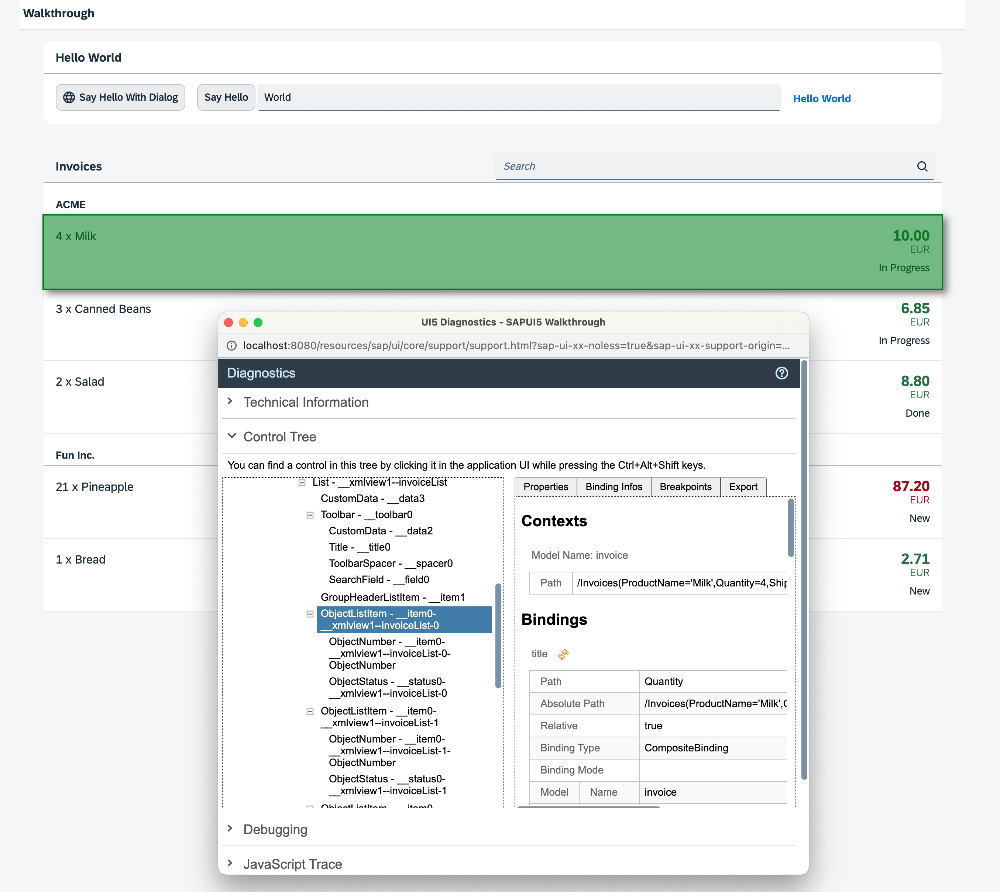
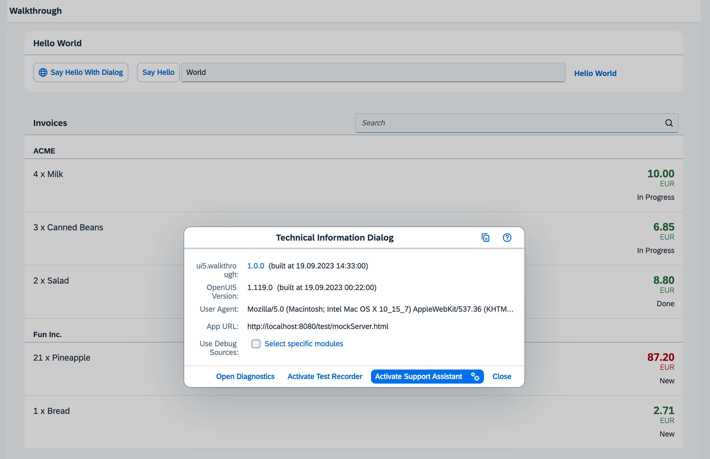

<!-- loio50990a077f964958a6e5cef1002e5316 -->

# Step 29: Debugging Tools \(TypeScript\)

Even though we have added a basic test coverage in the previous steps, it seems like we accidentally broke our app, because it does not display prices to our invoices anymore. We need to debug the issue and fix it before someone finds out.

Luckily, SAPUI5 provides a couple of debugging tools that we can use within the app to check the application logic and the developer tools of modern browsers are also quite good. We will now check for the root cause.


<a name="loio50990a077f964958a6e5cef1002e5316__section_chj_s5x_31b"/>

## Preview

  
  
**The diagnostics window**




<a name="loio50990a077f964958a6e5cef1002e5316__section_dhj_s5x_31b"/>

## Coding

You can view all files at [OpenUI5 TypeScript Walkthrough - Step 29: Debugging Tools](https://github.com/sap-samples/ui5-typescript-walkthrough/tree/main/steps/29) and [download the solution as a zip file](https://sap-samples.github.io/ui5-typescript-walkthrough/ui5-typescript-walkthrough-step-29.zip).


<a name="loio50990a077f964958a6e5cef1002e5316__section_ykp_sth_tyb"/>

## webapp/view/InvoiceList.view.xml

We introduce a typo in the binding of the number attribute to simulate a frequent error; instead of using `'invoice>ExtendedPrice'` we use <code>'invoice&gt;Ex<b>T</b>endedPrice'</code>.

```xml
<mvc:View
    controllerName="ui5.walkthrough.controller.InvoiceList"
    xmlns="sap.m"
    xmlns:core="sap.ui.core"
    xmlns:mvc="sap.ui.core.mvc">

    <List
        id="invoiceList"
        headerText="{i18n>invoiceListTitle}"
        class="sapUiResponsiveMargin"
        width="auto"
        items="{
            path : 'invoice>/Invoices',
            sorter : {
                path : 'ShipperName',
                group : true
            }
        }">

        <headerToolbar>
            <Toolbar>
                <Title text="{i18n>invoiceListTitle}" />
                <ToolbarSpacer />
                <SearchField
                    width="50%"
                    search=".onFilterInvoices"/>
            </Toolbar>
        </headerToolbar>
        <items>
            <ObjectListItem
                core:require="{
                    Currency: 'sap/ui/model/type/Currency'
                }"
                title="{invoice>Quantity} x {invoice>ProductName}"
                number="{
                    parts: [
                        'invoice>ExTendedPrice',
                        'view>/currency'
                    ],
                    type: 'Currency',
                    formatOptions: {
                        showMeasure: false
                    }
                }"
                numberUnit="{view>/currency}"
                numberState="{= ${invoice>ExtendedPrice} > 50 ? 'Error' : 'Success' }">
                <firstStatus>
                    <ObjectStatus
                        core:require="{
                            Formatter: 'ui5/walkthrough/model/formatter'
                        }"
                        text="{
                            path: 'invoice>Status',
                            formatter: 'Formatter.statusText.bind($controller)'
                        }"/>
                </firstStatus>
            </ObjectListItem>
        </items>
    </List>
</mvc:View>
```

Now we call the app and notice that the price is actually missing. By entering the [shortcut](../02_Read-Me-First/keyboard-shortcuts-for-sapui5-tools-154844c.md) [Ctrl\] + [Shift\] + [Alt\] /[Option\] + [S\]  we open the SAPUI5 support diagnostics tool and check the app.

> ### Note:  
> If you use the Google Chrome browser, you can install the *UI5 Inspector* plugin. With this plugin, you can easily debug your SAPUI5- or OpenUI5-based apps. For more information, see [UI5 Inspector](../04_Essentials/ui5-inspector-b24e724.md).

Besides technical information about the app and a trace that is similar to the developer tools console of the browser, there is a really handy tool for checking such errors in this dialog. Open the tab *Control Tree* by clicking on the expand symbol on the right.

A hierarchical tree of SAPUI5 controls is shown on the left and the properties of the selected control are displayed on the right. If we now select the first `ObjectListItem` control of the tree and go to the *Binding Infos* tab on the right, we can actually see that the binding path of the number attribute is marked as invalid. We can now correct the error in the view and the price should appear in the list of invoices again.

Sometimes errors are not as easy to spot and you actually need to debug the JavaScript code with the tools of the browser.

> ### Note:  
> When debugging UI5 applications that use built resources, the SAPUI5 files are minified, which means that variable names are shortened and comments are removed.
> 
> This makes debugging harder, because the code is a lot less readable. You can load the debug sources by adding the URL parameter `sap-ui-debug=true` or by pressing [Ctrl\] + [Shift\] + [Alt\] /[Option\] + [P\]  and selecting *Use Debug Sources* in the dialog box that is displayed. After reloading the page, you can see in the *Network* tab of the browser's developer tools that now a lot of files are loaded that have a `–dbg` suffix. These are the source code files that include comments and the uncompressed code of the app and the SAPUI5 artifacts.

  
  
**Technical information dialog**



For a more detailed explanation of the SAPUI5 support tools, go through the [Troubleshooting Tutorial](troubleshooting-tutorial-5661952.md) tutorial.

If you're stuck and need help for some development task, you can also post a question in the SAPUI5-related forums, for example in the [SAP Community](https://www.sap.com/community/topic/ui5.html) or on [Stack Overflow](https://stackoverflow.com/search?q=sapui5).


<a name="loio50990a077f964958a6e5cef1002e5316__section_lvc_gkw_31b"/>

## Conventions

-   As per SAPUI5 convention uncompressed source files end with `*-dbg.js`


**Related Information**  


[Debugging](../04_Essentials/debugging-c9b0f8c.md#loioc9b0f8cca852443f9b8d3bf8ba5626ab "When developing apps, searching for bugs is an inevitable part of the process. To analyze an issue, you can use the developer tools of your browser and built-in SAPUI5 tools. In this section, we give an overview of the SAPUI5 tools you can use when debugging. To learn more about the developer tools of your browser, check the documentation of the browser.")

[Diagnostics](../04_Essentials/diagnostics-6ec18e8.md#loio6ec18e80b0ce47f290bc2645b0cc86e6 "The Diagnostics window available in SAPUI5 is a support tool that runs within an existing SAPUI5 app.")

[Technical Information Dialog](../04_Essentials/technical-information-dialog-616a3ef.md#loio616a3ef07f554e20a3adf749c11f64e9 "The Technical Information dialog shows details of the SAPUI5 version currently being used in an app built with SAPUI5. You can use the Technical Information dialog to enable debug resources and open additional support tools to debug your app.")

[UI5 Inspector](../04_Essentials/ui5-inspector-b24e724.md "The UI5 Inspector is an open source Chrome DevTools extension that helps app developers to inspect, analyze, and support SAPUI5-based apps. It is supported for apps based on SAPUI5 version 1.28 and higher.")

