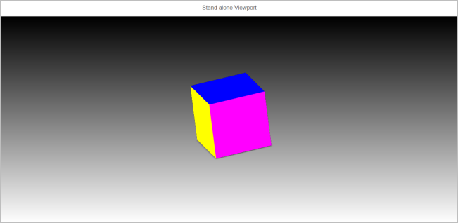

<!-- loio112d7b417e914a5a951abc6411d6f6c4 -->

# Step 3: 3D Viewer Using the Viewport Control

In this step, you will be creating a 3D Viewer application using the `sap.ui.vk.Viewport` control.

In previous steps, we utilized the `sap.ui.vk.Viewer` composite control to create a Viewer application capable of loading a 2D or 3D resource. Now, we will create a Viewer application with a pre-loaded resource without using the composite `sap.ui.vk.Viewer` control. Instead, we will use the following controls and library in `sap.ui.vk`, which are what you'll need at a minimum to display a 3D model in your application.

-   `Viewport` control
-   `ContentResource` control
-   `ContentConnector` library

We will build on this sample application in later steps of the 3D Viewer tutorial by introducing the other non-composite `sap.ui.vk` controls to create more complex Viewer applications.


## Preview

  
  
**Viewer application that consists solely of a Viewport**




## Coding

You can view and download all files at [3D Viewer - Step 3 - 3D Viewer Using the Viewport Control](https://ui5.sap.com/#/entity/sap.ui.vk.tutorial.VIT/sample/sap.ui.vk.tutorial.VIT.03).


### index.html

Update the `index.html` file to reference the `standaloneViewport` namespace, which will be the namespace we'll use for the sample application in this step.

```html
<!DOCTYPE HTML>
<html>
    <head>
        <meta http-equiv="Content-Type" content="text/html;charset=UTF-8"/>
        <script id="sap-ui-bootstrap"
            src="https://ui5.sap.com/resources/sap-ui-core.js"
            data-sap-ui-libs="sap.ui.vk"
            data-sap-ui-theme="sap_horizon"
            data-sap-ui-resource-roots='{
                "standaloneViewport": "./"
            }'>
        </script>
        <script>
        sap.ui.getCore().attachInit(function(){
            new sap.m.Shell({
                app: new sap.ui.core.ComponentContainer({
                    name : "standaloneViewport"
                })
            }).placeAt("content");
        });
        </script>
    </head>
    <body id="content" class="sapUiBody">
    </body>
</html>
```


### Component.js

Update the `Component.js` file to reference the namespace specified for this application.

```js
sap.ui.define([
        "sap/ui/core/UIComponent"
], function (UIComponent) {
        "use strict";
        return UIComponent.extend("standaloneViewport.Component", {
        metadata: {
            manifest: "json"
        },
        init: function () {
            // call the init function of the parent
            UIComponent.prototype.init.apply(this, arguments);
        }
    });
});
```


### i18n.properties

Because we are not creating any fields that a user can interact with, we only have one line of code which specifies the label for the page title.

```ini
# Page Descriptor
pageTitle=Standalone Viewport
```


### manifest.json

Update the `manifest.json` file so that it references the correct files.

```js
{
    "_version": "1.8.0",
    "sap.app": {
        "id": "standaloneViewport",
        "type": "application",
        "i18n": "i18n/i18n.properties",
        "title": "{{appTitle}}",
        "description": "{{appDescription}}",
        "applicationVersion": {
            "version": "1.0.0"
        }
    },
    "sap.ui": {
        "technology": "UI5",
        "deviceTypes": {
            "desktop": true,
            "tablet": true,
            "phone": true
        }
    },
    "sap.ui5": {
        "rootView": "standaloneViewport.view.App",
        "dependencies": {
            "minUI5Version": "1.30",
            "libs": {
                "sap.m": {}
            }
        },
        "models": {
            "i18n": {
                "type": "sap.ui.model.resource.ResourceModel",
                "settings": {
                    "bundleName": "standaloneViewport.i18n.i18n"
                }
            }
        }
    }
}
```


### App.view.xml

Because the Viewport is the only item that we need to display on the application screen, we only need to have the `<vk:Viewport>` element added to this file. In the element's attributes, we specify the Viewport's width and height on the screen, and also give it an arbitrary identifier value.

```xml
<mvc:View
        controllerName="standaloneViewport.controller.App"
        xmlns="sap.m"
        xmlns:mvc="sap.ui.core.mvc"
        xmlns:vk="sap.ui.vk"
        xmlns:l="sap.ui.layout"
        xmlns:f="sap.ui.layout.form"
        xmlns:u="sap.ui.unified"
        displayBlock="true">
    <App id="standaloneViewport">
        <Page
            title="{i18n>pageTitle}">
            <vk:Viewport
                    id="viewport"
                    width="100%"
                    height="85%"/>
        </Page>
    </App>
</mvc:View>
```


### App.controller.js

The logic in this `App.controller.js` file can be summarized as follows:

1.  Create a Content Resource that stores a pre-specified model
2.  Initiate a scene in our application in the following order:
    1.  Create a Content Connector instance
    2.  Create a Viewport that is bound to the Content Connector instance
    3.  Load the Content Resource to the Content Connector for rendering on the Viewport


```js
sap.ui.define([
    "sap/base/Log",
    "sap/ui/core/mvc/Controller",
    "sap/ui/vk/ContentResource",
    "sap/ui/vk/ContentConnector"
], function (Log, Controller, ContentResource, ContentConnector) {
    "use strict";

    var contentResource = new sap.ui.vk.ContentResource({
        source: "/models/boxTestModel.vds",
        sourceType: "vds4",
        id: "abc123"
    });

    return Controller.extend("standaloneViewport.controller.App",{
        onInit: function() {
            var view = this.getView();
            var viewport = view.byId("viewport");
            var contentConnector = new ContentConnector({
                contentChangesFinished: function(event) {
                    var failureReason = event.getParameter("failureReason");
                    if (failureReason) {
                        Log.error("Some of content resources cannot be loaded: " + failureReason);
                    } else {
                        Log.info("Scene successfully loaded");
                    }
                }
            });
            viewport.setContentConnector(contentConnector);
            contentConnector.addContentResource(contentResource);
        }
    });
});
```

We'll now break the code down to look at each part in more detail.

**Create a New Content Resource** 

Create a `contentResource` object that specifies the resource to load. In this case, we're pre-loading the `boxTestModel.vds` model into the application. This occurs before the scene in our Viewer application is initiated. Once again we are using `vds4` as the value for `sourceType` to use the ThreeJs rendering engine.

```js
sap.ui.define([
    "sap/ui/core/mvc/Controller",
    "sap/ui/vk/ContentResource",
], function (Controller, ContentResource) {
    "use strict";
    var contentResource = new sap.ui.vk.ContentResource({
        source: "/models/boxTestModel.vds",
        sourceType: "vds4",
        id: "abc123"

```

**Create a new Content Connector instance** 

Create a new Content Connector instance. We're only specifying one input parameter, which is an even handler which is invoked when content resource loading is finished \(either successfully or unsuccessfully\). We then get the current viewport, and attach the Content Connector instance so that the model we've loaded can be rendered.

In the following code block, we have specified some checks in the *contentChangesFinished* event handler to make sure that the model loads correctly. If no resource is loaded, or if there is an error loading the resource, we log the following error on the screen "Some of content resources cannot be loaded" as well as any error message received from Content Connector.

```js
return Controller.extend("standaloneViewport.controller.App",{
    onInit: function() {
        var view = this.getView();
        var viewport = view.byId("viewport");
        
        var contentConnector = new ContentConnector({
            contentChangesFinished: function(event) {
                var failureReason = event.getParameter("failureReason");
                if (failureReason) {
                    Log.error("Some of content resources cannot be loaded: " + failureReason);
                } else {
                    Log.info("Scene successfully loaded");
                }
            }
        });
        viewport.setContentConnector(contentConnector);
```

**Load the Content Resource for Rendering** 

Now that we've associated the viewport with the Content Connector, we can load our model to be displayed on the Viewport.

```js
contentConnector.addContentResource(contentResource);
```


## API Reference

-   [`sap.ui.vk.Viewport`](https://ui5.sap.com/#/api/sap.ui.vk.Viewport)
-   [`sap.ui.vk.ContentConnector`](https://ui5.sap.com/#/api/sap.ui.vk.ContentConnector)

