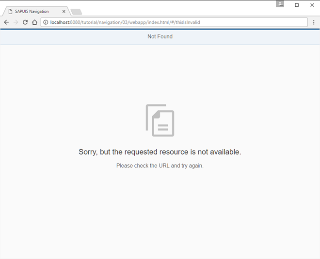
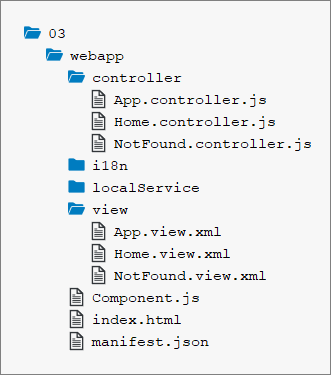

<!-- loioe047e0596e8a4a1db50f4a53c11f4276 -->

# Step 3: Catch Invalid Hashes

Sometimes it is important to display an indication that the requested resource was not found. To give you an example: If a user tries to access an invalid pattern which does not match any of the configured routes, the user is notified that something went wrong. You might also know this as a “404” or *Not Found Page* from traditional web pages. In this step, we will implement a feature that detects invalid hashes and visualizes this in a nice way.


## Preview

   
  
<a name="loioe047e0596e8a4a1db50f4a53c11f4276__fig_r1j_pst_mr"/>*Not Found* page

  


## Coding

You can view and download all files in the *Samples* in the Demo Kit at [Routing and Navigation - Step 3](https://ui5.sap.com/#/entity/sap.ui.core.tutorial.navigation/sample/sap.ui.core.tutorial.navigation.03).

   
  
<a name="loioe047e0596e8a4a1db50f4a53c11f4276__fig_chm_4jp_ls"/>Folder structure for this step

  


## webapp/manifest.json

```js
{
   ...
   "sap.ui5": {
      ...
      "routing": {
         "config": {
            "routerClass": "sap.m.routing.Router",
            "type": "View",
            "viewType": "XML",
            "path": "sap.ui.demo.nav.view",
            "controlId": "app",
            "controlAggregation": "pages",
            "transition": "slide",
            "bypassed": {
               "target": "notFound"
            },
            "async": true
         },
         "routes": [{
            "pattern": "",
            "name": "appHome",
            "target": "home"
         }],
         "targets": {
            "home": {
               "id": "home",
               "name": "Home",
               "level" : 1
            },
            "notFound": {
               "id": "notFound",
               "name": "NotFound",
               "transition": "show"
            }
         }
      }
   }
}
```

Let’s extend the routing configuration in the descriptor by adding a `bypassed` property and setting its `target` to `notFound`. This configuration tells the router to display the `notFound` target in case no route was matched to the current hash. Next, we add a `notFound` target to the `bypassed` section. The `notFound` target simply configures a `notFound` view with a `show` transition.


## webapp/view/NotFound.view.xml \(New\)

```xml
<mvc:View
   controllerName="sap.ui.demo.nav.controller.NotFound"
   xmlns="sap.m"
   xmlns:mvc="sap.ui.core.mvc">
   <MessagePage
      title="{i18n>NotFound}"
      text="{i18n>NotFound.text}"
      description="{i18n>NotFound.description}"/>
</mvc:View>
```

Now we create the view referenced above in a new file `NotFound.view.xml` in the `webapp/view folder`. It uses a `sap.m.MessagePage` control to display an error message to the user. In a real app you might use a dynamic message matching the current error situation. Here, we simply display a preconfigured text from our resource bundle.


## webapp/controller/NotFound.controller.js \(New\)

```js
sap.ui.define([
   "sap/ui/core/mvc/Controller"
], function (Controller) {
   "use strict";
   return Controller.extend("sap.ui.demo.nav.controller.NotFound", {
      onInit: function () {
      }
   });
});
```

Now we create the controller for the `NotFound` view and save it into the `webapp/controller` folder. This controller will be extended later.


## webapp/i18n/i18n.properties

```js
...
NotFound=Not Found
NotFound.text=Sorry, but the requested resource is not available.
NotFound.description=Please check the URL and try again.
```

Add the new properties to the `i18n.properties` file.

Open the URL `index.html#/thisIsInvalid` in your browser. From now on the user will see a nice *Not Found* page if a hash could not be matched to one of our routes.


## Conventions

-   Always configure the `bypassed` property and a corresponding target

-   Use the `sap.m.MessagePage` control to display routing related error messages


**Parent topic:** [Navigation and Routing](navigation-and-routing-1b6dcd3.md "SAPUI5 comes with a powerful routing API that helps you control the state of your application efficiently. This tutorial will illustrate all major features and APIs related to navigation and routing in SAPUI5 apps by creating a simple and easy to understand mobile app. It represents a set of best practices for applying the navigation and routing features of SAPUI5 to your applications.")

**Next:** [Step 2: Enable Routing](step-2-enable-routing-cf3c57c.md "In this step we will modify the app and introduce routing. Instead of having the home page of the app hard coded we will configure a router to wire multiple views together when our app is called. The routing configuration controls the application flow when the user triggers a navigation action or opens a link to the application directly.")

**Previous:** [Step 4: Add a Back Button to Not Found Page](step-4-add-a-back-button-to-not-found-page-66670b0.md "When we are on the Not Found page because of an invalid hash, we want to get back to our app to select another page. Therefore, we will add a Back button to the Not Found view and make sure that the user gets redirected to either the previous page or the overview page when the Back button is pressed.")

**Related Information**  


[API Reference: `sap.m.MessagePage`](https://ui5.sap.com/#/api/sap.m.MessagePage)

[API Overview and Samples: `sap.m.MessagePage` ](https://ui5.sap.com/#/entity/sap.m.MessagePage)

