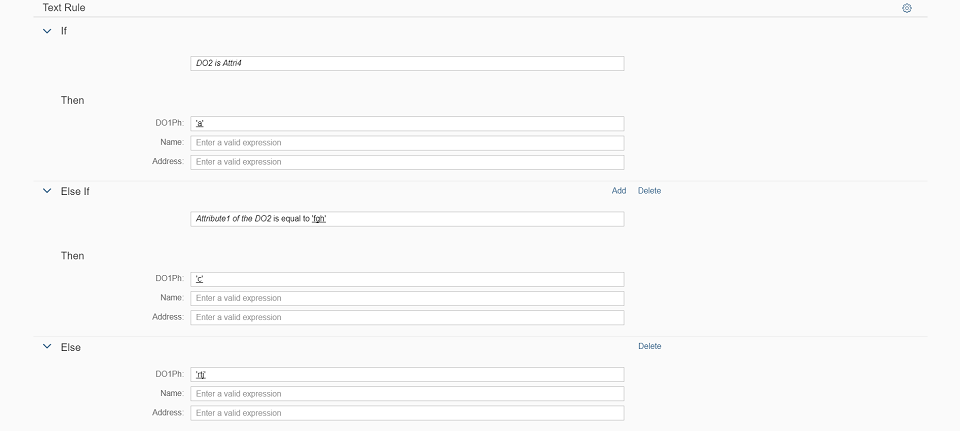
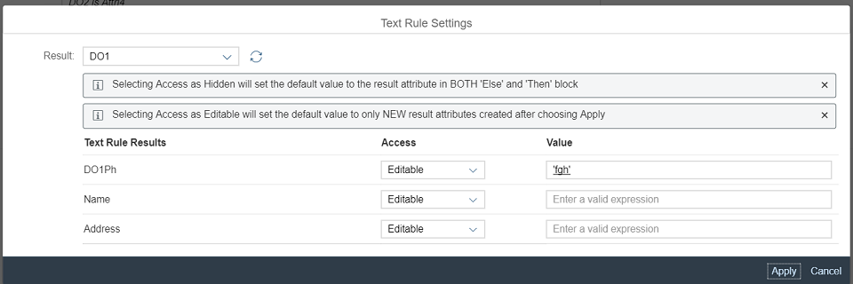

<!-- loio1758e45f9a1c403e8b2febc1cc7e51e3 -->

# Step 3: Changing the Text Rule Configuration

Text rule has a set of configurations that influence different aspects of the its functionality and the actions that business users can perform. Part of the configuration of the text rule can be exposed to the end user via the text rule *Settings* dialog box.

Text rule has a condition part \(`if, elseif`\) and the result parts \(`then, else`\). In this type of rule authoring, the user can create a text rule which has different semantic fonts, colors for vocabulary \(data\), grammar \(reserved words\), inline error highlighting and provides the autocomplete feature to support user input for the rules \(condition & results\).

If you are using a data object with reference attributes as the result data object, then the attributes of the target data object will also be displayed as result attributes. For more information on reference attributes, see *Attributes* in [Data Objects](https://help.sap.com/viewer/0e4dd38c4e204f47b1ffd09e5684537b/Cloud/en-US/12725c18964e454c859424322c85fc2a.html).


<a name="loio1758e45f9a1c403e8b2febc1cc7e51e3__section_qqb_rq3_rz"/>

## Preview






<a name="loio1758e45f9a1c403e8b2febc1cc7e51e3__section_mjx_fn3_rz"/>

## Coding

You can view and download all files at [Rule Builder - Text Rule](https://ui5.sap.com/#/entity/sap.rules.ui.RuleBuilder/sample/sap.rules.ui.sample.TextRule).


<a name="loio1758e45f9a1c403e8b2febc1cc7e51e3__section_jhn_5q3_rz"/>

## Page.view.xml

```xml
<mvc:View
        xmlns:mvc="sap.ui.core.mvc"
        displayBlock="true"
        xmlns="sap.m"
        controllerName="sap.rules.ui.sample.TextRule.Page"
        viewName="sap.rules.ui.sample.TextRule.Page.view"
        xmlns:rules="sap.rules.ui">
    <Button id="editButton" press="handleEditButton" text="Edit"/>
    <rules:RuleBuilder id="ruleBuilder" types="TextRule" editable="true">
		<rules:textRuleConfiguration>
		<rules:textRuleConfiguration enableSettings="true" enableElseIf= "false"/>
		</rules:textRuleConfiguration>
    </rules:RuleBuilder>
</mvc:View> 

```

The `enableSettings` option is `false` by default and can be set to `true` which enables the *Settings* icon, and opens the *Settings* dialog box. The `enableElse` and `enableElseIf` options are `true` by default and can be set to `false` which disables the `Else` and `ElseIf` parts in the condition.

Multiple `ElseIf` statements can also be configured in the condition.

