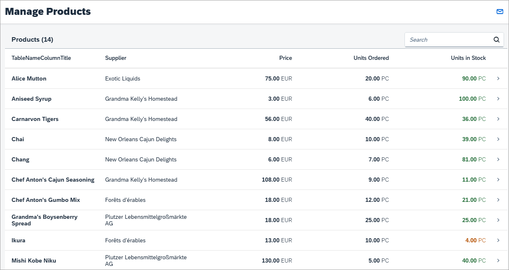

<!-- loio84100bcfd5b34f62858bdd6f67976b4a -->

# Step 3: Extending the Worklist Table

In this step, we will edit the worklist table to include additional columns for our manage product stocks scenario. We display the supplier, the product price, and the number of units on order for each product and format the values accordingly.


## Preview

   
  
<a name="loio84100bcfd5b34f62858bdd6f67976b4a__fig_djl_pjl_c5"/>The improved worklist table with new columns and formatting

  


## Coding

You can view and download all files in the Demo Kit at [Worklist App - Step 3](https://ui5.sap.com/#/entity/sap.m.tutorial.worklist/sample/sap.m.tutorial.worklist.03).


### webapp/view/Worklist.view.xml \[MODIFY\]

```xml
…
<Table
	id="table"
	width="auto"
	items="{
		path: '/Products',
		sorter: {
			path: 'ProductName',
			descending: false
		},
		parameters: {
			'expand': 'Supplier'
		}
	}"
	noDataText="{worklistView>/tableNoDataText}"
	busyIndicatorDelay="{worklistView>/tableBusyDelay}"
	growing="true"
	growingScrollToLoad="true"
	updateFinished=".onUpdateFinished">
	<headerToolbar>
		<Toolbar>
			<Title id="tableHeader" text="{worklistView>/worklistTableTitle}"/>
			<ToolbarSpacer />
			<SearchField
				id="searchField"
				tooltip="{i18n>worklistSearchTooltip}"
				search=".onSearch"
				width="auto">
			</SearchField>
		</Toolbar>
…

```

We want to display the supplier’s company name in a separate column in the table for each product. Therefore, we extend the `items` aggregation of the table with an `expand` parameter for the `Supplier` entity. With this, the supplier data will be already included in the service request for the products.

We expand the supplier because we want to avoid sending one additional request for each product to get the supplier. Furthermore, this allows us to bind directly to `{Supplier/CompanyName}` later.

> ### Note:  
> **OData’s “expand” Mechanism:**
> 
> OData `$expand` is very helpful when combining data from different service entities. Instead of having to send an additional service request for the second entity, we simply expand the service call to include the second entity as well – similar to a join in a relational database. Have a look at the local service metadata definition file `webapp/localService/metadata.xml` that represents the interface of our service. In the `metadata` you can see a list of entities that are available in this service, for example `Products` and `Suppliers`. Each entity lists a number of fields that we can bind to the properties of our view.


### webapp/localService/metadata.xml \[MODIFY\]

```xml
<EntityType Name="Product">
    <Key>
        <PropertyRef Name="ProductID"/>
    </Key>
    <Property
        xmlns:p8="http://schemas.microsoft.com/ado/2009/02/edm/annotation" Name="ProductID" Type="Edm.Int32" Nullable="false" p8:StoreGeneratedPattern="Identity"/>
        <Property Name="ProductName" Type="Edm.String" Nullable="false" MaxLength="40" Unicode="true" FixedLength="false"/>
        <Property Name="SupplierID" Type="Edm.Int32" Nullable="true"/>
        <Property Name="CategoryID" Type="Edm.Int32" Nullable="true"/>
        <Property Name="QuantityPerUnit" Type="Edm.String" Nullable="true" MaxLength="20" Unicode="true" FixedLength="false"/>
        <Property Name="UnitPrice" Type="Edm.Decimal" Nullable="true" Precision="19" Scale="4"/>
        <Property Name="UnitsInStock" Type="Edm.Int16" Nullable="true"/>
        <Property Name="UnitsOnOrder" Type="Edm.Int16" Nullable="true"/>
        <Property Name="ReorderLevel" Type="Edm.Int16" Nullable="true"/>
        <Property Name="Discontinued" Type="Edm.Boolean" Nullable="false"/>
        <NavigationProperty Name="Category" Relationship="NorthwindModel.FK_Products_Categories" FromRole="Products" ToRole="Categories"/>
        <NavigationProperty Name="Order_Details" Relationship="NorthwindModel.FK_Order_Details_Products" FromRole="Products" ToRole="Order_Details"/>
        <NavigationProperty Name="Supplier" Relationship="NorthwindModel.FK_Products_Suppliers" FromRole="Products" ToRole="Suppliers"/>
    </EntityType>
```

In the entity `Products`, you can see that an additional relation to the `Supplier` is available as a `NavigationProperty`. A navigation property links two entities of an OData service and assigns the supplier to the product here.

When using a real OData service, the interface would be available by calling the service URL directly in a browser \(e.g. `http://services.odata.org/V3/Northwind/Northwind.svc/$metadata` for the Northwind OData test service\). In our app project we use local mock data and serve the data with the mock server instead.


### webapp/view/Worklist.view.xml \[MODIFY\]

```xml
…
<columns>
	<Column id="nameColumn">
		<Text
			id="nameColumnTitle"
			text="{i18n>TableNameColumnTitle}"/>
	</Column>
	<Column
		id="supplierNameColumn"
		demandPopin="false"
		minScreenWidth="Tablet">
		<Text text="{i18n>TableSupplierColumnTitle}"/>
	</Column>
	<Column
		id="unitPriceColumn"
		hAlign="End"
		demandPopin="true"
		minScreenWidth="Tablet">
		<Text text="{i18n>TablePriceColumnTitle}"/>
	</Column>
	<Column
		id="unitsOnOrderColumn"
		demandPopin="true"
		minScreenWidth="Tablet"
		hAlign="End">
		<Text text="{i18n>TableUnitsOrderedColumnTitle}"/>
	</Column>
	<Column
		id="unitsInStockColumn"
		hAlign="End">
		<Text text="{i18n>TableUnitsInStockColumnTitle}"/>
	</Column>
</columns>
…
```

Next, we change the column definitions of the table. We define the new columns and update the existing ones in the columns aggregation of the table according to the code above \(i.e. just copy and paste the highlighted content into your columns aggregation\).

The column definitions include a text that we will later define in the resource bundle \(`i18n` model – a short name for internationalization\) so that the column titles can be translated to other languages. And we will define additional settings for text alignment and making the table responsive. Some columns are not as important as others and can be displayed below the main columns \(`popin`\) on devices with small or medium-sized screens.

Let's have a detailed look at the columns:

-   Product Name

    The product name is the first column and it is always visible on any device.

-   Supplier

    Each product has a supplier. This column contains the company name of the supplier supplying the product. On small screen devices like smart phones we hide this column as we do not have much screen space for a table.

-   Price

    The currency of the product’s unit price is Euro \(EUR\). We are talking about stock levels in this app, so the number of units is most interesting for us - not their price. Price is still good to know, so it is not entirely removed. However, this field is not as important as the unit fields and will `popin` on smart phones.

-   Units on Order

    This column shows the units that have been ordered already for this product and will be added to the stock shortly. In other words, this is the number of items ordered, but not yet received. A shortage for a product can easily be resolved by reordering the product in advance \(we add this feature later\). This field will `popin` on smart phone devices.

-   Units in Stock

    The column contains the product’s stock units currently available for sale. This field is the most important column for our manage product stocks app. Therefore, this column is visible for all devices and it’s visible without a `popin`. Later, we will use this column to visualize a stock status for the specific products so that attention will be drawn to any stock issues with the products.


### webapp/model/formatter.js \[MODIFY\]

```js
sap.ui.define([
	"sap/ui/core/library"
] , function (coreLibrary) {
    "use strict";

	// shortcut for sap.ui.core.ValueState
	var ValueState = coreLibrary.ValueState;


	return {

		...
		},

		/**
		 * Defines a value state based on the stock level
		 *
		 * @public
		 * @param {number} iValue the stock level of a product
		 * @returns {string} sValue the state for the stock level
		 */
		quantityState: function(iValue) {
			if (iValue === 0) {
				return ValueState.Error;
			} else if (iValue <= 10) {
				return ValueState.Warning;
			} else {
				return ValueState.Success;
			}
		}


	};

});

```

Our table has a column that will contain the units in stock for each product. It would be nice to visualize the corresponding numbers so that we can point out important information to the users, such as a shortage. We want to visualize the numbers by using a specific `ValueState` depending on the units in stock. This can be achieved by a simple formatter, which we will use later.

We add a new formatter function `quantityState` to the `webapp/model/formatter.js` file. The `ValueState` type is loaded as an additional dependency. The formatter implements the following logic with a simple `if`/`else` statement:

-   A totally depleted stock \(0 pieces remaining\) will return a semantic `Error` state that will color the text in the units in stock field red.

-   Very low stock \(10 or less pieces remaining\) will lead to a `Warning` state \(orange\).

-   A stock of more than 10 items will convert to `Success` \(green\)


### webapp/view/Worklist.view.xml \[MODIFY\]

```xml
…
<items>
    <ColumnListItem
        type="Navigation"
        press="onPress">
        <cells>
         <ObjectIdentifier
            title="{ProductName}"/>
         <Text text = "{Supplier/CompanyName}"/>
         <ObjectNumber
            unit="EUR"
            number="{
               path: 'UnitPrice',
               formatter: '.formatter.numberUnit'
            }"/>
         <ObjectNumber
            number="{UnitsOnOrder}"
            unit="PC"/>
         <ObjectNumber
            number="{UnitsInStock}"
            unit="PC"
            state="{
               path: 'UnitsInStock',
               formatter: '.formatter.quantityState'
            }"/>

      </cells>
   </ColumnListItem>
</items>
…
```

The next task is to define the cells to appear in each row of the table. For each column, we define a control in the `cells` aggregation of the table and configure the data binding as well as the formatting of the data.

-   The first cell simply displays the `ProductName` property of the corresponding entity by using an `ObjectIdentifier` control.

-   The *Supplier* cell of each row is a simple `sap.m.Text` control. Its text property is bound to `Supplier/CompanyName`. This references the property `CompanyName` of the entity’s `NavigationProperty` `Supplier`. This `NavigationProperty` will be expanded automatically; we configured this earlier in this step.

-   The *Price* cell uses an `sap.m.ObjectNumber` control and a custom formatter. You can find the formatter’s implementation in the `webapp/model/formatter.js` file. The unit property is not bound and hard coded to “EUR” as the currency is not part of the model for our app. The units on order are displayed with a sap.m.ObjectNumber control as well, but without additional formatting. Its `unit` property is hard coded to `PC`, which is the short form for "pieces".

-   The last cell shows the units in stock and was already specified in the previous step. We would like to use this field to show an additional status based on the stock level so we change the binding syntax to an object notation and add an additional formatter `quantityState`. We implemented this formatter in the previous code block above.


> ### Note:  
> The formatter functions used in this XML view are loaded by the controller and thus can be accessed relatively to the controller through the property name `.formatter`. This logic is already part of the initial app.


### webapp/i18n/i18n.properties \[MODIFY\]

```ini
#XTIT: The title of the column containing Product name
TableProductColumnTitle=Product

#XTIT: The title of the column containing Supplier name
TableSupplierColumnTitle=Supplier

#XTIT: The title of the column containing Price
TablePriceColumnTitle=Price

#XTIT: The title of the column containing Ordered Units
TableUnitsOrderedColumnTitle=Units Ordered

#XTIT: The title of the column containing Units in Stock
TableUnitsInStockColumnTitle=Units in Stock


#XBLI: Text for a table with no data
tableNoDataText=No products are currently available
...
```

Finally, we modify the existing column names in the resource bundle file `webapp/i18n/i18n.properties` to match our scenario and add the new texts for the column titles.

> ### Note:  
> The `webapp/i18n/i18n.properties` file contains some annotations for each key in the file. These annotations offer some more context, which can help translators to better interpret the semantics of the text belonging to the keys. An example for such an annotation is XTIT in the `i18n.properties` file above, which tells that the corresponding key is supposed to be used as a title. The guidelines at [https://github.com/SAP/openui5/blob/master/docs/guidelines/translationfiles.md](https://github.com/SAP/openui5/blob/master/docs/guidelines/translationfiles.md) give you a better idea of how this can be used. Be aware that this is how SAP uses the annotations internally. In case you want to use this approach to work with your own translators make sure that you agree on a common set of allowed annotations that everybody understands.

> ### Tip:  
> **Testing the responsiveness of the app**
> 
> In the previous code blocks of this step we made sure that our table is responsive. Depending on the device type, columns are hidden, displayed as a popin, or displayed without a popin. Now, we want to test the responsiveness without the having different devices. If you use the Google Chrome browser, you can also use its great developer tools to test the responsiveness of your app:
> 
> 1.  Call the app and open the developer tools in Chrome with [F12\].
> 
> 2.  Choose the *Toggle device mode* icon.
> 
> 3.  Now choose from the different devices in the *Models* field, and observe the behavior of your app.

**Parent topic:** [Worklist App](worklist-app-6a6a621.md "In this tutorial we will build an app using SAPUI5 that, for example, a shop owner can use to manage his product stock levels.")

**Next:** [Step 2: Custom Mock Data](step-2-custom-mock-data-3118903.md "In this step, we want to change the mock data of the initial app.")

**Previous:** [Step 4: Quick Filter for the Worklist](step-4-quick-filter-for-the-worklist-85ec3a9.md "For easily detecting and managing product shortages in our app, we will add a quick filter for the worklist table. Users can press the filter tabs to display the products according to whether they are in stock, have low stock or no stock. The table will update accordingly and show only the products matching the criteria.")

