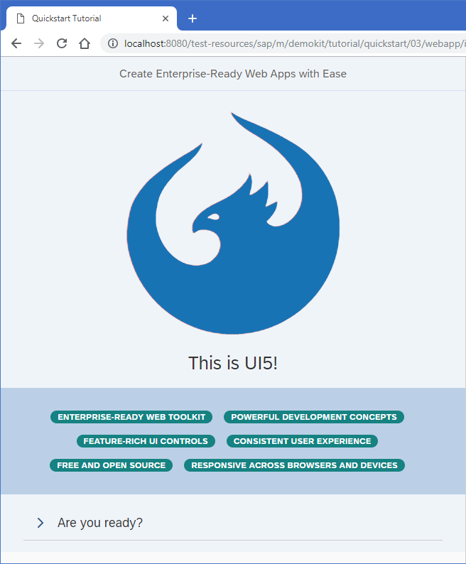

<!-- loio073d1073fc604beda94589d5c93b32e2 -->

# Step 3: Go!

Finally, we add a second page to our app showcasing some of the key SAPUI5 concepts.


## Preview

   
  
<a name="loio073d1073fc604beda94589d5c93b32e2__fig_hqz_2n3_1gb"/>The second page shows plenty of UI controls and concepts to explore

  


<a name="loio073d1073fc604beda94589d5c93b32e2__section_tph_kn3_1gb"/>

## Coding

You can view and download all files at [Quick Start - Step 3](https://ui5.sap.com/#/sample/sap.m.tutorial.quickstart.03/preview).


<a name="loio073d1073fc604beda94589d5c93b32e2__section_cbq_4n3_1gb"/>

## webapp/index.html

```html
<!DOCTYPE html>
<html>
<head>
	<meta charset="utf-8">
	<title>Quickstart Tutorial</title>
	<script id="sap-ui-bootstrap"
		src="https://sdk.openui5.org/resources/sap-ui-core.js"
		data-sap-ui-theme="sap_belize"
		data-sap-ui-libs="sap.m, sap.ui.layout, sap.tnt"
		data-sap-ui-resourceroots='{"Quickstart": "./"}'
		data-sap-ui-onInit="module:Quickstart/index"
		data-sap-ui-compatVersion="edge"
		data-sap-ui-async="true">
	</script>
</head>
<body class="sapUiBody" id="content"></body>
</html>
```

Let's spice up our app by adding some more UI controls. We add two more libraries in the bootstrap tag: `sap.ui.layout` and `sap.tnt`.

> ### Tip:  
> To browse all available controls and libraries, see the [Samples](https://ui5.sap.com/#/controls). 


<a name="loio073d1073fc604beda94589d5c93b32e2__section_txk_n43_1gb"/>

## webapp/App.view.xml

```xml
<mvc:View
	controllerName="Quickstart.App"
	displayBlock="true"
	xmlns="sap.m"
	xmlns:mvc="sap.ui.core.mvc"
	xmlns:l="sap.ui.layout"
	xmlns:core="sap.ui.core"
	xmlns:tnt="sap.tnt">
	<App id="app">
		<Page title="My App">
			<Button
				icon="sap-icon://sap-ui5"
				text="Go!"
				press=".onPress"
				type="Emphasized"
				class="sapUiSmallMargin"/>
		</Page>
		<Page id="intro" title="Create Enterprise-Ready Web Apps with Ease">
			<l:BlockLayout background="Light">
				<l:BlockLayoutRow>
					<l:BlockLayoutCell>
						<core:Icon color="#1873B4" src="sap-icon://sap-ui5" size="20rem" class="sapUiMediumMarginBottom" width="100%"/>
						<Title level="H1" titleStyle="H1" text="This is UI5!" width="100%" textAlign="Center"/>
					</l:BlockLayoutCell>
				</l:BlockLayoutRow>
				<l:BlockLayoutRow>
					<l:BlockLayoutCell>
						<FlexBox items="{/features}" justifyContent="Center" wrap="Wrap" class="sapUiSmallMarginBottom">
							<tnt:InfoLabel text="{}" class="sapUiSmallMarginTop sapUiSmallMarginEnd"/>
						</FlexBox>
					</l:BlockLayoutCell>
				</l:BlockLayoutRow>

				<l:BlockLayoutRow>
					<l:BlockLayoutCell>
						<Panel headerText="Are you ready?" expandable="true">
							<Switch change=".onChange" customTextOn="yes" customTextOff="no"/>
							<l:HorizontalLayout id="ready" visible="false" class="sapUiSmallMargin">
								<Text text="Ok, let's get you started!" class="sapUiTinyMarginEnd"/>
								<Link text="Learn more" href="https://sdk.openui5.org/"/>
							</l:HorizontalLayout>
						</Panel>
					</l:BlockLayoutCell>
				</l:BlockLayoutRow>
			</l:BlockLayout>
		</Page>

	</App>
</mvc:View>
```

We also define the two new libraries in the `View` tag and give them a meaningful prefix. To the `App` control, we will assign an ID so that the controller can easily identify it.

The button now receives an icon and triggers our navigation to page two. Therefore, we change the text to "Go!".

Copy the second `Page` control with all its content into the view. It is defined with the `intro` ID and a new title. It contains several new UI controls like a `BlockLayout`, an `Icon`, and a `Panel`.

We use essential SAPUI5 concepts like navigation, data binding, and user interaction to define a nice playground on the second page of our app.

Don't worry too much about the details, we will explain them in the next tutorials.


<a name="loio073d1073fc604beda94589d5c93b32e2__section_uw2_gt3_1gb"/>

## webapp/App.controller.js

```js
sap.ui.define([
	"sap/ui/core/mvc/Controller",
	"sap/m/MessageToast",
	"sap/ui/model/json/JSONModel"
], function (Controller, MessageToast, JSONModel) {
	"use strict";

	return Controller.extend("Quickstart.App", {
		onPress : function () {
			MessageToast.show("Hello UI5!");
			this.byId("app").to(this.byId("intro"));
		},

		onInit : function () {
			this.getView().setModel(new JSONModel({
					features: [
						"Enterprise-Ready Web Toolkit",
						"Powerful Development Concepts",
						"Feature-Rich UI Controls",
						"Consistent User Experience",
						"Free and Open Source",
						"Responsive Across Browsers and Devices"
					]
				})
			);
		},

		onChange: function (oEvent) {
			var bState = oEvent.getParameter("state");
			this.byId("ready").setVisible(bState);
		}
	});

});
```

The `onPress` function now also triggers the navigation to the `intro` page. We fetch the `app` control by its ID and instruct it to navigate by calling the `to` method.

The `onInit` method is a lifecycle hook that is called automatically when the controller is initialized. It defines a simple JSON model with some texts located at the `features` key.

We display these texts on the second page using data binding. The `InfoLabel` tag from our view is a template that is repeated as many times as we have entries in our model.

Finally, we make the Panel in the lower part of the view interactive by attaching an `onChange` event to the switch defined there. SAPUI5 comes with a large set of feature-rich controls that you can combine as you need.

Run the app, and navigate to the second page to see some nice UI controls and interaction. If we expand the panel and click the switch, we toggle the visibility of the text and the link next to it.

You now have a little playground in your app that you can modify and extend as you wish. We intentionally did not go into all the details. If you want to know more, just continue with the Walkthrough tutorial.

Have fun with SAPUI5!

**Parent topic:** [Quick Start](quick-start-592f36f.md "Unleash your SAPUI5 skills with this simple three-step tutorial. We start with a simple &quot;Hello World&quot; example, and convert it to a minimalist two-page app.")

**Next:** [Step 2: Steady...](step-2-steady-128214a.md "Now we extend our minimalist HTML page to a basic app with a view and a controller.")

**Related Information**  


[Working with Controls](../04_Essentials/working-with-controls-91f0a22.md "Controls are used to define the appearance and behavior of screen areas.")

[Data Binding](../04_Essentials/data-binding-68b9644.md "You use data binding to bind UI elements to data sources to keep the data in sync and allow data editing on the UI.")

[Routing and Navigation](../04_Essentials/routing-and-navigation-3d18f20.md "SAPUI5 offers hash-based navigation, which allows you to build single-page apps where the navigation is done by changing the hash. In this way the browser does not have to reload the page; instead there is a callback to which the app and especially the affected view can react. A hash string is parsed and matched against patterns which will then inform the handlers.")

