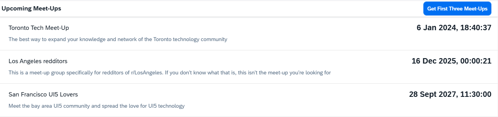

<!-- loio46c1ca4eb2804af6bfa371ad51c9b887 -->

# Step 3: Handling Custom URL Parameters

In this step, we add the functionality to interpret URL parameters in our local mock server configuration.

We know that the OData V2 provider of this service implements a URL parameter that returns only the first three entries of a set. So, for example, calling the URL with parameter`/Meetups?first=3` should return only the first 3 meet-up entries instead of all available entries.


## Preview

   
  
**Only the next three meet-ups are shown**

  


## Coding

You can view and download all files in the Demo Kit at [Mock Server - Step 3](https://ui5.sap.com/#/entity/sap.ui.core.tutorial.mockserver/sample/sap.ui.core.tutorial.mockserver.03).


## webapp/localService/mockserver.js

```js
sap.ui.define([
	"sap/ui/core/util/MockServer",
	"sap/base/Log"
], function(MockServer, Log) {
	"use strict";

	return {
		/**
		 * Initializes the mock server.
		 * You can configure the delay with the URL parameter "serverDelay".
		 * The local mock data in this folder is returned instead of the real data for testing.
		 * @public
		 */
		init: function() {
			// create
			var oMockServer = new MockServer({
				rootUri: "/"
			});

			oMockServer.simulate("../localService/metadata.xml", {
				sMockdataBaseUrl: "../localService/mockdata",
				bGenerateMissingMockData: true
			});

			// handling custom URL parameter step
			var fnCustom = function(oEvent) {
				var oXhr = oEvent.getParameter("oXhr");
				if (oXhr && oXhr.url.indexOf("first") > -1) {
					oEvent.getParameter("oFilteredData").results.splice(3, 100);
				}
			};
			oMockServer.attachAfter("GET", fnCustom, "Meetups");


			// start
			oMockServer.start();

			Log.info("Running the app with mock data");
		}

	};

});

```

In some scenarios, a server-specific implementation is used to calculate the returned data. For example, you can use a custom URL parameter that is typically interpreted by the server. The mock server ignores it, thus still returning the entire set of meet-ups.

In this tutorial, we use the URL parameter `first=3` to fetch the first three entries. So, for example, calling to `/Meetups?first=3` should return at most three meet-up entries.

However, since this is a custom parameter that is not part of the standard official OData V2 query options, it will not get processed correctly by the mock server. Moreover, the mock server simply ignores it and return the entire set of meet-ups.

We now enable the functionality when running in mock mode. As its functionality corresponds to the OData V2 `$top` system query, we simply evaluate it to `$top` at runtime.

First, we create a callback function that we later attach to every `GET` request made to the `Meetups` entity set of the service. Note that we choose the `attachAfter` event that is fired after the built-in request processing of the mock server. The event contains the actual `XHR` object and the mock data to be returned to the application. Inside the callback function we remove all results starting from third entry: The `oFilteredData` parameter comes with the event `attachAfter` and contains the mock data entries that are about to be returned in the response.

Second, we attach the callback to every `GET` request to the specific `Meetups` entity set.

