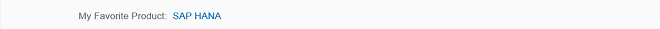
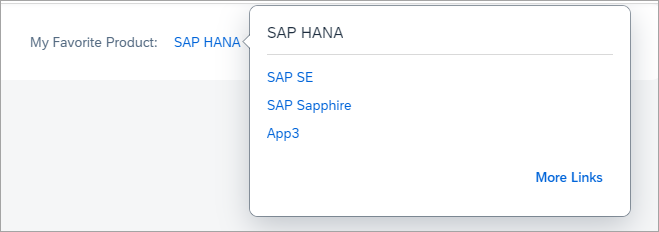
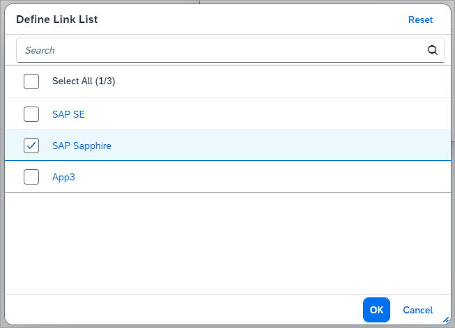
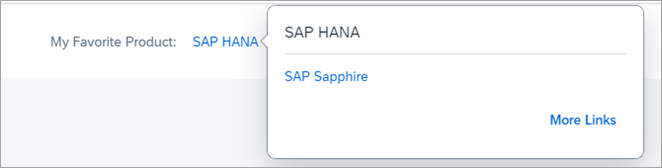

<!-- loioc81d6b3382df43abb56e3468a2b5d22e -->

# Step 3: Smart Field with Smart Link

We now show yet another but quite different feature of the `SmartField` control, `SmartField` used in combination with `SmartLink`, which allow you to embed a dialog with related cross-application links.

We will learn that a `SmartField` control in an XML view bound to an OData model with a `SemanticObject` annotation renders a special link that shows a dialog containing different cross-application links. These cross-application links are neither configured within the XML view nor directly specified in the OData metadata. The information about these links is extracted automatically when the view is running in the SAP Fiori launchpad or, more generally, the unified shell.


## Preview

   
  
<a name="loioc81d6b3382df43abb56e3468a2b5d22e__fig_r1j_pst_mr"/>Smart Field with Smart Link

  

When you choose the link, a dialog opens:

   
  
<a name="loioc81d6b3382df43abb56e3468a2b5d22e__fig_w13_3jj_js"/>Dialog with Navigation Targets

  

When you choose *More Links*, a dialog opens where you can select the cross-application links you want to see.

   
  
<a name="loioc81d6b3382df43abb56e3468a2b5d22e__fig_dtg_2rh_dy"/>Link List

  

After your selection, the dialog looks like this:

   
  
<a name="loioc81d6b3382df43abb56e3468a2b5d22e__fig_w1c_jm3_dy"/>Changed Links

  

You can choose *More Links* to go back to the link list.


## Coding

You can view and download all files in the *Samples* in the Demo Kit at [Smart Controls - Step 3 - Smart Field with Smart Link](https://ui5.sap.com/#/entity/sap.ui.comp.tutorial.smartControls/sample/sap.ui.comp.tutorial.smartControls.03).

To have a working example, we include the `UShellCrossApplicationNavigationMock.js` class. This class basically mocks the required services, which would normally be available in the SAP Fiori launchpad. These services provide the cross-application navigation targets along with the URL parsing, thus making it possible to determine which link qualifies as a “fact sheet” target. As these services will be provided for in a real-world scenario, we will not analyze the mock class in more detail and also not provide a code listing of the class. The class file can be found in the *Samples*.


## SmartLink.view.xml

```xml
<mvc:View
	controllerName="sap.ui.demo.smartControls.SmartLink"
	xmlns="sap.m"
	xmlns:mvc="sap.ui.core.mvc"
	xmlns:smartForm="sap.ui.comp.smartform"
	xmlns:sap.ui.layout="sap.ui.layout"
	xmlns:smartField="sap.ui.comp.smartfield">
	<smartForm:SmartForm editable="true">
		<smartForm:layout>
			<smartForm:ColumnLayout 
				emptyCellsLarge="4"
				labelCellsLarge="4"
				columnsM="1"
				columnsL="1"
				columnsXL="1"/>
		</smartForm:layout>
		<smartForm:Group>
			<smartForm:GroupElement>
				<smartField:SmartField value="{Name}" id="idName" editable="false"/>
			</smartForm:GroupElement>
		</smartForm:Group>
	</smartForm:SmartForm>
</mvc:View>
```

We recognize our setup of the previous two examples in the `view.xml`. We are referring to a different field, but apart from this, there is no substantial change. The `SmartField` control is rendered as a link in the display mode. We set `editable` to `false` to achieve the same effect in this example.


## SmartLink.controller.js

```js
sap.ui.define([
	'sap/ui/core/mvc/Controller', 'sap/ui/demo/smartControls/test/service/UShellCrossApplicationNavigationMock'
], function(Controller, UShellCrossApplicationNavigationMock) {
	"use strict";

	return Controller.extend("sap.ui.demo.smartControls.SmartLink", {
		onInit: function() {
			this.getView().bindElement("/Products('4711')");

			UShellCrossApplicationNavigationMock.mockUShellServices({
				tutorial_03_Name: {
					links: [
						{
							action: "sap_se",
							intent: "http://www.sap.com",
							text: "SAP SE"
						}, {
							action: "sap_sapphire",
							intent: "http://www.sap.com/sapphire",
							text: "SAP Sapphire"
						}, {
							action: "app3",
							intent: "http://www.sap.com/hana",
							text: "App3"
						}
					]
				}
			});
		},

		onExit: function() {
			UShellCrossApplicationNavigationMock.unMockUShellServices();
		}
	});

});

```

We notice the instantiation of the mock class `UShellCrossApplicationNavigationMock` mentioned above and also the subsequent destroy.


## metadata.xml

```xml
<?xml version="1.0" encoding="utf-8"?>
<edmx:Edmx Version="1.0"
	xmlns:edmx="http://schemas.microsoft.com/ado/2007/06/edmx"
	xmlns:m="http://schemas.microsoft.com/ado/2007/08/dataservices/metadata"
	xmlns:sap="http://www.sap.com/Protocols/SAPData">
	<edmx:DataServices m:DataServiceVersion="2.0">
		<Schema Namespace="com.sap.wt03" 
			sap:schema-version="1" xmlns="http://schemas.microsoft.com/ado/2008/09/edm">
			<EntityType Name="Product">
				<Key>
					<PropertyRef Name="ProductId" />
				</Key>
				<Property Name="ProductId" Type="Edm.String" />
				<Property Name="Name" Type="Edm.String" sap:label="My Favorite Product" />
			</EntityType>
			<EntityContainer m:IsDefaultEntityContainer="true"
				sap:supported-formats="json">
				<EntitySet Name="Products" EntityType="com.sap.wt03.Product" />
			</EntityContainer>
			<Annotations Target="com.sap.wt03.Product/Name"
				xmlns="http://docs.oasis-open.org/odata/ns/edm">
				<Annotation Term="com.sap.vocabularies.Common.v1.SemanticObject"
					String="tutorial_03_Name" />
			</Annotations>
		</Schema>
	</edmx:DataServices>
</edmx:Edmx>
```

As you would expect, one piece of configuration is found in the metadata, namely the `SemanticObject` annotation. With this annotation we ensure that the `SmartField` embeds a special link control, the `SmartLink` control. Let's assume we are running in a unified shell that provides the services `CrossApplicationNavigation` and `URLParsing` \(that we are mocking in our `UShellCrossApplicationNavigationMock` class\). In this case, when the link is pressed, the `SmartLink` control triggers these service calls, analyzes the result, and renders the cross-application links accordingly. Since these services deliver configuration content of the unified shell, `SmartLink` is controlled by more than just OData metadata.


## Products.json

```js
[{
	"ProductId": "4711",
	"Name": "SAP HANA"
}]
```

We list the content of this for reasons of completeness. We note that this JSON file only contains the data shown for the link, nothing related to the dialog.

**Parent topic:** [Smart Controls](smart-controls-64bde9a.md "In this tutorial you learn how to work with smart controls.")

**Next:** [Step 2: Smart Field with Value Help](step-2-smart-field-with-value-help-3361e27.md "You can use the SmartField control in combination with the ValueHelpDialog control that allow you to carry out a complex search in order to identify the value you are looking for.")

**Previous:** [Step 4: Smart Form](step-4-smart-form-f712d30.md "The SmartForm control is used to obtain a form-like layout for several controls.")

**Related Information**  


[Smart Field](../10_More_About_Controls/smart-field-4864403.md "The sap.ui.comp.smartfield.SmartField control offers a wrapper for other controls using OData metadata to determine which control has to be instantiated and makes it possible to add input-enabled fields to an application.")

[Smart Link](../10_More_About_Controls/smart-link-f638884.md "The sap.ui.comp.navpopover.SmartLink control provides a popover with navigation links to related applications, for example, more detailed information about customer data.")

