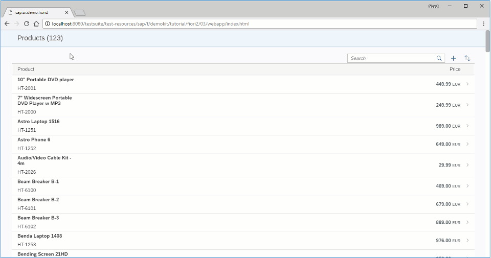

<!-- loio0830bce271bf42d98c2740bed43d435d -->

# Step 3: Using Dynamic Page for the Master View

In this step, we create the master view of the app using `sap.f.DynamicPage` control.


<a name="loio0830bce271bf42d98c2740bed43d435d__section_ed2_4dd_lbb"/>

## Preview

   
  
<a name="loio0830bce271bf42d98c2740bed43d435d__fig_r1j_pst_mr"/>Master page with `sap.f.DynamicPage`

  


<a name="loio0830bce271bf42d98c2740bed43d435d__section_fd2_4dd_lbb"/>

## Coding

You can view and download all files at [Flexible Column Layout App - Step 3](https://ui5.sap.com/#/sample/sap.f.tutorial.fiori2.03/preview).

webapp/manifest.json \[MODIFY\]


```json
{
	"_version": "1.12.0",
	"sap.app": {
		"id": "sap.ui.demo.fiori2",
		"type": "application",
		"applicationVersion": {
			"version": "1.0.0"
		}
	},
	"sap.ui5": {
		"rootView": {
			"viewName": "sap.ui.demo.fiori2.view.App",
			"type": "XML",
			"async": true,
			"id": "fcl"
		},
		"dependencies": {
			"minUI5Version": "1.60.0",
			"libs": {
				"sap.ui.core": {},
				"sap.m": {},
				"sap.f": {}
			}
		},
		"config": {
			"fullWidth": true
		}
	}
}
```

First, we add the `sap.m` library as a dependency in the `manifest.json`.


<a name="loio0830bce271bf42d98c2740bed43d435d__section_ddz_pjj_l4b"/>

## webapp/index.html \[MODIFY\]

```html
	...
	<script id="sap-ui-bootstrap"
		src="https://sdk.openui5.org/resources/sap-ui-core.js"
		data-sap-ui-theme="sap_belize"
		data-sap-ui-resourceroots='{
			"sap.ui.demo.fiori2": "./",
			"sap.ui.demo.mock": "https://sdk.openui5.org/test-resources/sap/ui/documentation/sdk/"
		}'
		data-sap-ui-oninit="module:sap/ui/core/ComponentSupport"
		data-sap-ui-compatVersion="edge"
		data-sap-ui-async="true"
		data-sap-ui-frameOptions="trusted">
	</script>
	...
```

We add the link to the mock data that is used in the app.


<a name="loio0830bce271bf42d98c2740bed43d435d__section_h5w_4jj_l4b"/>

## webapp/Component.js \[MODIFY\]

```js
sap.ui.define([
	'sap/ui/core/UIComponent',
	'sap/ui/model/json/JSONModel'
], function(UIComponent, JSONModel) {
	'use strict';

	return UIComponent.extend('sap.ui.demo.fiori2.Component', {

		metadata: {
			manifest: 'json'
		},

		init: function () {
			var oProductsModel;

			UIComponent.prototype.init.apply(this, arguments);

			// set products demo model on this sample
			oProductsModel = new JSONModel(sap.ui.require.toUrl('sap/ui/demo/mock') + '/products.json');
			oProductsModel.setSizeLimit(1000);
			this.setModel(oProductsModel, 'products');
		}
	});
});
```

We create the `init` method in the `Component.js` to set the model.


<a name="loio0830bce271bf42d98c2740bed43d435d__section_shq_mjj_l4b"/>

## webapp/view/Master.view.xml \[NEW\]

```xml
<mvc:View
	controllerName="sap.ui.demo.fiori2.controller.Master"
	xmlns="sap.m"
	xmlns:f="sap.f"
	xmlns:mvc="sap.ui.core.mvc">
	<f:DynamicPage id="dynamicPageId" toggleHeaderOnTitleClick="false">
		<!-- DynamicPage Title -->
		<f:title>
			<f:DynamicPageTitle>
				<f:heading>
					<Title text="Products ({products>/ProductCollectionStats/Counts/Total})"/>
				</f:heading>
			</f:DynamicPageTitle>
		</f:title>

		<!-- DynamicPage Content -->
		<f:content>
			<VBox fitContainer="true">
				<OverflowToolbar class="sapFDynamicPageAlignContent">
					<ToolbarSpacer/>
					<SearchField search=".onSearch" width="17.5rem"/>
					<OverflowToolbarButton icon="sap-icon://add" text="Add" type="Transparent" press=".onAdd"/>
					<OverflowToolbarButton icon="sap-icon://sort" text="Sort" type="Transparent" press=".onSort"/>
				</OverflowToolbar>
				<Table
					id="productsTable"
					inset="false"
					items="{
						path: 'products>/ProductCollection',
						sorter: {
							path: 'Name'
						}
					}"
					class="sapFDynamicPageAlignContent"
					width="auto">
					<columns>
						<Column width="12em">
							<Text text="Product"/>
						</Column>
						<Column	hAlign="End">
							<Text text="Price"/>
						</Column>
					</columns>
					<items>
						<ColumnListItem type="Navigation">
							<cells>
								<ObjectIdentifier title="{products>Name}" text="{products>ProductId}"/>
								<ObjectNumber
									number="{
										parts:[
											{path:'products>Price'},
											{path:'products>CurrencyCode'}
										],
										type: 'sap.ui.model.type.Currency',
										formatOptions: {showMeasure: false}
									}"
									unit="{products>CurrencyCode}"/>
							</cells>
						</ColumnListItem>
					</items>
				</Table>
			</VBox>
		</f:content>

		<!-- DynamicPage Footer -->
		<f:footer>
			<OverflowToolbar>
				<ToolbarSpacer/>
				<Button type="Accept" text="Accept"/>
				<Button type="Reject" text="Reject"/>
			</OverflowToolbar>
		</f:footer>
	</f:DynamicPage>
</mvc:View>
```

We create the master view using `sap.f.DynamicPage`. The page consists of a list with all products.


<a name="loio0830bce271bf42d98c2740bed43d435d__section_zrl_ljj_l4b"/>

## webapp/view/App.view.xml \[MODIFY\]

```xml
<mvc:View
	displayBlock="true"
	height="100%"
	xmlns="sap.f"
	xmlns:mvc="sap.ui.core.mvc">
	<FlexibleColumnLayout id="flexibleColumnLayout" backgroundDesign="Solid">
		<beginColumnPages>
			<mvc:XMLView id="beginView" viewName="sap.ui.demo.fiori2.view.Master"/>
		</beginColumnPages>
	</FlexibleColumnLayout>
</mvc:View>
```

We add the master view in `FlexibleColumnLayout's` `beginColumnPages` aggregation.


<a name="loio0830bce271bf42d98c2740bed43d435d__section_ovn_jjj_l4b"/>

## webapp/controller/Master.controller.js \[NEW\]

```js
sap.ui.define([
	"sap/ui/model/json/JSONModel",
	"sap/ui/core/mvc/Controller",
	"sap/ui/model/Filter",
	"sap/ui/model/FilterOperator",
	'sap/ui/model/Sorter',
	'sap/m/MessageBox'
], function (JSONModel, Controller, Filter, FilterOperator, Sorter, MessageBox) {
	"use strict";

	return Controller.extend("sap.ui.demo.fiori2.controller.Master", {
		onInit: function () {
			this.oView = this.getView();
			this._bDescendingSort = false;
			this.oProductsTable = this.oView.byId("productsTable");
		},

		onSearch: function (oEvent) {
			var oTableSearchState = [],
				sQuery = oEvent.getParameter("query");

			if (sQuery && sQuery.length > 0) {
				oTableSearchState = [new Filter("Name", FilterOperator.Contains, sQuery)];
			}

			this.oProductsTable.getBinding("items").filter(oTableSearchState, "Application");
		},

		onAdd: function () {
			MessageBox.information("This functionality is not ready yet.", {title: "Aw, Snap!"});
		},

		onSort: function () {
			this._bDescendingSort = !this._bDescendingSort;
			var oBinding = this.oProductsTable.getBinding("items"),
				oSorter = new Sorter("Name", this._bDescendingSort);

			oBinding.sort(oSorter);
		}
	});
});
```

We create the master controller that provides a basic search and sort functionality for the products listed in the master page.

**Parent topic:** [Flexible Column Layout App](flexible-column-layout-app-c4de2df.md "In this tutorial, we showcase how to structure your SAPUI5 app using the layout patterns that comply with the SAP Fiori design guidelines.")

**Next:** [Step 2: Creating an Empty Flexible Column Layout](step-2-creating-an-empty-flexible-column-layout-bf38e4d.md "In this step, we add an instance of the sap.f.FlexibleColumnLayout control in the main view of the app.")

**Previous:** [Step 4: Adding a Detail Page](step-4-adding-a-detail-page-4e4315c.md "In this step, we add an empty detail page.")

