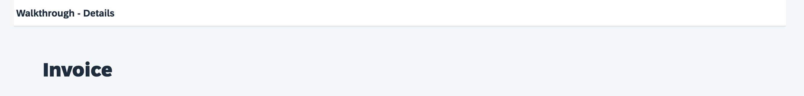

<!-- loioe5200ee755f344c8aef8efcbab3308fb -->

# Step 30: Routing and Navigation

So far, we have put all app content on one single page. As we add more and more features, we want to split the content and put it on separate pages.

In this step, we will use the SAPUI5 navigation features to load and show a separate detail page that we can later use to display details for an invoice. In the previous steps, we defined the page directly in the app view so that it is displayed when the app is loaded. We will now use the SAPUI5 router class to load the pages and update the URL for us automatically. We specify a routing configuration for our app and create a separate view for each page of the app, then we connect the views by triggering navigation events.


## Preview

  
  
**A second page is added to display the invoice**




<a name="loioe5200ee755f344c8aef8efcbab3308fb__section_ips_rvh_tyb"/>

## Coding

You can view and download all files at [Walkthrough - Step 30](https://ui5.sap.com/#/entity/sap.m.tutorial.walkthrough/sample/sap.m.tutorial.walkthrough.30).


<a name="loioe5200ee755f344c8aef8efcbab3308fb__section_jps_rvh_tyb"/>

## webapp/manifest.json

```
{
  ...
  "sap.ui5": {
  ...
    "routing": {
      "config": {
        "routerClass": "sap.m.routing.Router",
        "type": "View",
        "viewType": "XML",
        "path": "ui5.walkthrough.view",
        "controlId": "app",
        "controlAggregation": "pages"
      },
      "routes": [
        {
          "pattern": "",
          "name": "overview",
          "target": "overview"
        },
        {
          "pattern": "detail",
          "name": "detail",
          "target": "detail"
        }
      ],
      "targets": {
        "overview": {
          "id": "overview",
          "name": "Overview"
        },
        "detail": {
          "id": "detail",
          "name": "Detail"
        }
      }
    }
  }
}
```

We add a new “routing" section to the `sap.ui5` part of the descriptor. There are three subsections that define the routing and navigation structure of the app:

-   `config`

    This section contains the global router configuration and default values that apply for all routes and targets. We define the router class that we want to use and where our views are located in the app. To load and display views automatically, we also specify which control is used to display the pages and what aggregation should be filled when a new page is displayed.

-   `routes`

    Each route defines a name, a pattern, and one or more targets to navigate to when the route has been hit. The pattern is basically the URL part that matches to the route, we define two routes for our app. The first one is a default route that will show the overview page with the content from the previous steps, and the second is the detail route with the URL pattern `detail` that will show a new page.

-   `targets`

    A target defines a view, or even another component, that is displayed; it is associated with one or more routes, and it can also be displayed manually from within the app. Whenever a target is displayed, the corresponding view is loaded and shown in the app. In our app we simply define two targets with a view name that corresponds to the target name.


## webapp/Component.js

```js
sap.ui.define([
	"sap/ui/core/UIComponent",
	"sap/ui/model/json/JSONModel"
], (UIComponent, JSONModel) => {
	"use strict";

	return UIComponent.extend("ui5.walkthrough.Component", {

		metadata: {
			interfaces: ["sap.ui.core.IAsyncContentCreation"],
			manifest: "json"
		},

		init() {
			// call the init function of the parent
			UIComponent.prototype.init.apply(this, arguments);

			// set data model
			const oData = {
				recipient: {
					name: "World"
				}
			};
			const oModel = new JSONModel(oData);
			this.setModel(oModel);

			// create the views based on the url/hash
			this.getRouter().initialize();
		}
	});
});
```

In the component initialization method, we now add a call to initialize the router. We do not need to instantiate the router manually, it is automatically instantiated based on our `AppDescriptor` configuration and assigned to the component.

Initializing the router will evaluate the current URL and load the corresponding view automatically. This is done with the help of the routes and targets that have been configured in the `manifest.json`, also known as the **app descriptor**. If a route has been hit, the view of its corresponding target is loaded and displayed.


## webapp/view/Overview.view.xml \(New\)

```xml
<mvc:View
    controllerName="ui5.walkthrough.controller.App"
    xmlns="sap.m"
    xmlns:mvc="sap.ui.core.mvc"
    displayBlock="true">
    <Page title="{i18n>homePageTitle}">
        <content>
            <mvc:XMLView viewName="ui5.walkthrough.view.HelloPanel" />
            <mvc:XMLView viewName="ui5.walkthrough.view.InvoiceList" />
        </content>
    </Page>
</mvc:View>
```

We move the content of the previous steps from the `App` view to a new `Overview` view. For simplicity, we do not change the controller as it only contains our helper method to open the dialog, that means we reuse the controller `ui5.walkthrough.controller.App` for two different views \(for the new overview and for the app view\). However, two instances of that controller are instantiated at runtime. In general, one instance of a controller is instantiated for each view that references the controller.


## webapp/view/App.view.xml

```xml
<mvc:View
    controllerName="ui5.walkthrough.controller.App"
    xmlns="sap.m"
    xmlns:mvc="sap.ui.core.mvc"
    displayBlock="true">
    <Shell>
        <App
            class="myAppDemoWT"
            id="app"/>
    </Shell>
</mvc:View>
```

Our `App` view is now only containing the empty app tag. The router will automatically add the view that corresponds to the current URL into the app control. The router identifies the app control with the ID that corresponds to the property `controlId: “app”` in the `AppDescriptor`.


## webapp/view/Detail.view.xml \(New\)

```xml
<mvc:View
	xmlns="sap.m"
	xmlns:mvc="sap.ui.core.mvc">
	<Page
		title="{i18n>detailPageTitle}">
		<ObjectHeader title="Invoice"/>
	</Page>
</mvc:View>
```

Now we add a second view for the detail view. It only contains a page and an `ObjectHeader` control that displays the static text *Invoice* for now.


## webapp/i18n/i18n.properties

```ini
…
# Invoice List
invoiceListTitle=Invoices
invoiceStatusA=New
invoiceStatusB=In Progress
invoiceStatusC=Done

# Detail Page
detailPageTitle=Walkthrough - Details
```

We add a new string to the resource bundle for the detail page title.


## webapp/view/InvoiceList.view.xml

```xml
<mvc:View
    controllerName="ui5.walkthrough.controller.InvoiceList"
    xmlns="sap.m"
    xmlns:mvc="sap.ui.core.mvc">
    ...
        <items>
            <ObjectListItem
                title="{invoice>Quantity} x {invoice>ProductName}"
                number="{
                    parts: [
                        'invoice>ExtendedPrice',
                        'view>/currency'
                    ],
                    type: 'sap.ui.model.type.Currency',
                    formatOptions: {
                        showMeasure: false
                    }
                }"
                numberUnit="{view>/currency}"
                numberState="{= ${invoice>ExtendedPrice} > 50 ? 'Error' : 'Success' }"
                type="Navigation"
                press=".onPress" >
                <firstStatus>
                    <ObjectStatus
                        text="{
                            path: 'invoice>Status',
                            formatter: '.formatter.statusText'
                        }"/>
                </firstStatus>
            </ObjectListItem>
        </items>
    </List>
</mvc:View>
```

In the invoice list view we add a press event to the list item and set the item type to `Navigation` so that the item can actually be clicked.


## webapp/controller/InvoiceList.controller.js

```js
sap.ui.define([
	"sap/ui/core/mvc/Controller",
	"sap/ui/model/json/JSONModel",
	"../model/formatter",
	"sap/ui/model/Filter",
	"sap/ui/model/FilterOperator"
], (Controller, JSONModel, formatter, Filter, FilterOperator) => {
	"use strict";

	return Controller.extend("ui5.walkthrough.controller.InvoiceList", {

		…

		onPress() {
			const oRouter = this.getOwnerComponent().getRouter();
			oRouter.navTo("detail");
		}
	});
});
```

We add the event handler function to the controller of our invoices list. Now it is time to navigate to the detail page by clicking an item in the invoice list. We access the router instance for our app by calling the helper method `getOwnerComponent().getRouter()`. On the router we call the `navTo` method to navigate to the `detail` route that we specified in the routing configuration.

You should now see the detail page when you click an item in the list of invoices.


## Conventions

-   Define the routing configuration in the descriptor

-   Initialize the router at the end of your `Component#init` function

**Related Information**  


[Routing and Navigation](../04_Essentials/routing-and-navigation-3d18f20.md "SAPUI5 offers hash-based navigation, which allows you to build single-page apps where the navigation is done by changing the hash. In this way the browser does not have to reload the page; instead there is a callback to which the app and especially the affected view can react. A hash string is parsed and matched against patterns which will then inform the handlers.")

[Tutorial: Navigation and Routing](navigation-and-routing-tutorial-1b6dcd3.md "SAPUI5 comes with a powerful routing API that helps you control the state of your application efficiently. This tutorial will illustrate all major features and APIs related to navigation and routing in SAPUI5 apps by creating a simple and easy to understand mobile app. It represents a set of best practices for applying the navigation and routing features of SAPUI5 to your applications.")

[API Reference: `sap.m.routing.Router`](https://ui5.sap.com/#/api/sap.m.routing.Router)

[Samples: `sap.m.routing.Router` ](https://ui5.sap.com/#/entity/sap.m.routing.Router)

