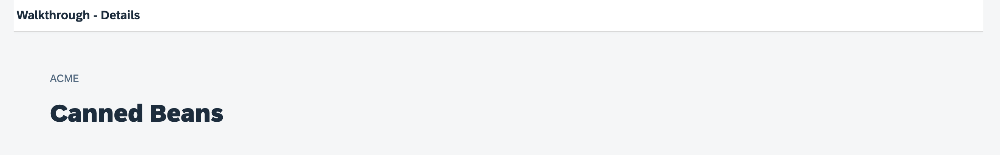

<!-- loio2366345a94f64ec1a80f9d9ce50a59ef -->

# Step 31: Routing with Parameters

We can now navigate between the overview and the detail page, but the actual item that we selected in the overview is not displayed on the detail page yet. A typical use case for our app is to show additional information for the selected item on the detail page.

To make this work, we have to pass over the information which item has been selected to the detail page and show the details for the item there.


## Preview

  
  
**The selected invoice details are now shown in the details page**




<a name="loio2366345a94f64ec1a80f9d9ce50a59ef__section_m2z_d5m_tyb"/>

## Coding

You can view and download all files at [Walkthrough - Step 31](https://ui5.sap.com/#/entity/sap.m.tutorial.walkthrough/sample/sap.m.tutorial.walkthrough.31).


<a name="loio2366345a94f64ec1a80f9d9ce50a59ef__section_n2z_d5m_tyb"/>

## webapp/manifest.json

```js
{
  …
  "sap.ui5": {
	…
	"routing": {
	  "config": {
		"routerClass": "sap.m.routing.Router",
		"type": "View",
		"viewType": "XML",
		"path": "ui5.walkthrough.view",
		"controlId": "app",
		"controlAggregation": "pages"
	  },
	  "routes": [
		{
		  "pattern": "",
		  "name": "overview",
		  "target": "overview"
		},
		{
		  "pattern": "detail/{invoicePath}",
		  "name": "detail",
		  "target": "detail"
		}
	  ],
		  "targets": {
		"overview": {
		  "id": "overview",
		  "name": "Overview"
		},
		"detail": {
		  "id": "detail",
		  "name": "Detail"
		}
	  }
	}
  }
}
```

We now add a navigation parameter `invoicePath` to the detail route so that we can hand over the information for the selected item to the detail page. Mandatory navigation parameters are defined with curly brackets.


## webapp/view/Detail.view.xml

```xml
<mvc:View
	controllerName="ui5.walkthrough.controller.Detail"
	xmlns="sap.m"
	xmlns:mvc="sap.ui.core.mvc">
	<Page
		title="{i18n>detailPageTitle}">
		<ObjectHeader
			intro="{invoice>ShipperName}"
			title="{invoice>ProductName}"/>
	</Page>
</mvc:View>
```

We add a controller that will take care of setting the item's context on the view and bind some properties of the `ObjectHeader` to the fields of our `invoice` model. We could add more detailed information from the `invoice` object here, but for simplicity reasons we just display two fields for now.


## webapp/controller/InvoiceList.controller.js

```js
sap.ui.define([
	"sap/ui/core/mvc/Controller",
	"sap/ui/model/json/JSONModel",
	"sap/ui/model/Filter",
	"sap/ui/model/FilterOperator"
], (Controller, JSONModel, Filter, FilterOperator) => {
	"use strict";

	return Controller.extend("ui5.walkthrough.controller.InvoiceList", {
		…

		onPress(oEvent) {
			const oItem = oEvent.getSource();
			const oRouter = this.getOwnerComponent().getRouter();
			oRouter.navTo("detail", {
				invoicePath: window.encodeURIComponent(oItem.getBindingContext("invoice").getPath().substring(1))
			});
		}
	});
});
```

The control instance that has been interacted with can be accessed by the `getSource` method that is available for all SAPUI5 events. It will return the `ObjectListItem` that has been clicked in our case. We will use it to pass the information of the clicked item to the detail page so that the same item can be displayed there.

In the `navTo` method we now add a configuration object to fill the navigation parameter `invoicePath` with the current information of the item. This will update the URL and navigate to the detail view at the same time. On the detail page, we can access this `context` information again and display the corresponding item.

To identify the object that we selected, we would typically use the key of the item in the back-end system because it is short and precise. For our invoice items however, we do not have a simple key and directly use the binding path to keep the example short and simple. The path to the item is part of the binding context which is a helper object of SAPUI5 to manage the binding information for controls. The binding context can be accessed by calling the `getBindingContext` method with the model name on any bound SAPUI5 control. We need to remove the first `/` from the binding path by calling `.substring(1)` on the string because this is a special character in URLs and is not allowed; we will add it again on the detail page. Also, the binding path might contain special characters which are not allowed in URLs, so we have to encode the path with `encodeURIComponent`.


## webapp/controller/Detail.controller.js \(New\)

```js
sap.ui.define([
	"sap/ui/core/mvc/Controller"
], (Controller) => {
	"use strict";

	return Controller.extend("ui5.walkthrough.controller.Detail", {
		onInit() {
			const oRouter = this.getOwnerComponent().getRouter();
			oRouter.getRoute("detail").attachPatternMatched(this.onObjectMatched, this);
		},

		onObjectMatched(oEvent) {
			this.getView().bindElement({
				path: "/" + window.decodeURIComponent(oEvent.getParameter("arguments").invoicePath),
				model: "invoice"
			});
		}
	});
});
```

Our last piece to fit the puzzle together is the detail controller. It needs to set the context that we passed in with the URL parameter `invoicePath` on the view, so that the item that has been selected in the list of invoices is actually displayed, otherwise, the view would simply stay empty.

In the `onInit` method of the controller we fetch the instance of our app router and attach to the detail route by calling the method `attachPatternMatched` on the route that we accessed by its name. We register an internal callback function `onObjectMatched` that will be executed when the route is hit, either by clicking on the item or by calling the app with a URL for the detail page.

In the `onObjectMatched` method that is triggered by the router we receive an event that we can use to access the URL and navigation parameters. The `arguments` parameter will return an object that corresponds to our navigation parameters from the route pattern. We access the `invoicePath` that we set in the invoice list controller and call the `bindElement` function on the view to set the context. We have to add the root `/` in front of the path again that was removed for passing on the path as a URL parameter. Because we have encoded the binding path part in the URL before, we have to decode it again with `decodeURIComponent`.

The `bindElement` function is creating a binding context for a SAPUI5 control and receives the model name as well as the path to an item in a configuration object. This will trigger an update of the UI controls that we connected with fields of the invoice model. You should now see the invoice details on a separate page when you click on an item in the list of invoices.


## Conventions

-   Define the routing configuration in the `manifest.json` / app descriptor

-   Initialize the router at the end of your `Component#init` function

**Related Information**  


[Routing and Navigation](../04_Essentials/routing-and-navigation-3d18f20.md "SAPUI5 offers hash-based navigation, which allows you to build single-page apps where the navigation is done by changing the hash. In this way the browser does not have to reload the page; instead there is a callback to which the app and especially the affected view can react. A hash string is parsed and matched against patterns which will then inform the handlers.")

[Tutorial: Navigation and Routing](navigation-and-routing-tutorial-1b6dcd3.md "SAPUI5 comes with a powerful routing API that helps you control the state of your application efficiently. This tutorial will illustrate all major features and APIs related to navigation and routing in SAPUI5 apps by creating a simple and easy to understand mobile app. It represents a set of best practices for applying the navigation and routing features of SAPUI5 to your applications.")

[API Reference: `sap.m.routing.Router`](https://ui5.sap.com/#/api/sap.m.routing.Router)

[Samples: `sap.m.routing.Router` ](https://ui5.sap.com/#/entity/sap.m.routing.Router)

