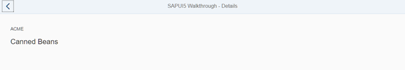

<!-- loio8ef57cfd37b44f089f7e3b52d56597eb -->

# Step 32: Routing Back and History

Now we can navigate to our detail page and display an invoice, but we cannot go back to the overview page yet. We'll add a back button to the detail page and implement a function that shows our overview page again.


## Preview

   
  
<a name="loio8ef57cfd37b44f089f7e3b52d56597eb__fig_r1j_pst_mr"/>A back button is now displayed on the detail page

  


## Coding

You can view and download all files at [Walkthrough - Step 32](https://ui5.sap.com/#/entity/sap.m.tutorial.walkthrough/sample/sap.m.tutorial.walkthrough.32).

```xml
<mvc:View
	controllerName="sap.ui.demo.walkthrough.controller.Detail"
	xmlns="sap.m"
	xmlns:mvc="sap.ui.core.mvc">
	<Page
		title="{i18n>detailPageTitle}"
		showNavButton="true"
		navButtonPress=".onNavBack">
		<ObjectHeader
			intro="{invoice>ShipperName}"
			title="{invoice>ProductName}"/>
	</Page>
</mvc:View>
```

On the detail page, we tell the control to display a back button by setting the parameter `showNavButton` to true and register an event handler that is called when the back button is pressed.


## webapp/controller/Detail.controller.js

```js
sap.ui.define([
	"sap/ui/core/mvc/Controller",
	"sap/ui/core/routing/History"
], function (Controller, History) {
	"use strict";

	return Controller.extend("sap.ui.demo.walkthrough.controller.Detail", {

		onInit: function () {
			var oRouter = this.getOwnerComponent().getRouter();
			oRouter.getRoute("detail").attachPatternMatched(this._onObjectMatched, this);
		},

		_onObjectMatched: function (oEvent) {
			this.getView().bindElement({
				path: "/" + window.decodeURIComponent(oEvent.getParameter("arguments").invoicePath),
				model: "invoice"
			});
		},

		onNavBack: function () {
			var oHistory = History.getInstance();
			var sPreviousHash = oHistory.getPreviousHash();

			if (sPreviousHash !== undefined) {
				window.history.go(-1);
			} else {
				var oRouter = this.getOwnerComponent().getRouter();
				oRouter.navTo("overview", {}, true);
			}
		}

	});
});

```

We load a new dependency that helps us to manage the navigation history from the `sap.ui.core.routing` namespace and add the implementation for the event handler to our detail page controller.

In the event handler we access the navigation history and try to determine the previous hash. In contrast to the browser history, we will get a valid result only if a navigation step inside our app has already happened. Then we will simply use the browser history to go back to the previous page. If no navigation has happened before, we can tell the router to go to our overview page directly. The third parameter `true` tells the router to replace the current history state with the new one since we actually do a back navigation by ourselves. The second parameter is an empty array \(`{}`\) as we do not pass any additional parameters to this route.

This implementation is a bit better than the browser’s back button for our use case. The browser would simply go back one step in the history even though we were on another page outside of the app. In the app, we always want to go back to the overview page even if we came from another link or opened the detail page directly with a bookmark. You can try it by loading the detail page in a new tab directly and clicking on the back button in the app, it will still go back to the overview page.


## Conventions

-   Add a path to go back to the parent page when the history state is unclear.


**Parent topic:** [Walkthrough](walkthrough-3da5f4b.md "In this tutorial we will introduce you to all major development paradigms of SAPUI5.")

**Next:** [Step 31: Routing with Parameters](step-31-routing-with-parameters-2366345.md "We can now navigate between the overview and the detail page, but the actual item that we selected in the overview is not displayed on the detail page yet. A typical use case for our app is to show additional information for the selected item on the detail page.")

**Previous:** [Step 33: Custom Controls](step-33-custom-controls-d12d2ee.md "In this step, we are going to extend the functionality of SAPUI5 with a custom control. We want to rate the product shown on the detail page, so we create a composition of multiple standard controls using the SAPUI5 extension mechanism and add some glue code to make them work nicely together. This way, we can reuse the control across the app and keep all related functionality in one module.")

