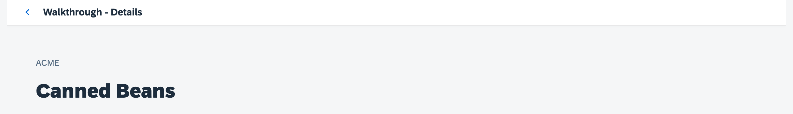

<!-- loioae61211b1bb744f7ab42731a37b7738c -->

# Step 32: Routing Back and History \(TypeScript\)

Now we can navigate to our detail page and display an invoice, but we cannot go back to the overview page yet. We'll add a back button to the detail page and implement a function that shows our overview page again.


## Preview

  
  
**A back button is now displayed on the detail page**




<a name="loioae61211b1bb744f7ab42731a37b7738c__section_l5n_zvm_tyb"/>

## Coding

You can view all files at [OpenUI5 TypeScript Walkthrough - Step 32: Routing Back and History](https://github.com/sap-samples/ui5-typescript-walkthrough/tree/main/steps/32) and [download the solution as a zip file](https://sap-samples.github.io/ui5-typescript-walkthrough/ui5-typescript-walkthrough-step-32.zip).


<a name="loioae61211b1bb744f7ab42731a37b7738c__section_nxm_dqv_4zb"/>

## webapp/controller/Detail.controller.ts

To be able to navigate from the detail view back to the view we came from, we implement a new event handler function in the controller of the detail view.

We load a new class called `History` from the `sap.ui.core.routing` namespace. This class provides methods for navigating through the history of the application.

In the event handler we access the navigation history and try to determine the previous hash. In contrast to the browser history, we will get a valid result only if a navigation step inside our app has already happened. The `History.getInstance()` method returns a singleton instance of the "History" class. Then, we use the `getPreviousHash` method to get the hash of the previous page. If there's a previous page \(i.e., `previousHash` isn't `undefined`\), we will simply use the browser history to go back to the previous page.

If no navigation has happened before, we get a reference to the router and use the `navTo` method to navigate to the "overview" route. As a second parameter we specify an empty array empty array \(`{}`\) as we do not pass any additional parameters to the route. The third parameter is set to `true`. This tells the router to replace the current history state with the new one since we actually do a back navigation by ourselves and don't want to have an entry in the browser history.

```js
import Controller from "sap/ui/core/mvc/Controller";
import UIComponent from "sap/ui/core/ UIComponent";
import { Route$PatternMatchedEvent } from "sap/ui/core/routing/Route";
import History from "sap/ui/core/routing/History";

/**
 * @namespace ui5.walkthrough.controller
 */
export default class Detail extends Controller {

    onInit(): void {
        const router = UIComponent.getRouterFor(this);
        router.getRoute("detail").attachPatternMatched(this.onObjectMatched, this);
    }

    onObjectMatched(event: Route$PatternMatchedEvent): void {
        this.getView().bindElement({
            path: "/" + window.decodeURIComponent( (event.getParameter("arguments") as any).invoicePath),
            model: "invoice"
        });
    }

    onNavBack(): void {
        const history = History.getInstance();
        const previousHash = history.getPreviousHash();

        if (previousHash !== undefined) {
            window.history.go(-1);
        } else {
            const router = UIComponent.getRouterFor(this);
            router.navTo("overview", {}, true);
        }
    }
};
```

This implementation is a bit better than the browser’s back button for our use case. The browser would simply go back one step in the history even though we were on another page outside of the app. In the app, we always want to go back to the overview page even if we came from another link or opened the detail page directly with a bookmark. You can try it by loading the detail page in a new tab directly and clicking on the back button in the app, it will still go back to the overview page.


<a name="loioae61211b1bb744f7ab42731a37b7738c__section_m5n_zvm_tyb"/>

## webapp/view/Detail.view.xml

Now only the back button is missing on the detail page. We do this by telling the page control on the view to display the back button using the control parameter `showNavButton` and register the event handler we defined in its controller to be called when the back button is pressed.

```xml
<mvc:View
	controllerName="ui5.walkthrough.controller.Detail"
	xmlns="sap.m"
	xmlns:mvc="sap.ui.core.mvc">
	<Page
		title="{i18n>detailPageTitle}"
		showNavButton="true"
		navButtonPress=".onNavBack">
		<ObjectHeader
			intro="{invoice>ShipperName}"
			title="{invoice>ProductName}"/>
	</Page>
</mvc:View>
```


## Conventions

-   Add a path to go back to the parent page when the history state is unclear.


**Related Information**  


[API Reference: `sap.m.routing.Router`](https://ui5.sap.com/#/api/sap.m.routing.Router)

[Samples: `sap.m.routing.Router` ](https://ui5.sap.com/#/entity/sap.m.routing.Router)

[API Reference: `sap.ui.core.routing.History`](https://ui5.sap.com/#/api/sap.ui.core.routing.History)

