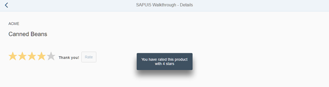

<!-- loiod12d2ee6a5454d799358d425f9e7c4db -->

# Step 33: Custom Controls

In this step, we are going to extend the functionality of SAPUI5 with a custom control. We want to rate the product shown on the detail page, so we create a composition of multiple standard controls using the SAPUI5 extension mechanism and add some glue code to make them work nicely together. This way, we can reuse the control across the app and keep all related functionality in one module.


## Preview

   
  
**A custom product rating control is added to the detail page**

  


## Coding

You can view and download all files at [Walkthrough - Step 33](https://ui5.sap.com/#/entity/sap.m.tutorial.walkthrough/sample/sap.m.tutorial.walkthrough.33).

```js
sap.ui.define([
	"sap/ui/core/Control"
], function (Control) {
	"use strict";
	return Control.extend("sap.ui.demo.walkthrough.control.ProductRating", {
		metadata : {
		},
		init : function () {
		},
		renderer : function (oRM, oControl) {
		}
	});
});
```

We create a new folder `control` and a file `ProductRating.js` that will hold our new control. As with our controllers and views, the custom control inherits the common control functionality from a SAPUI5 base object, for controls this is done by extending the base class `sap.ui.core.Control`.

Custom controls are small reuse components that can be created within the app very easily. Due to their nature, they are sometimes also referred to as "notepad” or “on the fly” controls. A custom control is a JavaScript object that has two special sections \(`metadata` and `renderer`\) and a number of methods that implement the functionality of the control.

The `metadata` section defines the data structure and thus the API of the control. With this meta information on the properties, events, and aggregations of the control SAPUI5 automatically creates setter and getter methods and other convenience functions that can be called within the app.

The renderer defines the HTML structure that will be added to the DOM tree of your app whenever the control is instantiated in a view. It is usually called initially by the core of SAPUI5 and whenever a property of the control is changed. The parameter `oRM` of the render function is the SAPUI5 render manager that can be used to write strings and control properties to the HTML page.

The `init` method is a special function that is called by the SAPUI5 core whenever the control is instantiated. It can be used to set up the control and prepare its content for display.

> ### Note:  
> Controls always extend `sap.ui.core.Control` and render themselves. You could also extend `sap.ui.core.Element` or `sap.ui.base.ManagedObject` directly if you want to reuse life cycle features of SAPUI5 including data binding for objects that are not rendered. Please refer to the API reference to learn more about the inheritance hierarchy of controls.

```js
sap.ui.define([
	"sap/ui/core/Control",
	"sap/m/RatingIndicator",
	"sap/m/Label",
	"sap/m/Button"

], function (Control, RatingIndicator, Label, Button) {
	"use strict";
	return Control.extend("sap.ui.demo.walkthrough.control.ProductRating", {
		metadata : {
			properties : {
				value: 	{type : "float", defaultValue : 0}
			},
			aggregations : {
				_rating : {type : "sap.m.RatingIndicator", multiple: false, visibility : "hidden"},
				_label : {type : "sap.m.Label", multiple: false, visibility : "hidden"},
				_button : {type : "sap.m.Button", multiple: false, visibility : "hidden"}
			},
			events : {
				change : {
					parameters : {
						value : {type : "int"}
					}
				}
			}
		},
		init : function () {
			this.setAggregation("_rating", new RatingIndicator({
				value: this.getValue(),
				iconSize: "2rem",
				visualMode: "Half",
				liveChange: this._onRate.bind(this)
			}));
			this.setAggregation("_label", new Label({
				text: "{i18n>productRatingLabelInitial}"
			}).addStyleClass("sapUiSmallMargin"));
			this.setAggregation("_button", new Button({
				text: "{i18n>productRatingButton}",
				press: this._onSubmit.bind(this)
			}).addStyleClass("sapUiTinyMarginTopBottom"));
		},

		setValue: function (fValue) {
			this.setProperty("value", fValue, true);
			this.getAggregation("_rating").setValue(fValue);
			
			return this;
		},

		reset: function () {
			var oResourceBundle = this.getModel("i18n").getResourceBundle();

			this.setValue(0);
			this.getAggregation("_label").setDesign("Standard");
			this.getAggregation("_rating").setEnabled(true);
			this.getAggregation("_label").setText(oResourceBundle.getText("productRatingLabelInitial"));
			this.getAggregation("_button").setEnabled(true);
		},

		_onRate : function (oEvent) {
			var oRessourceBundle = this.getModel("i18n").getResourceBundle();
			var fValue = oEvent.getParameter("value");

			this.setProperty("value", fValue, true);

			this.getAggregation("_label").setText(oRessourceBundle.getText("productRatingLabelIndicator", [fValue, oEvent.getSource().getMaxValue()]));
			this.getAggregation("_label").setDesign("Bold");
		},

		_onSubmit : function (oEvent) {
			var oResourceBundle = this.getModel("i18n").getResourceBundle();

			this.getAggregation("_rating").setEnabled(false);
			this.getAggregation("_label").setText(oResourceBundle.getText("productRatingLabelFinal"));
			this.getAggregation("_button").setEnabled(false);
			this.fireEvent("change", {
				value: this.getValue()
			});
		},
		renderer : function (oRm, oControl) {
			oRm.openStart("div", oControl);
			oRm.class("myAppDemoWTProductRating");
			oRm.openEnd();
			oRm.renderControl(oControl.getAggregation("_rating"));
			oRm.renderControl(oControl.getAggregation("_label"));
			oRm.renderControl(oControl.getAggregation("_button"));
			oRm.close("div");
		}
	});
});
```

We now enhance our new custom control with the custom functionality that we need. In our case we want to create an interactive product rating, so we define a value and use three internal controls that are displayed updated by our control automatically. A `RatingIndicator` control is used to collect user input on the product, a label is displaying further information, and a button submits the rating to the app to store it.

In the `metadata` section we therefore define several properties that we make use in the implementation:

-   Properties

    -   Value

        We define a control property `value` that will hold the value that the user selected in the rating. Getter and setter function for this property will automatically be created and we can also bind it to a field of the data model in the XML view if we like.


-   Aggregations

    As described in the first paragraph, we need three internal controls to realize our rating functionality. We therefore create three “hidden aggregations” by setting the `visibility` attribute to `hidden`. This way, we can use the models that are set on the view also in the inner controls and SAPUI5 will take care of the lifecycle management and destroy the controls when they are not needed anymore. Aggregations can also be used to hold arrays of controls but we just want a single control in each of the aggregations so we need to adjust the cardinality by setting the attribute `multiple` to `false`.

    -    `_rating`: A `sap.m.RatingIndicator` control for user input

    -    `_label`: A `sap.m.Label` to display additional information

    -    `_button`: A `sap.m.Button` to submit the rating


    > ### Note:  
    > You can define `aggregations` and `associations` for controls. The difference is in the relation between the parent and the related control:
    > 
    > -   An **aggregation** is a strong relation that also manages the lifecycle of the related control, for example, when the parent is destroyed, the related control is also destroyed. Also, a control can only be assigned to one single aggregation, if it is assigned to a second aggregation, it is removed from the previous aggregation automatically.
    > 
    > -   An **association** is a weak relation that does not manage the lifecycle and can be defined multiple times. To have a clear distinction, an association only stores the ID, whereas an aggregation stores the direct reference to the control. We do not specify associations in this example, as we want to have our internal controls managed by the parent.

-   Events

    -   Change

        We specify a `change` event that the control will fire when the rating is submitted. It contains the current value as an event parameter. Applications can register to this event and process the result similar to “regular” SAPUI5 controls, which are in fact built similar to custom controls.


In the `init` function that is called by SAPUI5 automatically whenever a new instance of the control is instantiated, we set up our internal controls. We instantiate the three controls and store them in the internal aggregation by calling the framework method `setAggregation` that has been inherited from `sap.ui.core.Control`. We pass on the name of the internal aggregations that we specified above and the new control instances. We specify some control properties to make our custom control look nicer and register a `liveChange` event to the rating and a press event to the button. The initial texts for the label and the button are referenced from our `i18n` model.

Let’s ignore the other internal helper functions and event handlers for now and define our renderer. With the help of the SAPUI5 render manager and the control instance that are passed on as a reference, we can now render the HTML structure of our control. We render the start of the outer `<div>` tag as `<div` and call the helper method `writeControlData` to render the ID and other basic attributes of the control inside the `div` tag. Next, we add a custom CSS class so that we can define styling rules for the custom control in our CSS file later. This CSS class and others that have been added in the view are then rendered by calling `writeClasses` on the renderer instance. Then we close the surrounding `div` tag and render three internal controls by passing the content of the internal aggregation to the render managers `renderControl` function. This will call the renderer of the controls and add their HTML to the page. Finally, we close our surrounding `<div>` tag.

The `setValue` is an overridden setter. SAPUI5 will generate a setter that updates the property value when called in a controller or defined in the XML view, but we also need to update the internal rating control in the hidden aggregation to reflect the state properly. Also, we can skip the rerendering of SAPUI5 that is usually triggered when a property is changed on a control by calling the `setProperty` method to update the control property with true as the third parameter.

Now we define the event handler for the internal rating control. It is called every time the user changes the rating. The current value of the rating control can be read from the event parameter value of the `sap.m.RatingIndicator` control. With the value we call our overridden setter to update the control state, then we update the `label` next to the rating to show the user which value he has selected currently and also displays the maximum value. The string with the placeholder values is read from the `i18n` model that is assigned to the control automatically.

Next, we have the `press` handler for the rating button that submits our rating. We assume that rating a product is a one-time action and first disable the rating and the button so that the user is not allowed to submit another rating. We also update the label to show a "Thank you for your rating!" message, then we fire the change event of the control and pass in the current value as a parameter so that applications that are listening to this event can react on the rating interaction.

We define the `reset` method to be able to revert the state of the control on the UI to its initial state so that the user can again submit a rating.


## webapp/view/Detail.view.xml

```xml
<mvc:View
	controllerName="sap.ui.demo.walkthrough.controller.Detail"
	xmlns="sap.m"
	xmlns:mvc="sap.ui.core.mvc"
	xmlns:wt="sap.ui.demo.walkthrough.control">
	<Page
		title="{i18n>detailPageTitle}"
		showNavButton="true"
		navButtonPress=".onNavBack">
		<ObjectHeader
			intro="{invoice>ShipperName}"
			title="{invoice>ProductName}"/>
		<wt:ProductRating id="rating" class="sapUiSmallMarginBeginEnd" change=".onRatingChange"/>
	</Page>
</mvc:View>

```

A new namespace `wt` is defined on the detail view so that we can reference our custom controls easily in the view. We then add an instance of the `ProductRating` control to our detail page and register an event handler for the change event. To have a proper layout, we also add a margin style class.


## webapp/controller/Detail.controller.js

```js
sap.ui.define([
	"sap/ui/core/mvc/Controller",
	"sap/ui/core/routing/History",
	"sap/m/MessageToast"

], function (Controller, History, MessageToast) {
	"use strict";

	return Controller.extend("sap.ui.demo.walkthrough.controller.Detail", {
		…
		_onObjectMatched: function (oEvent) {
			this.byId("rating").reset();
			this.getView().bindElement({
				path: "/" + window.decodeURIComponent(oEvent.getParameter("arguments").invoicePath),
				model: "invoice"
			});
		},

		onNavBack: function () {
			var oHistory = History.getInstance();
			var sPreviousHash = oHistory.getPreviousHash();

			if (sPreviousHash !== undefined) {
				window.history.go(-1);
			} else {
				var oRouter = this.getOwnerComponent().getRouter();
				oRouter.navTo("overview", {}, true);
			}
		},

		onRatingChange: function (oEvent) {
			var fValue = oEvent.getParameter("value");
			var oResourceBundle = this.getView().getModel("i18n").getResourceBundle();

			MessageToast.show(oResourceBundle.getText("ratingConfirmation", [fValue]));
		}
	});
});
```

In the `Detail` controller we load the dependency to the `sap.m.MessageToast` because we will simply display a message instead of sending the rating to the backend to keep the example simple. The event handler `onRatingChange` reads the value of our custom change event that is fired when the rating has been submitted. We then display a confirmation message with the value in a `MessageToast` control.

In the `onObjectMatched` private method, we call the `reset` method to make it possible to submit another rating as soon as the detail view is displayed for a different item.


## webapp/css/style.css

```
.myAppDemoWTmyCustomButton.sapMBtn {
	margin-right: 0.125rem;
}
.myAppDemoWTmyCustomText {
	font-weight: bold;
}
/*  ProductRating */
.myAppDemoWTProductRating {
	padding: 0.75rem;
}
.myAppDemoWTProductRating .sapMRI {
	vertical-align: initial;
}
```

To layout our control, we add a little padding to the root class to have some space around the three inner controls, and we override the alignment of the `RatingIndicator` control so that it is aligned in one line with the label and the button.

We could also do this with more HTML in the renderer but this is the simplest way and it will only be applied inside our custom control. However, please be aware that the custom control is in your app and might have to be adjusted when the inner controls change in future versions of SAPUI5.

```ini
…
# Detail Page
detailPageTitle=Walkthrough - Details
ratingConfirmation=You have rated this product with {0} stars

# Product Rating
productRatingLabelInitial=Please rate this product
productRatingLabelIndicator=Your rating: {0} out of {1}
productRatingLabelFinal=Thank you for your rating!
productRatingButton=Rate
```

The resource bundle is extended with the confirmation message and the strings that we reference inside the custom control. We can now rate a product on the detail page with our brand new control.


## Conventions

-   Put custom controls in the `control` folder of your app.


**Related Information**  


[Developing Controls](../09_Developing_Controls/developing-controls-8dcab00.md "You can create own content for SAPUI5. To develop controls in JavaScript, you can either extend existing controls or create new ones.")

[Defining the Control Metadata](../09_Developing_Controls/defining-the-control-metadata-7b52540.md "Control metadata consists of properties, events, as well as aggregations and associations.")

[API Reference: `sap.m.RatingIndicator`](https://ui5.sap.com/#/api/sap.m.RatingIndicator)

[Samples: `sap.m.RatingIndicator` ](https://ui5.sap.com/#/entity/sap.m.RatingIndicator)

[API Reference: `sap.m.Label`](https://ui5.sap.com/#/api/sap.m.Label)

[Samples: `sap.m.Label` ](https://ui5.sap.com/#/entity/sap.m.Label)

[API Reference: `sap.m.Button`](https://ui5.sap.com/#/api/sap.m.Button)

[Samples: `sap.m.Button` ](https://ui5.sap.com/#/entity/sap.m.Button)

[API Reference: `sap.ui.core.Control`](https://ui5.sap.com/#/api/sap.ui.core.Control)

[API Reference: `sap.ui.core.Element`](https://ui5.sap.com/#/api/sap.ui.core.Element)

[API Reference: `sap.ui.base.ManagedObject`](https://ui5.sap.com/#/api/sap.ui.base.ManagedObject)

