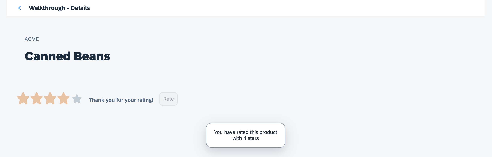

<!-- loio3cc020e232a2472c9f7fde2e99230633 -->

# Step 33: Custom Controls \(TypeScript\)

In this step, we are going to extend the functionality of SAPUI5 with a custom control. We want to rate the product shown on the detail page, so we create a composition of multiple standard controls using the SAPUI5 extension mechanism and add some glue code to make them work nicely together. This way, we can reuse the control across the app and keep all related functionality in one module.


## Preview

  
  
**A custom product rating control is added to the detail page**




<a name="loio3cc020e232a2472c9f7fde2e99230633__section_ylk_pbn_tyb"/>

## Coding

You can view all files at [OpenUI5 TypeScript Walkthrough - Step 33: Custom Controls](https://github.com/sap-samples/ui5-typescript-walkthrough/tree/main/steps/33) and [download the solution as a zip file](https://sap-samples.github.io/ui5-typescript-walkthrough/ui5-typescript-walkthrough-step-33.zip).


<a name="loio3cc020e232a2472c9f7fde2e99230633__section_bzj_rbn_tyb"/>

## webapp/i18n/i18n.properties

For our new product-rating custom control we will need some additional text resources: Firstly, we'll need some labels for the custom control, interacting with the user. Then we want to display a confirmation message on the detail page once a user has provided their rating.

```ini
…
# Detail Page
detailPageTitle=Walkthrough - Details
ratingConfirmation=You have rated this product with {0} stars

# Product Rating
productRatingLabelInitial=Please rate this product
productRatingLabelIndicator=Your rating: {0} out of {1}
productRatingLabelFinal=Thank you for your rating!
productRatingButton=Rate
```


<a name="loio3cc020e232a2472c9f7fde2e99230633__section_azj_rbn_tyb"/>

## webapp/css/style.css

To layout our new custom control, we specify some additional css. We create a root class `myAppDemoWTProductRating` that sets the padding to `0.75rem`. We will use this class to specify some space around our inner controls. In a second rule we reset the vertical alignment of controls with the class `sapMRI` assigned to inside controls with the class `myAppDemoWTProductRating` to the initial value. We will need this rule to align all the controls we use with our composition.

```
html[dir="ltr"] .myAppDemoWT .myCustomButton.sapMBtn {
    margin-right: 0.125rem
}
html[dir="rtl"] .myAppDemoWT .myCustomButton.sapMBtn {
    margin-left: 0.125rem
}
.myAppDemoWT .myCustomText {
    display: inline-block;
    font-weight: bold;
}
/*  ProductRating */
.myAppDemoWTProductRating {
    padding: 0.75rem;
}
.myAppDemoWTProductRating .sapMRI {
    vertical-align: initial;
}
```

We could also do this with more HTML in the renderer, but this is the simplest way and it will only be applied inside our custom control. However, please be aware that the custom control is in your app and might have to be adjusted when the inner controls change in future versions of SAPUI5.


<a name="loio3cc020e232a2472c9f7fde2e99230633__section_zlk_pbn_tyb"/>

## webapp/control/ProductRating.ts \(New\)

Custom controls are small reuse components that can be created within the app very easily. Due to their nature, they are sometimes also referred to as "notepad" or "on the fly" controls. A custom control is a script object that has two special sections \(`metadata` and `renderer`\) and a number of methods that implement the functionality of the control.

We create a new folder `control` and a file `ProductRating.ts` that will hold our new control.

We start with importing two classes, the `Control` and the `RenderManager` from the `sap/ui/core` module. These classes are part of the SAPUI5 framework and are used for creating controls and managing their rendering. We then declare the class . This property defines the data structure and thus the API of the control. With this metadata for the control's properties, events, and aggregations, `ProductRating` by extending the base class `sap.ui.core.Control`.

To add functionality to the control, we can provide meta information via a static property named `metadata`SAPUI5. This can automatically create setter and getter methods along with other convenience functions that can be used within the application. We'ill leave the `metadata` property empty for now.

The `init` function is a lifecycle function that is automatically called by the SAPUI5 framework when an instance of the control is created. We'll use this function to initialize the control and prepare its contents for display.

The `renderer` property is an object that determines how the control is rendered. It is invoked initially by the SAPUI5 framework, and also each time any property of the control is changed. The `renderer` object has two properties: `apiVersion` and `render`. The `apiVersion` property specifies the API version of the `RenderManager` that is used in this renderer. The `render` property is a method that takes two parameters: a `RenderManager` object and the control instance itself. We'll delve into the implementation of our control's rendering within this method at a later stage.

> ### Note:  
> The `RenderManager` is an important component in SAPUI5 that is responsible for converting abstract representations of controls into actual HTML elements that can be displayed in the browser. Different versions of the `RenderManager` API exist, each representing an evolution of the `RenderManager` with specific sets of APIs and rendering techniques. These different API versions are important to ensure compatibility between different versions of SAPUI5.
> 
> The latest version of the `RenderManager` API is Version 4, which introduces new features and improvements compared to previous versions. It also includes performance enhancements, making your applications run faster and more efficiently. For example, Version 4 avoids the re-rendering of child controls unless they are invalidated, which can save processing time.
> 
> When developing a custom control, it's crucial to specify the appropriate `apiVersion` for the control's renderer. This ensures that your control can can leverage the latest rendering features and improvements available in the `RenderManager`.

```js
import Control from "sap/ui/core/Control";
import RenderManager from "sap/ui/core/RenderManager";

/**
 * @namespace ui5.walkthrough.control
 */
export default class ProductRating extends Control {

	static readonly metadata: MetadataOptions = {
	
	}
	init(): void {
	
	}
	
	renderer = {  
		apiVersion: 4,
		render: (rm: RenderManager, control: ProductRating) => {
		}
	}
};
```

For now, the metadata section plus `init` and `render` function are empty. We will take care of this in the next step.

> ### Note:  
> Controls always extend `sap.ui.core.Control` and render themselves. You could also extend `sap.ui.core.Element` or `sap.ui.base.ManagedObject` directly if you want to reuse life cycle features of SAPUI5 including data binding for objects that are not rendered. Please refer to the API reference to learn more about the inheritance hierarchy of controls.


<a name="loio3cc020e232a2472c9f7fde2e99230633__section_bvh_qbn_tyb"/>

## webapp/control/ProductRating.ts

We now enhance our new custom control with the custom functionality that we need. In our case we want to create an interactive product rating, so we define a value and use three internal controls that are displayed updated by our control automatically. A `RatingIndicator` control is used to collect user input on the product, a label is displaying further information, and a button submits the rating to the app to store it.

In the `metadata` section we therefore define several properties that we make use in the implementation \(for details on individual metadata properties, see [MetadataOptions](https://ui5.sap.com/#/api/sap.ui.base.ManagedObject.MetadataOptions)\):

-   Properties

    -   Value

        We define a control property `value` that will hold the value that the user selected in the rating. Getter and setter function for this property will automatically be created and we can also bind it to a field of the data model in the XML view if we like.


-   Aggregations

    As described in the first paragraph, we need three internal controls to realize our rating functionality. We therefore create three "hidden aggregations" by setting the `visibility` attribute to `hidden`. This way, we can use the models that are set on the view also in the inner controls and SAPUI5 will take care of the lifecycle management and destroy the controls when they are not needed anymore. Aggregations can also be used to hold arrays of controls but we just want a single control in each of the aggregations so we need to adjust the cardinality by setting the attribute `multiple` to `false`.

    -   `_rating`: A `sap.m.RatingIndicator` control for user input

    -   `_label`: A `sap.m.Label` to display additional information

    -   `_button`: A `sap.m.Button` to submit the rating


    > ### Note:  
    > You can define `aggregations` and `associations`
    > 
    > -   An **aggregation** is a strong relation that also manages the lifecycle of the related control, for example, when the parent is destroyed, the related control is also destroyed. Also, a control can only be assigned to one single aggregation, if it is assigned to a second aggregation, it is removed from the previous aggregation automatically.
    > 
    > -   An **association** is a weak relation that does not manage the lifecycle and can be defined multiple times. To have a clear distinction, an association only stores the ID, whereas an aggregation stores the direct reference to the control. We do not specify associations in this example, as we want to have our internal controls managed by the parent.

-   Events

    -   Change

        We specify a `change` event that the control will fire when the rating is submitted. It contains the current value as an event parameter. Applications can register to this event and process the result similar to "regular" SAPUI5 controls, which are in fact built similar to custom controls.


In the `init` function that is called by SAPUI5 automatically whenever a new instance of the control is instantiated, we set up our internal controls. We instantiate the three controls and store them in the internal aggregation by calling the framework method `setAggregation` that has been inherited from `sap.ui.core.Control`. We pass on the name of the internal aggregations that we specified above and the new control instances. We specify some control properties to make our custom control look nicer and register a `liveChange` event to the rating and a press event to the button. The initial texts for the label and the button are referenced from our `i18n` model.

Let's ignore the other internal helper functions and event handlers for now and define our renderer. By using the APIs of the `RenderManager` and the control instance that are passed as references, we can describe the necessary HTML for our control. To open a new HTML tag we use the `openStart` method and pass `"div"` as the HTML element to be created. We also pass our control instance \(`ProductRating`\) to be associated with the HTML tag. The RenderManager will automatically generate the properties for the control and assign it to the `div` tag. After calling `openStart`, we can chain additional methods to set attributes or styles for the element. To set `myAppDemoWTProductRating` as our custom CSS class for the `div` element, we use the `class` method. If a `tooltip` exists, we call the `attr` method to set the `title` attribute with the value of the tooltip for the `div` element. Finally, we close the surrounding `div` tag by calling `openEnd`.

> ### Note:  
> Since our custom control extends the `sap.ui.core.Control` class, it also inherits its properties and aggregations. In this case, the `tooltip` property is defined in the `sap.ui.core.Element` class, which is inherited by the `sap.ui.core.Control` class. Therefore, your custom control also inherits this aggregation. However, controls must explicitly support tooltips as they have to render them.

Next, we render the three child controls we defined in the aggregation of our `ProductRating` control. We retrieve the child controls using the `getAggregation` method with the aggregation name as parameter. The `renderControl` method is then called on each child control to render them. Finally, we close the element by calling the `close` method on the `RenderManager` and passing the `"div"` element name as argument. This completes the rendering of the custom control.

The `setValue` is an overridden setter. SAPUI5 will generate a setter that updates the property value when called in a controller or defined in the XML view, but we also need to update the internal rating control in the hidden aggregation to reflect the state properly. Also, we can skip the rerendering of SAPUI5 that is usually triggered when a property is changed on a control by calling the `setProperty` method to update the control property with true as the third parameter.

Now we define the event handler for the internal rating control. It is called every time the user changes the rating. The current value of the rating control can be read from the event parameter value of the `sap.m.RatingIndicator` control. With the value we call the `setProperty` method to update the control state, then we update the `label` next to the rating to show the user which value he has selected currently and also displays the maximum value. The string with the placeholder values is read from the `i18n` model that is assigned to the control automatically.

Next, we have the `press` handler for the rating button that submits our rating. We assume that rating a product is a one-time action and first disable the rating and the button so that the user is not allowed to submit another rating. We also update the label to show a "Thank you for your rating!" message, then we fire the change event of the control and pass in the current value as a parameter so that applications that are listening to this event can react on the rating interaction.

We define the `reset` method to be able to revert the state of the control on the UI to its initial state so that the user can again submit a rating.

```js
import Control from "sap/ui/core/Control";
import RenderManager from "sap/ui/core/RenderManager";
import { MetadataOptions } from "sap/ui/core/Element";
import Label from "sap/m/Label";
import Button, { Button$PressEvent } from "sap/m/Button";
import RatingIndicator, { RatingIndicator$LiveChangeEvent } from "sap/m/RatingIndicator";
import ResourceBundle from "sap/base/i18n/ResourceBundle";
import ResourceModel from "sap/ui/model/resource/ResourceModel";

/**
 * @namespace ui5.walkthrough.control
 */
export default class ProductRating extends Control {

	static readonly metadata: MetadataOptions = {
		properties: {
			value: {
				type: "float",
				defaultValue: 0
			}
		},
		aggregations: {
			_rating: {
				type: "sap.m.RatingIndicator", 
				multiple: false,
				visibility: "hidden"
			},
			_label: {
				type: "sap.m.Label", 
				multiple: false,
				visibility: "hidden"
			},
			_button: {
				type: "sap.m.Button",
				multiple: false,
				visibility: "hidden"
			} 
		},
		events: {
			change: {
				parameters: {
					"value": "int"
				}
			}
		}
	}
	
	init(): void {
		this.setAggregation("_rating", new RatingIndicator({
			value: this.getValue(),
			iconSize: "2rem",
			liveChange: this._onRate.bind(this)
		}));
		this.setAggregation("_label", new Label({
			text: "{i18n>productRatingLabelInitial}"
		}).addStyleClass("sapUiSmallMargin"));
		this.setAggregation("_button", new Button({
			text: "{i18n>productRatingButton}",
			press: this._onSubmit.bind(this)
		}).addStyleClass("sapUiTinyMarginTopBottom"));
	}

	setValue(value: "float" ): ProductRating {
		this.setProperty("value", value, true);
		(this.getAggregation("_rating") as RatingIndicator).setValue(value);
		return this;		
	}
	
	reset(): void {
		const resourceBundle = (this?.getModel("i18n") as ResourceModel)?.getResourceBundle() as ResourceBundle;
		
		this.setValue(0);
		(this.getAggregation("_label") as Label).setDesign("Standard");
		(this.getAggregation("_rating") as RatingIndicator).setEnabled(true);
		(this.getAggregation("_label") as Label).setText(resourceBundle.getText("productRatingLabelInitial"));
		(this.getAggregation("_button") as Button).setEnabled(true);
	}
	
	_onRate(event: RatingIndicator$LiveChangeEvent): void {
		const resourceBundle = (this?.getModel("i18n") as ResourceModel)?.getResourceBundle() as ResourceBundle;
		const value = event.getParameter("value");
		
		this.setProperty("value", value, true);
		
		(this.getAggregation("_label") as Label).setText(resourceBundle.getText("productRatingLabelIndicator", [value, (event.getSource() as RatingIndicator).getMaxValue()]));
		(this.getAggregation("_label") as Label).setDesign("Bold");
	}
	
	_onSubmit(event: Button$PressEvent): void {
		const resourceBundle = (this?.getModel("i18n") as ResourceModel)?.getResourceBundle() as ResourceBundle;
		
		(this.getAggregation("_rating") as RatingIndicator).setEnabled(false);
		(this.getAggregation("_label") as Label).setText(resourceBundle.getText("productRatingLabelFinal"));
		(this.getAggregation("_button") as Button).setEnabled(false);
		this.fireEvent("change", {
			value: this.getValue()
		})
	}
	
	renderer = {  
		apiVersion: 4,
		render: (rm: RenderManager, control: ProductRating) => {
			const tooltip = control.getTooltip_AsString();
			rm.openStart("div", control);
			rm.class("myAppDemoWTProductRating");
			if (tooltip) {
				rm.attr("title", tooltip);
			}
			rm.openEnd();
			rm.renderControl(control.getAggregation("_rating") as Control);
			rm.renderControl(control.getAggregation("_label") as Control);
			rm.renderControl(control.getAggregation("_button") as Control);
			rm.close("div");
		}
	}
};
```


<a name="loio3cc020e232a2472c9f7fde2e99230633__section_s2z_hkw_4zb"/>

## Generate Control Interfaces to Resolve the TypeScript Errors

While the application would run successfully, the editor still displays an error in the `ProductRating.ts` renderer.

The solution is to use the [ts-interface-generator](https://www.npmjs.com/package/@ui5/ts-interface-generator), a small tool that scans the project for any controls \(as well as other subclasses of `sap.ui.ManagedObject`\) and generates TypeScript interface definitions declaring those generated methods:

-   Open a new terminal window in your app root folder and execute `npm install @ui5/ts-interface-generator --save-dev` to install this package as a new development dependency in your `package.json`.

-   Run `ui5 serve`. This starts the interface generator tool in "watch" mode and creates the required interface definition \(after a short startup delay during which all existing types in the project and in UI5 are scanned\).


You can inspect the generated file `webapp/control/ProductRating.gen.d.ts` next to the control implementation. It defines an interface with the same name as the control class and declares the same module name. This causes [TypeScript to merge the definitions](https://www.typescriptlang.org/docs/handbook/declaration-merging.html) and to assume that the interface methods also exist in the class.

As a result, the TypeScript error message related to the new `ProductRating` control is gone and code completion is also available for all control API methods.

You can now stop the interface generator again, as no further control API changes will be done in this tutorial. For continuous control development with frequent API changes, you would likely add a "watch" script to `package.json` for starting this generator.


<a name="loio3cc020e232a2472c9f7fde2e99230633__section_a4x_1kw_4zb"/>

## webapp/controller/Detail.controller.ts

In the `Detail` controller we implement a new `onRatingChange` event that reads the value of our coustom change event that is fired when a rating has been submitted. This requires to import our new control, as well as the `ProductRating$ChangeEvent` type we just defined to the detail controller. To keep the sample simple we only display a message message instead of sending the rating to the back end. We therefore load the `MessageToast` module from the `sap.m` namespace to our script. In addition we need the `ResourceBundle` module from the `sap/base/i18n` namespace as well as the `ResourceModel` module from the `sap/ui/model/resource` namespace, as we want to display the confirmation message we specified in our resource bundle in the message toast.

In the `onRatingChange` event handler we extract the value of our custom change event that is fired when the rating has been submitted. We then display the confirmation message we defined in our resource bundle with the rating value in a `MessageToast` control.

In the `onObjectMatched` method, we call the `reset` method to make it possible to submit another rating as soon as the detail view is displayed for a different item.

```js
import Controller from "sap/ui/core/mvc/Controller";
import UIComponent from "sap/ui/core/ UIComponent";
import { Route$PatternMatchedEvent } from "sap/ui/core/routing/Route";
import History from "sap/ui/core/routing/History";
import MessageToast from "sap/m/MessageToast";
import ProductRating, { ProductRating$ChangeEvent } from "../control/ProductRating";
import ResourceBundle from "sap/base/i18n/ResourceBundle";
import ResourceModel from "sap/ui/model/resource/ResourceModel";

/**
 * @namespace ui5.walkthrough.controller
 */
export default class Detail extends Controller {

    onInit(): void {
        const router = UIComponent.getRouterFor(this);
        router.getRoute("detail").attachPatternMatched(this.onObjectMatched, this);
    }
	
    onObjectMatched(event: Route$PatternMatchedEvent): void {
    
        (<ProductRating> this.byId("rating")).reset();
        this.getView().bindElement({
            path: "/" + window.decodeURIComponent((<any> event.getParameter("arguments")).invoicePath),
            model: "invoice"
        });
    }
	
    onNavBack(): void {
        const history = History.getInstance();
        const previousHash = history.getPreviousHash();
		
        if (previousHash !== undefined) {
            window.history.go(-1);
        } else {
            const router = UIComponent.getRouterFor(this);
            router.navTo("overview", {}, true);
        }
    }    
   
    onRatingChange(event: ProductRating$ChangeEvent): void {
        const value = event.getParameter("value");
        const resourceBundle = <ResourceBundle> (<ResourceModel> this?.getView().getModel("i18n"))?.getResourceBundle();
		
        MessageToast.show(resourceBundle.getText("ratingConfirmation", [value]));
    }
};
```


## webapp/view/Detail.view.xml

All we need now is to add our new control to the detail view. To do so we must add a new namespace `wt`on the view so that we can reference our custom controls easily in the view. We then add an instance of the `ProductRating` control to our detail page and register our event handler for the change event. As we want to reset the value when navigating away, we need to assign an ID to the control. To have a proper layout, we also add a margin style class.

```xml
<mvc:View
	controllerName="ui5.walkthrough.controller.Detail"
	xmlns="sap.m"
	xmlns:mvc="sap.ui.core.mvc"
	xmlns:wt="ui5.walkthrough.control">
	<Page
		title="{i18n>detailPageTitle}"
		showNavButton="true"
		navButtonPress=".onNavBack">
		<ObjectHeader
			intro="{invoice>ShipperName}"
			title="{invoice>ProductName}"/>
		<wt:ProductRating 
			id="rating"
			tooltip="{invoice>ProductName}"
			class="sapUiSmallMarginBeginEnd" 
			change=".onRatingChange"/>
	</Page>
</mvc:View>

```

We can now rate a product on the detail page with our brand new control.


<a name="loio3cc020e232a2472c9f7fde2e99230633__section_zpb_2kw_4zb"/>

## webapp/control/ProductRating.ts

When opening the detail page you'll see the following note in the console informing you that there is still something missing in our `ProductRating` script:

```
NOTE:
Class ProductRating in file [..]/webapp/control/ProductRating.ts needs to contain the following constructors,
in order to make TypeScript aware of the possible constructor settings. 
Please copy&paste the block manually, as the ts-interface-generator will not touch your source files:
===== BEGIN =====
// The following three lines were generated and should remain as-is  
// to make TypeScript aware of the constructor signatures
constructor(idOrSettings?: string | $ProductRatingSettings);
constructor(id?: string, settings?: $ProductRatingSettings);
constructor(id?: string, settings?: $ProductRatingSettings) { super(id, settings); }
===== END =====
```

To complete the setup of the generated interface, we follow the instructions and add the block between the BEGIN and END line into the `ProductRating` class body in the file `webapp/control/ProductRating.ts`.

```js
import Control from "sap/ui/core/Control";
import RenderManager from "sap/ui/core/RenderManager";
import { MetadataOptions } from "sap/ui/core/Element";
import Label from "sap/m/Label";
import Button, { Button$PressEvent } from "sap/m/Button";
import RatingIndicator, { RatingIndicator$LiveChangeEvent } from "sap/m/RatingIndicator";
import ResourceBundle from "sap/base/i18n/ResourceBundle";
import ResourceModel from "sap/ui/model/resource/ResourceModel";

/**
 * @namespace ui5.walkthrough.control
 */
export default class ProductRating extends Control {

	// The following three lines were generated and should remain as-is 
	// to make TypeScript aware of the constructor signatures
	constructor(idOrSettings?: string | $ProductRatingSettings);
	constructor(id?: string, settings?: $ProductRatingSettings);
	constructor(id?: string, settings?: $ProductRatingSettings) { super(id, settings); }	
    ...
```

Adding the block at this position provides the constructors and the structure of the constructor settings object. As result, the constructor signatures with and without control ID are available. Furthermore, TypeScript checks the settings you give in the constructor and suggests the available ones, like the direction property.


## Conventions

-   Put custom controls in the `control` folder of your app.


**Related Information**  


[Developing Controls](../09_Developing_Controls/developing-controls-8dcab00.md "You can create own content for SAPUI5. To develop controls in JavaScript, you can either extend existing controls or create new ones.")

[Defining the Control Metadata](../09_Developing_Controls/defining-the-control-metadata-7b52540.md "Control metadata consists of properties, events, as well as aggregations and associations.")

[init\(\) Method](../09_Developing_Controls/init-method-6d6b5bd.md "The init() method can be used to set up, for example, internal variables or subcontrols of a composite control.")

[API Reference: `sap.ui.core.ControlRenderer`](https://ui5.sap.com/#/api/sap.ui.core.ControlRenderer)

[Renderer Object](../09_Developing_Controls/renderer-object-c9ab345.md "The renderer object is responsible for creating the HTML structure for the control.")

[API Reference: `sap.ui.core.RenderManager`](https://ui5.sap.com/#/api/sap.ui.core.RenderManager)

[Blog: UI5 Rendering: The Next Big Step Towards a Better Performance](https://blogs.sap.com/2023/04/05/the-next-innovation-of-ui5-rendering/)

[API Reference: `sap.m.RatingIndicator`](https://ui5.sap.com/#/api/sap.m.RatingIndicator)

[Samples: `sap.m.RatingIndicator` ](https://ui5.sap.com/#/entity/sap.m.RatingIndicator)

[API Reference: `sap.m.Label`](https://ui5.sap.com/#/api/sap.m.Label)

[Samples: `sap.m.Label` ](https://ui5.sap.com/#/entity/sap.m.Label)

[API Reference: `sap.m.Button`](https://ui5.sap.com/#/api/sap.m.Button)

[Samples: `sap.m.Button` ](https://ui5.sap.com/#/entity/sap.m.Button)

[API Reference: `sap.ui.core.Control`](https://ui5.sap.com/#/api/sap.ui.core.Control)

[API Reference: `sap.ui.core.Element`](https://ui5.sap.com/#/api/sap.ui.core.Element)

[Event Handler Methods](../09_Developing_Controls/event-handler-methods-bdf3e98.md "Event handler methods are invoked when an event occurs. Method names starting with on are reserved for event handler methods.")

[API Reference: `sap.ui.base.ManagedObject`](https://ui5.sap.com/#/api/sap.ui.base.ManagedObject)

[NPM Package: `ui5/ts-interface-generator`](https://www.npmjs.com/package/@ui5/ts-interface-generator)

[TypeScript: Declaration Merging](https://www.typescriptlang.org/docs/handbook/declaration-merging.html)

