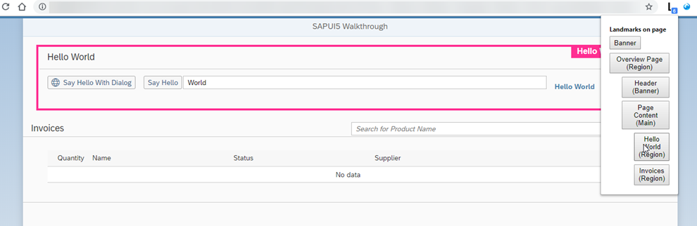
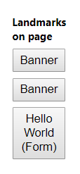
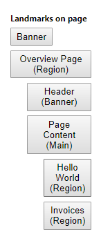

<!-- loioff7cab1f271a4181a86e5aa5c2f8d421 -->

# Step 37: Accessibility

As the last step in this tutorial, we are going to improve the accessibility of our app.

To achieve this, we will add ARIA attributes. ARIA attributes are used by screen readers to recognize the application structure and to interpret UI elements properly. That way, we can make our app more accessible for users who are limited in their use of computers, for example visually impaired persons. The main goal here is to make our app usable for as many people as we can.

> ### Tip:  
> ARIA is short for **Accessible Rich Internet Applications**. It is a set of attributes that enable us to make apps more accessible by assigning semantic characteristics to certain elements. For more information, see [Accessible Rich Internet Applications \(ARIA\) – Part 1: Introduction](https://blogs.sap.com/2015/06/01/accessible-rich-internet-applications-aria-part-1-introduction/).


<a name="loioff7cab1f271a4181a86e5aa5c2f8d421__section_xpr_2ls_gfb"/>

## Preview

   
  
<a name="loioff7cab1f271a4181a86e5aa5c2f8d421__fig_qnj_x4b_hfb"/>Landmarks in our app

  


<a name="loioff7cab1f271a4181a86e5aa5c2f8d421__section_mxx_3ls_gfb"/>

## Coding

You can view and download all files at [Walkthrough - Step 37](https://ui5.sap.com/#/sample/sap.m.tutorial.walkthrough.37/preview).

One part of the ARIA attribute set are the so-called landmarks. You can compare landmarks to maps in that they help the user navigate through an app. For this step, we will use Google Chrome with a free [landmark navigation extension](https://chrome.google.com/webstore/detail/landmark-navigation-via-k/ddpokpbjopmeeiiolheejjpkonlkklgp) We will now add meaningful landmarks to our code.


<a name="loioff7cab1f271a4181a86e5aa5c2f8d421__section_ygj_1b1_hfb"/>

## webapp/view/Overview.view.xml

```xml
<mvc:View
	controllerName="sap.ui.demo.walkthrough.controller.App"
	xmlns="sap.m"
	xmlns:mvc="sap.ui.core.mvc">
	<Page title="{i18n>homePageTitle}">
		<landmarkInfo>
			<PageAccessibleLandmarkInfo
				rootRole="Region"
				rootLabel="{i18n>Overview_rootLabel}"
				contentRole="Main"
				contentLabel="{i18n>Overview_contentLabel}"
				headerRole="Banner"
				headerLabel="{i18n>Overview_headerLabel}"/>
		</landmarkInfo>
		<headerContent>
			…
		</headerContent>
		<content>
			…
		</content>
	</Page>
</mvc:View>
 

```

We use `sap.m.PageAccessibleLandmarkInfo` to define ARIA roles and labels for the overview page areas. For more information, see the [API Reference: `sap.m.PageAccessibleLandmarkInfo`](https://ui5.sap.com/#/api/sap.m.PageAccessibleLandmarkInfo). 


<a name="loioff7cab1f271a4181a86e5aa5c2f8d421__section_uw5_zns_gfb"/>

## webapp/view/InvoiceList.view.xml

```xml
<mvc:View
	controllerName="sap.ui.demo.walkthrough.controller.InvoiceList"
	xmlns="sap.m"
	xmlns:mvc="sap.ui.core.mvc">
	<Panel accessibleRole="Region">
		<headerToolbar>
			<Toolbar>
				<Title text="{i18n>invoiceListTitle}"/>
				<ToolbarSpacer/>
				<SearchField
					width="50%"
					search=".onFilterInvoices"
					ariaLabelledBy="searchFieldLabel"
					ariaDescribedBy="searchFieldDescription"
					placeholder="{i18n>searchFieldPlaceholder}"/>
			</Toolbar>
		</headerToolbar>
		<Table
			id="invoiceList"
			class="sapUiResponsiveMargin"
			width="auto"
			items="{
				path : 'invoice>/Invoices',
				sorter : {
					path : 'ShipperName',
					group : true
				}
			}">
			<columns>
				<Column
					hAlign="End"


	…
			</columns>
		</Table>
	</Panel>
</mvc:View>

```

We add a `sap.m.Panel` around the invoice list, and we move the toolbar from the table into the panel so the region can take the title of the toolbar as its own. This has the effect that it will now be a region in our landmarks.


<a name="loioff7cab1f271a4181a86e5aa5c2f8d421__section_qdh_k4s_gfb"/>

## webapp/view/HelloPanel.view.xml

```xml
<mvc:View
	controllerName="sap.ui.demo.walkthrough.controller.HelloPanel"
	xmlns="sap.m"
	xmlns:mvc="sap.ui.core.mvc">
	<Panel
		headerText="{i18n>helloPanelTitle}"
		class="sapUiResponsiveMargin"
		width="auto"
		expandable="{device>/system/phone}"
		expanded="{= !${device>/system/phone} }"
		accessibleRole="Region">	
		…
	</Panel>
</mvc:View>

```

In this view, we already have a panel, so we just add the `accessibleRole` attribute.


> ### Note:  
> To add ARIA roles, labels and panels to other views, for example your `Detail.view.xml`, you can follow the same pattern. We won't go into detail in this tutorial step, but if you're interested, simply download the tutorial code and take a look at the `Detail.view.xml`.


<a name="loioff7cab1f271a4181a86e5aa5c2f8d421__section_azh_fps_gfb"/>

## webapp/i18n/i18n.properties

```ini
...
#Overview Page
Overview_rootLabel=Overview Page
Overview_headerLabel=Header
Overview_contentLabel=Page Content
ratingTitle=Rate the Product
...
```

Here, we add the text for the rating panel title and the labels for the ARIA regions to the text bundle.


<a name="loioff7cab1f271a4181a86e5aa5c2f8d421__section_yxf_3qs_gfb"/>

## Result


<table>
<tr>
<td valign="top">




</td>
<td valign="top">




</td>
</tr>
<tr>
<td valign="top">

**Landmarks on the overview page - before**


</td>
<td valign="top">

**Landmarks on the overview page - after**


</td>
</tr>
</table>

As you can see, we now have four landmarks on our page. The top three landmarks structure our page:

-   *Overview Page* marks the complete page.

-   *Header* marks the page title.

-   *Page Content* marks the content of our page. This landmark already has two children.


<a name="loioff7cab1f271a4181a86e5aa5c2f8d421__section_u12_lby_tfb"/>

## Congratulations!

You've completed the walkthrough, good job! You should be familiar with all major development paradigms of SAPUI5 now. Our other tutorials focus on certain aspects of SAPUI5, so feel free to explore!

**Related Information**  


[Accessibility](../05_Developing_Apps/accessibility-03b914b.md "In this guide we cover the most important accessibility aspects for application development, based on SAPUI5.")

[Screen Reader Support for SAPUI5 Controls](../04_Essentials/screen-reader-support-for-sapui5-controls-656e825.md "SAPUI5 offers screen reader support in order to aid people with visual impairments. The implementation is based on the ARIA and HTML standards.")

