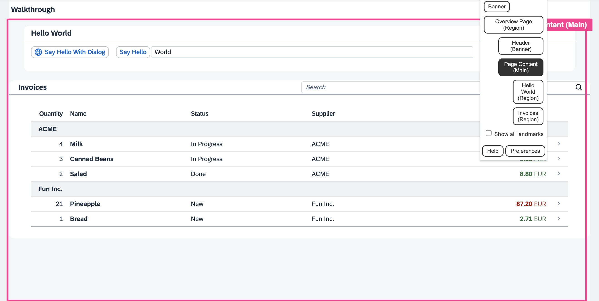

<!-- loio5a74cea49f5f446298b85ac248871a0b -->

# Step 37: Accessibility \(TypeScript\)

In this step we're going to improve the accessibility of our app.

To achieve this, we will add ARIA attributes. ARIA attributes are used by screen readers to recognize the application structure and to interpret UI elements properly. That way, we can make our app more accessible for users who are limited in their use of computers, for example visually impaired persons. The main goal here is to make our app usable for as many people as we can.

> ### Tip:  
> ARIA is short for **Accessible Rich Internet Applications**. It is a set of attributes that enable us to make apps more accessible by assigning semantic characteristics to certain elements. For more information, see [Accessible Rich Internet Applications \(ARIA\) – Part 1: Introduction](https://blogs.sap.com/2015/06/01/accessible-rich-internet-applications-aria-part-1-introduction/).


<a name="loio5a74cea49f5f446298b85ac248871a0b__section_xpr_2ls_gfb"/>

## Preview

  
  
**Landmarks in our app**




<a name="loio5a74cea49f5f446298b85ac248871a0b__section_mxx_3ls_gfb"/>

## Coding

You can view all files at [OpenUI5 TypeScript Walkthrough - Step 37: Accessibility](https://github.com/sap-samples/ui5-typescript-walkthrough/tree/main/steps/37) and [download the solution as a zip file](https://sap-samples.github.io/ui5-typescript-walkthrough/ui5-typescript-walkthrough-step-37.zip).

One part of the ARIA attribute set are the so-called landmarks. You can compare landmarks to maps in that they help the user navigate through an app. For this step, we will use Google Chrome with a free [landmark navigation extension](https://chrome.google.com/webstore/detail/landmark-navigation-via-k/ddpokpbjopmeeiiolheejjpkonlkklgp) We will now add meaningful landmarks to our code.


<a name="loio5a74cea49f5f446298b85ac248871a0b__section_azh_fps_gfb"/>

## webapp/i18n/i18n.properties

We add the labels we will need for the ARIA regions in the ovierview iew to the text bundle.

```ini
# App Descriptor
appTitle=Hello World
appDescription=A simple walkthrough app that explains the most important concepts of UI5

#Overview Page
Overview_rootLabel=Overview Page
Overview_headerLabel=Header
Overview_contentLabel=Page Content

# Hello Panel
...
```


<a name="loio5a74cea49f5f446298b85ac248871a0b__section_ygj_1b1_hfb"/>

## webapp/view/Overview.view.xml

We add the `landmarkInfo` aggregation to the page and use `sap.m.PageAccessibleLandmarkInfo` to define ARIA roles and labels for the overview page areas. In the `PageAccessibilityLandmarkInfo` control we specify a role and a title for the root, the content, and the header of the page.

For more information, see the [API Reference: `sap.m.PageAccessibleLandmarkInfo`](https://ui5.sap.com/#/api/sap.m.PageAccessibleLandmarkInfo). 

```xml
<mvc:View
	controllerName="ui5.walkthrough.controller.App"
	xmlns="sap.m"
	xmlns:mvc="sap.ui.core.mvc"
	displayBlock="true">
	<Page title="{i18n>homePageTitle}">
		<landmarkInfo>
			<PageAccessibleLandmarkInfo
				rootRole="Region"
				rootLabel="{i18n>Overview_rootLabel}"
				contentRole="Main"
				contentLabel="{i18n>Overview_contentLabel}"
				headerRole="Banner"
				headerLabel="{i18n>Overview_headerLabel}"/>
		</landmarkInfo>
		<content>
			<mvc:XMLView viewName="ui5.walkthrough.view.HelloPanel"/>
			<mvc:XMLView viewName="ui5.walkthrough.view.InvoiceList"/>
		</content>
	</Page>
</mvc:View>
```


<a name="loio5a74cea49f5f446298b85ac248871a0b__section_uw5_zns_gfb"/>

## webapp/view/InvoiceList.view.xml

We add an `sap.m.Panel` around the invoice list and move the toolbar from the table into the panel, so that the region can take the title of the toolbar as its own. This has the effect that it will now be a region in our landmarks.

```xml
<mvc:View
	controllerName="ui5.walkthrough.controller.InvoiceList"
	xmlns="sap.m"
	xmlns:mvc="sap.ui.core.mvc">
	<Panel accessibleRole="Region">
		<headerToolbar>
			<Toolbar>
				<Title text="{i18n>invoiceListTitle}"/>
				<ToolbarSpacer/>
				<SearchField
					width="50%"
					search=".onFilterInvoices"/>
			</Toolbar>
		</headerToolbar>
		<Table
			id="invoiceList"
			class="sapUiResponsiveMargin"
			width="auto"
			items="{
				path : 'invoice>/Invoices',
				sorter : {
					path : 'ShipperName',
					group : true
				}
			}">
			<columns>
				<Column
					hAlign="End"
					...
			</columns>
			...
		</Table>
	</Panel>
</mvc:View>
```


<a name="loio5a74cea49f5f446298b85ac248871a0b__section_qdh_k4s_gfb"/>

## webapp/view/HelloPanel.view.xml

In the `HelloPanel` view, we already have a panel, so we just add the `accessibleRole` attribute.

```xml
<mvc:View
	controllerName="ui5.walkthrough.controller.HelloPanel"
	xmlns="sap.m"
	xmlns:mvc="sap.ui.core.mvc">
	<Panel
		headerText="{i18n>helloPanelTitle}"
		class="sapUiResponsiveMargin"
		width="auto"
		expandable="{device>/system/phone}"
		expanded="{= !${device>/system/phone} }"
		accessibleRole="Region">	
		…
	</Panel>
</mvc:View>

```


<a name="loio5a74cea49f5f446298b85ac248871a0b__section_yxf_3qs_gfb"/>

## Result


<table>
<tr>
<td valign="top">


</td>
<td valign="top">


</td>
</tr>
<tr>
<td valign="top">

**Landmarks on the overview page - before**

</td>
<td valign="top">

**Landmarks on the overview page - after**

</td>
</tr>
</table>

As you can see, we now have four landmarks on our page. The top three landmarks structure our page:

-   *Overview Page* marks the complete page.

-   *Header* marks the page title.

-   *Page Content* marks the content of our page. This landmark already has two children.


**Related Information**  


[Accessibility](../05_Developing_Apps/accessibility-03b914b.md "In this guide we cover the most important accessibility aspects for application development, based on SAPUI5.")

[Screen Reader Support for SAPUI5 Controls](../04_Essentials/screen-reader-support-for-sapui5-controls-656e825.md "SAPUI5 offers screen reader support in order to aid people with visual impairments. The implementation is based on the ARIA and HTML standards.")

[API Reference: `sap.m.PageAccessibleLandmarkInfo`](https://ui5.sap.com/#/api/sap.m.PageAccessibleLandmarkInfo)

