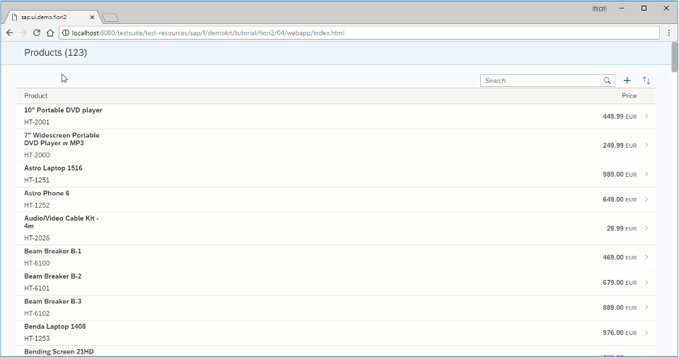

<!-- loio4e4315cef89e48ceb60b4dc12f5be2d2 -->

# Step 4: Adding a Detail Page

In this step, we add an empty detail page.


<a name="loio4e4315cef89e48ceb60b4dc12f5be2d2__section_ed2_4dd_lbb"/>

## Preview

  
  
**List Page with Empty Detail Page**




<a name="loio4e4315cef89e48ceb60b4dc12f5be2d2__section_fd2_4dd_lbb"/>

## Coding

You can view and download all files at [Flexible Column Layout App - Step 4](https://ui5.sap.com/#/sample/sap.f.tutorial.fiori2.04/preview).


<a name="loio4e4315cef89e48ceb60b4dc12f5be2d2__section_a5b_clj_l4b"/>

## webapp/view/Detail.view.xml \[NEW\]

```xml
<mvc:View
	xmlns:mvc="sap.ui.core.mvc">
</mvc:View>
```

First, we create a blank detail page.


<a name="loio4e4315cef89e48ceb60b4dc12f5be2d2__section_t3z_1lj_l4b"/>

## webapp/view/App.view.xml \[MODIFY\]

```xml
<mvc:View
	displayBlock="true"
	height="100%"
	xmlns="sap.f"
	xmlns:mvc="sap.ui.core.mvc">
	<FlexibleColumnLayout id="flexibleColumnLayout" backgroundDesign="Solid">
		<beginColumnPages>
			<mvc:XMLView id="beginView" viewName="sap.ui.demo.fiori2.view.List"/>
		</beginColumnPages>
		<midColumnPages>
			<mvc:XMLView id="detailView" viewName="sap.ui.demo.fiori2.view.Detail"/>
		</midColumnPages>
	</FlexibleColumnLayout>
</mvc:View>
```

We add the detail page in `FlexibleColumnLayout's` `midColumnPages` aggregation in the `App.view.xml` file. This way the detail page will be displayed in the middle column.


<a name="loio4e4315cef89e48ceb60b4dc12f5be2d2__section_xw1_1lj_l4b"/>

## webapp/view/List.view.xml \[MODIFY\]

```xml
		...
		<!-- DynamicPage Content -->
					...

					...
					<items>
						<ColumnListItem type="Navigation" press=".onListItemPress">
							<cells>
								<ObjectIdentifier title="{products>Name}" text="{products>ProductId}"/>
								<ObjectNumber
									number="{
										parts:[
											{path:'products>Price'},
											{path:'products>CurrencyCode'}
										],
										type: 'sap.ui.model.type.Currency',
										formatOptions: {showMeasure: false}
									}"
									unit="{products>CurrencyCode}"/>
							</cells>
						</ColumnListItem>
					</items>
					...
```

We add a `press` handler to each `ColumnListItem` in the `List.view.xml`.


<a name="loio4e4315cef89e48ceb60b4dc12f5be2d2__section_nxz_ykj_l4b"/>

## webapp/controller/List.controller.js \[MODIFY\]

```js
sap.ui.define([
	"sap/ui/model/json/JSONModel",
	"sap/ui/core/mvc/Controller",
	"sap/ui/model/Filter",
	"sap/ui/model/FilterOperator",
	'sap/ui/model/Sorter',
	'sap/m/MessageBox',
	'sap/f/library'
], function (JSONModel, Controller, Filter, FilterOperator, Sorter, MessageBox, fioriLibrary) {
	"use strict";
		...

		...
		onSort: function () {
			this._bDescendingSort = !this._bDescendingSort;
			var oBinding = this.oProductsTable.getBinding("items"),
				oSorter = new Sorter("Name", this._bDescendingSort);

			oBinding.sort(oSorter);
		},

		onListItemPress: function () {
			var oFCL = this.oView.getParent().getParent();

			oFCL.setLayout(fioriLibrary.LayoutType.TwoColumnsMidExpanded);
		}
	});
});
```

In the `List.controller.js`, we attach a `onListItemPress` function to the `press` handler, which changes the `layout` to `TwoColumnsBeginExpanded`. This means that there are going to be two columns, where the first one is larger than the second. For more information on the available layout types, see [Types of Layout](../10_More_About_Controls/types-of-layout-3b9f760.md).

