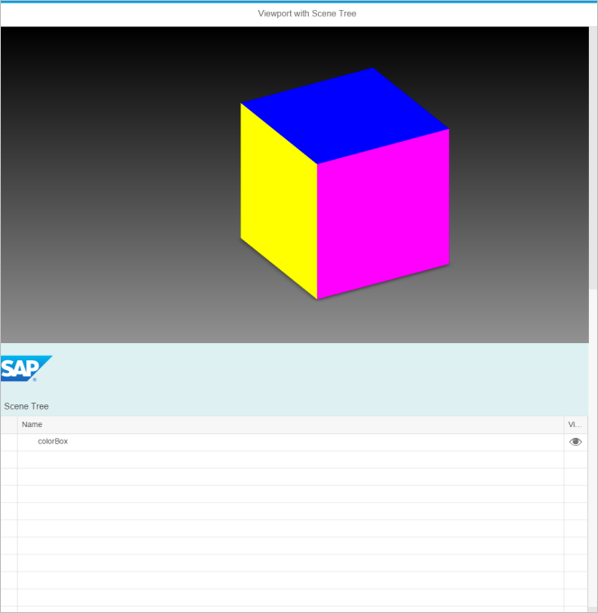

<!-- loio773a0088c5a54d0cbeb985c347cb643f -->

# Step 4: Adding a Scene Tree

In this step, you will be adding an `sap.ui.vk.SceneTree` control to your 3D Viewer application.

The following `sap.ui.vk` controls are introduced in this step:

-   `SceneTree` control
-   `ViewStateManager` control

We will use the `SceneTree` control to create a tree structure that displays the hierarchy of the nodes for the loaded model. We will then use the `ViewStateManager` control to link the Scene Tree with the model loaded into the Viewport, so that we can visually associate a selection in the scene with its corresponding node as displayed in the Scene Tree.

The content in this step builds on the code from [Step 3: 3D Viewer Using the Viewport Control](step-3-3d-viewer-using-the-viewport-control-112d7b4.md), and code changes performed in this step of the tutorial are done in relation to the files in [Step 3: 3D Viewer Using the Viewport Control](step-3-3d-viewer-using-the-viewport-control-112d7b4.md).


## Preview

  
  
**Viewer application with a Viewport and a Scene Tree**




## Coding

You can view and download all files at [3D Viewer - Step 4 - Add a Scene Tree](https://ui5.sap.com/#/entity/sap.ui.vk.tutorial.VIT/sample/sap.ui.vk.tutorial.VIT.04).


### index.html

Update the `index.html` file to reference the `viewportScenetree` namespace, which will be the namespace we'll use for the sample application in this step.

```html
<!DOCTYPE HTML>
<html>
    <head>
        <meta http-equiv="Content-Type" content="text/html;charset=UTF-8"/>
    <script id="sap-ui-bootstrap"
        src="https://ui5.sap.com/resources/sap-ui-core.js"
        data-sap-ui-libs="sap.ui.vk, sap.m"
        data-sap-ui-theme="sap_belize"
        data-sap-ui-bindingSyntax="complex"
        data-sap-ui-resourceroots='{
            "viewportScenetree": "./"
        }'>
    </script>
    <script>
    sap.ui.getCore().attachInit(function(){
        new sap.m.Shell({
            app: new sap.ui.core.ComponentContainer({
                name : "viewportScenetree"
            })
        }).placeAt("content");
    });
    </script>
    </head>
    <body id="content" class="sapUiBody">
    </body>
</html>
```


### Component.js

Update the `Component.js` file to reference the namespace specified for this application.

```js
sap.ui.define([
    "sap/ui/core/UIComponent"
], function (UIComponent) {
    "use strict";

    return UIComponent.extend("viewportScenetree.Component", {
        metadata: {
            manifest: "json"
        },
        init: function () {
            // call the init function of the parent
            UIComponent.prototype.init.apply(this, arguments);
        }
    });
});
```


### i18n.properties

Update the page title to say "Viewport with Scene Tree".

```ini
# Page Descriptor
pageTitle=Viewport with Scene Tree
```


### manifest.json

Update the `manifest.json` file so that it references the correct files.

```js
{
    "_version": "1.8.0",
    "sap.app": {
        "id": "viewportScenetree",
        "type": "application",
        "i18n": "i18n/i18n.properties",
        "title": "{{appTitle}}",
        "description": "{{appDescription}}",
        "applicationVersion": {
            "version": "1.0.0"
        }
    },
    "sap.ui": {
        "technology": "UI5",
        "deviceTypes": {
            "desktop": true,
            "tablet": true,
            "phone": true
        }
    },
    "sap.ui5": {
        "rootView": "viewportScenetree.view.App",
        "dependencies": {
            "minUI5Version": "1.30",
            "libs": {
                "sap.m": {}
            }
        },
        "models": {
            "i18n": {
                "type": "sap.ui.model.resource.ResourceModel",
                "settings": {
                    "bundleName": "viewportScenetree.i18n.i18n"
                }
            }
        }
    }
}
```


### App.view.xml

To display the Scene Tree in your application, add the `<vk:SceneTree>` element. In the element's attribute's, specify the Scene Tree control's width and height on the screen, and give it an arbitrary identifier value.

```xml
<mvc:View
        controllerName="viewportScenetree.controller.App"
        xmlns="sap.m"
        xmlns:mvc="sap.ui.core.mvc"
        xmlns:vk="sap.ui.vk"
        xmlns:l="sap.ui.layout"
        xmlns:f="sap.ui.layout.form"
        xmlns:u="sap.ui.unified"
        displayBlock="true">
    <App id="viewportScenetree">
        <Page
                title="{i18n>pageTitle}">
            <vk:Viewport
                    id="viewport"
                    width="100%"
                    height="50%"/>
            <vk:SceneTree
                    id="scenetree"/>
        </Page>
    </App>
</mvc:View>
```


### App.controller.js

For the most part, the code in the `App.controller.js` file will be the same as the content of the `App.controller.js` file for the application in [Step 3: 3D Viewer Using the Viewport Control](step-3-3d-viewer-using-the-viewport-control-112d7b4.md). The highlighted sections in the following code block indicate the additions and changes made in the code to incorporate a Scene Tree in the 3D Viewer application.

```js
sap.ui.define([
    "sap/base/Log",
    "sap/ui/core/mvc/Controller",
    "sap/ui/vk/ContentResource",
    "sap/ui/vk/ContentConnector"
], function (Log, Controller, ContentResource, ContentConnector) {
    "use strict";

    var contentResource = new ContentResource({
        source: "models/boxTestModel.vds",
        sourceType: "vds4",
        id: "abc123"
    });
    return Controller.extend("viewportScenetree.controller.App",{
        onInit: function() {
            var view = this.getView();
            var sceneTree = view.byId("scenetree");
            var contentConnector = new ContentConnector({
                contentChangesFinished: function(event) {
                    var failureReason = event.getParameter("failureReason");
                    if (failureReason) {
                        Log.error("Some of content resources cannot be loaded: " + failureReason);
                } else {
                       Log.info("Scene successfully loaded");
                }
            });
            var viewStateManager = new ViewStateManager({
                contentConnector: contentConnector
            });
            viewport.setViewStateManager(viewStateManager);
            viewport.setContentConnector(contentConnector);
            sceneTree.setViewStateManager(viewStateManager);
            sceneTree.setContentConnector(contentConnector);
            contentConnector.addContentResource(contentResource);
        }
    });
});
```

Let us look at the changes in more detail.

The following code line gets a reference to a new Scene Tree object.

```js
var sceneTree = view.byId("scenetree");
```

We create a new object called `viewStateManager` that gets the node hierarchy of the resource that's loaded into the scene and takes care of nodes 'states' for example visibility or selection states. Then, we associate newly created `viewStateManager` object with our Viewport and `sceneTree`. We also associate the Content Connector to the `viewStateManager` and `sceneTree` objects so they can get notified when content is changed.

```js
var viewStateManager = new ViewStateManager({
    contentConnector: contentConnector
});
viewport.setViewStateManager(viewStateManager);
viewport.setContentConnector(contentConnector);
sceneTree.setViewStateManager(viewStateManager);
sceneTree.setContentConnector(contentConnector);
```

Finally, we load Content Resource in Content Connector to take care of notifying the `Viewport` and `SceneTree` when the model is loaded.

```js
contentConnector.addContentResource(contentResource);
```

Now you can select box in Scene Tree and it will be selected in the Viewport. In the same way, if you click on the box in the Viewport and select it then this will select it in Scene Tree. You can change the visibility state of the box in the Scene Tree by clicking the eye icon; this hides or shows the box in Viewport. This means that `ViewStateManager` has been connected to both objects and keeps them synchorized.


## API Reference

-   [`sap.ui.vk.SceneTree`](https://ui5.sap.com/#/api/sap.ui.vk.SceneTree)
-   [`sap.ui.vk.ViewStateManager`](https://ui5.sap.com/#/api/sap.ui.vk.ViewStateManager)

**Related Information**  


[Scene Tree](../10_More_About_Controls/scene-tree-ab70215.md "")

