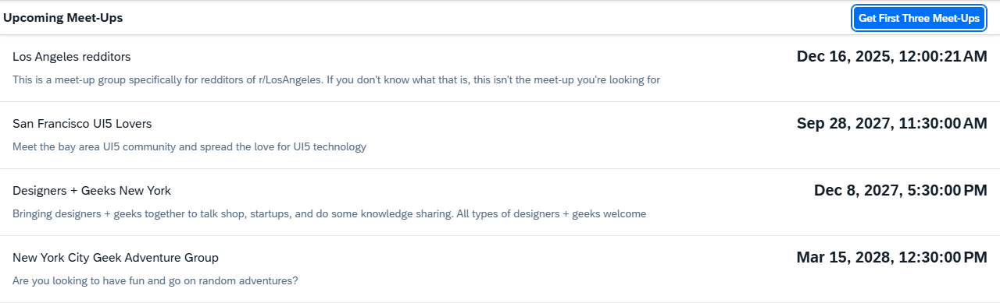
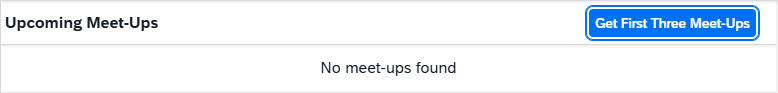

<!-- loio95e5b87804ef4059bb68dd511666d4e3 -->

# Step 4: Calling a Function Import

We only want to display the upcoming meetings and hide the meetings happened in the past in our app. By using a function import that calculates these items on the back end we do not need to do the calculation on the client. The OData V2 mock server will be instructed to do the calculation locally for testing purposes.


## Preview

   
  
**Only the upcoming meet-ups are shown**

  


## Coding

You can view and download all files in the Demo Kit at [Mock Server - Step 4](https://ui5.sap.com/#/entity/sap.ui.core.tutorial.mockserver/sample/sap.ui.core.tutorial.mockserver.04).


## webapp/localService/metadata.xml

```xml
... 
      <EntityContainer Name="NerdMeetups" m:IsDefaultEntityContainer="true">
        <EntitySet Name="Meetups" EntityType="NerdMeetup.Models.Meetup" />
        <FunctionImport Name="FindUpcomingMeetups" EntitySet="Meetups" ReturnType="Collection(NerdMeetup.Models.Meetup)" m:HttpMethod="GET" />
      </EntityContainer>
    </Schema>
  </edmx:DataServices>
</edmx:Edmx>
```

The function import we are going to use is declared in the `metadata.xml` file.


## webapp/view/App.view.xml

```xml
...
  //Delete items="{/Meetups}"
	<List id="list" items="{/FindUpcomingMeetups}" noDataText="{i18n>noDataText}"> 
...
```

We change the binding of the list to a function import call that returns only upcoming meet-ups, instead of the call to the entire meet-ups collection.

After saving and running the app again, we should get the following result:

   
  
**No data visible**

  

Since the function import call is not simulated automatically by the mock server, we do not see any data in list, and a failed network call is issued in the developer tools of the browser.

> ### Tip:  
> In Google Chrome, mocked requests will appear in a debug level log of the console \(both request and response\) and not on the *Network* tab. If you do see them in the *Network* tab, they are not mocked and you need to check your code.

In order to simulate the function import call, we write our own \(mocked\) implementation, and add to the internal list of requests.


## webapp/localService/mockserver.js

```js
sap.ui.define([
	"sap/ui/thirdparty/jquery",

	"sap/ui/core/util/MockServer",
	"sap/base/Log"
], function(jQuery, MockServer, Log) {
	"use strict";
	return {
		/**
		 * Initializes the mock server.
		 * You can configure the delay with the URL parameter "serverDelay".
		 * The local mock data in this folder is returned instead of the real data for testing.
		 * @public
		 */
		init: function() {
			// create
			var oMockServer = new MockServer({
				rootUri: "/"
			});
			oMockServer.simulate("../localService/metadata.xml", {
				sMockdataBaseUrl: "../localService/mockdata",
				bGenerateMissingMockData: true
			});

			// handling mocking a function import call step
			var aRequests = oMockServer.getRequests();
			aRequests.push({
				method: "GET",
				path: new RegExp("FindUpcomingMeetups(.*)"),
				response: function(oXhr) {
					Log.debug("Incoming request for FindUpcomingMeetups");
					var today = new Date();
					today.setHours(0); // or today.toUTCString(0) due to timezone differences
					today.setMinutes(0);
					today.setSeconds(0);
					jQuery.ajax({
						url: "/Meetups?$filter=EventDate ge " + "/Date(" + today.getTime() + ")/",
						dataType : 'json',
						async: false,
						success : function(oData) {
							oXhr.respondJSON(200, {}, JSON.stringify(oData));
						}
					});
					return true;
				}
			});
			oMockServer.setRequests(aRequests);
			// handling custom URL parameter step
			var fnCustom = function(oEvent) {
				var oXhr = oEvent.getParameter("oXhr");
				if (oXhr && oXhr.url.indexOf("first") > -1) {
					oEvent.getParameter("oFilteredData").results.splice(3, 100);
				}
			};
			oMockServer.attachAfter("GET", fnCustom, "Meetups");
			// start
			oMockServer.start();
			Log.info("Running the app with mock data");
		}
	};
});
```

We push a new request handler to mock the function import call as follows:

1.  Fetch the array of requests from the `MockServer`. The OData V2 mock server holds an internal list of requests that you have to get and set if you want to modify.

2.  Push a new request handler to handle the function import

3.  Set the updated request array


The request handler has the following structure:

-   `method`: The HTTP method of the mock request

-   `path`: The relative path \(appended to the `rootUri`\) of the request.

    We can define the path as a regular expression, for example, to handle URL parameters.

-   `response`: A response function that simulates the answer from the server

The `response` function executes a request to the `Meetups` entity set with an OData `$filter` query that actually returns all meet-ups with `EventDate` that is greater than or equals today. We compose a date for the filter and send it to the `server` manually as a synchronous request.

It is o.k. to use `jQuery.sap.sjax` here, because the call will not actually leave the client. It triggers a new request that again is intercepted and processed by the mock server.

We finally respond on the XHR object by calling the `respondJSON` API. It will add the proper content type header for the JSON format and send the result. We provide the HTTP status code `200` \(success\) and the 'stringified' response data as the arguments. Returning `true` at the end of the function indicates that we have completed the processing of the request in this handler \(no additional request handlers should be checked for that request\).

When you now start the app again you will see a list of upcoming meet-ups.


## Creating and Editing Mock Data in SAP Web IDE \(Optional\)


### webapp/localService/mockserver.js

```js
...
oMockServer.simulate("localService/metadata.xml", {
	sMockdataBaseUrl : "localService/mockdata",
	bGenerateMissingMockData : true
});
...
```

The path we gave in the simulate function for mock data is where we want to store the .json file\(s\).

-   Save it \(in JSON format\) from a real service

-   Create it manually

-   Generate it in SAP Web IDE by choosing *Edit Mock Data* in the context menu of the `medatdata.xml` file. For more information about SAP Web IDE, see the documentation for SAP Web IDE on the SAP Help Portal at [https://help.sap.com/viewer/p/SAP\_Web\_IDE](https://help.sap.com/viewer/p/SAP_Web_IDE).

       
      
    **Editing mock data in SAP Web IDE**

      


