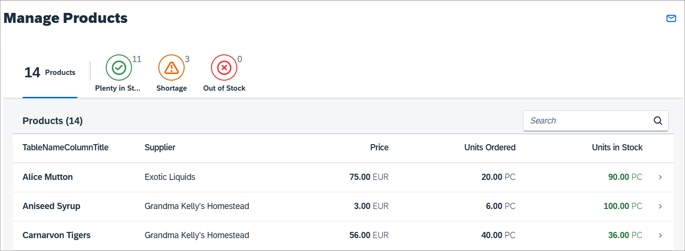

<!-- loio85ec3a9454ac4eb1a901745e773844d3 -->

# Step 4: Quick Filter for the Worklist

For easily detecting and managing product shortages in our app, we will add a quick filter for the worklist table. Users can press the filter tabs to display the products according to whether they are in stock, have low stock or no stock. The table will update accordingly and show only the products matching the criteria.


## Preview

   
  
<a name="loio85ec3a9454ac4eb1a901745e773844d3__fig_nmv_yrs_c5"/>A quick filter allows filtering the product table

  


## Coding

You can view and download all files in the Demo Kit at [Worklist App - Step 4](https://ui5.sap.com/#/entity/sap.m.tutorial.worklist/sample/sap.m.tutorial.worklist.04).


### webapp/view/Worklist.view.xml \[MODIFY\]

```xml
<mvc:View
	controllerName="myCompany.myApp.controller.Worklist"
	xmlns:mvc="sap.ui.core.mvc"
	xmlns:semantic="sap.m.semantic"
	xmlns="sap.m">
	<semantic:FullscreenPage
		id="page"
		navButtonPress="onNavBack"
		showNavButton="true"
		title="{i18n>worklistViewTitle}">
		<semantic:headerContent>
			<IconTabBar
				id="iconTabBar"
				select=".onQuickFilter"
				expandable="false">
				<items>
					<IconTabFilter
						key="all"
						showAll="true"
						count="{worklistView>/countAll}"
						text="{i18n>WorklistFilterProductsAll}"/>
					<IconTabSeparator/>
					<IconTabFilter
						key="inStock"
						icon="sap-icon://message-success"
						iconColor="Positive"
						count="{worklistView>/inStock}"
						text="{i18n>WorklistFilterInStock}"/>
					<IconTabFilter
						key="shortage"
						icon="sap-icon://message-warning"
						iconColor="Critical"
						count="{worklistView>/shortage}"
						text="{i18n>WorklistFilterShortage}"/>
					<IconTabFilter
						key="outOfStock"
						icon="sap-icon://message-error"
						iconColor="Negative"
						count="{worklistView>/outOfStock}"
						text="{i18n>WorklistFilterOutOfStock}"/>
				</items>
				<content>
					<Table
...
					</Table>
				</content>
			</IconTabBar>


		</semantic:headerContent>
		<semantic:sendEmailAction>
			<semantic:SendEmailAction
				id="shareEmail"
				press="onShareEmailPress"/>
		</semantic:sendEmailAction>
	</semantic:FullscreenPage>
</mvc:View>

```

We now update the view and add the new UI for the quick filter to the content aggregation of the `sap.m.SemanticPage` control just before the `table`. It is modeled using a `sap.m.IconTabBar` control and a `sap.m.IconTabFilter` for each of the following filter options:

-   *Total Stock*

    This tab will simply show the overall number of products that has been returned by the data service. The `count` property is bound to a local view model and the number will be updated in the controller later in this step. This tab will show a larger number only \(optional\) and no icon by using the `showAll` property.

-   *Out of Stock*

    This tab will show all the products that are out of stock. We choose a matching icon from the icon font and set the icon color to the semantic `Negative` state so that it will appear in red.

-   *Shortage*

    This tab will show products that have less than 10 pieces remaining with a semantic `Critical` state that will make the icon appear in orange. The count of the number of low stock products will be displayed on the tab and the icon will appear in orange.

-   *Plenty in Stock*

    This tab will show products that have more than 10 pieces in stock. The semantic `Positive` state will let the icon appear in green. As usual the UI texts for the tabs are linked to the resource bundle file and will be added later. Do not forget to set the standard CSS class `sapUiNoMarginTop` on the table to remove the spacing between the `IconTabBar` and the `table` and make the UI look nicer.

    > ### Note:  
    > Each `IconTabFilter` element has a `key` property that is used to identify the tab that was pressed in the event handler `onQuickFilter` that is registered on the `IconTabBar` control directly. The event handler implementation does the actual filtering on the table and is defined in the controller.


### webapp/controller/Worklist.controller.js \[MODIFY\]

```js
		...
		onInit : function () {
			var oViewModel,
				iOriginalBusyDelay,
				oTable = this.byId("table");

			// Put down worklist table's original value for busy indicator delay,
			// so it can be restored later on. Busy handling on the table is
			// taken care of by the table itself.
			iOriginalBusyDelay = oTable.getBusyIndicatorDelay();
			this._oTable = oTable;
			// keeps the search state
			this._aTableSearchState = [];

			// Model used to manipulate control states
			oViewModel = new JSONModel({
				worklistTableTitle: this.getResourceBundle().getText("worklistTableTitle"),
				shareOnJamTitle: this.getResourceBundle().getText("worklistTitle"),
				shareSendEmailSubject: this.getResourceBundle().getText("shareSendEmailWorklistSubject"),
				shareSendEmailMessage: this.getResourceBundle().getText("shareSendEmailWorklistMessage", [location.href]),
				tableNoDataText: this.getResourceBundle().getText("tableNoDataText"),
				tableBusyDelay: 0,
				inStock: 0,
				shortage: 0,
				outOfStock: 0,
				countAll: 0
			});
			this.setModel(oViewModel, "worklistView");
			// Create an object of filters
			this._mFilters = {
				"inStock": [new Filter("UnitsInStock", FilterOperator.GT, 10)],
				"outOfStock": [new Filter("UnitsInStock", FilterOperator.LE, 0)],
				"shortage": [new Filter("UnitsInStock", FilterOperator.BT, 1, 10)],
				"all": []
			};

			// Make sure, busy indication is showing immediately so there is no
			// break after the busy indication for loading the view's meta data is
			// ended (see promise 'oWhenMetadataIsLoaded' in AppController)
			oTable.attachEventOnce("updateFinished", function(){
				// Restore original busy indicator delay for worklist's table
				oViewModel.setProperty("/tableBusyDelay", iOriginalBusyDelay);
			});
		},
		...
```

As a preparation step for the filter tabs we add properties for the counters into the local view model of the worklist controller. We initialize the four values with `0` each. Furthermore, we create an object `_mFilters` that contains a filter for each tab. We will use the filters for filtering the table below the tabs. The properties in `_mFilters` correlate to the keys of the `IconTabFilter` controls we defined above in the `Worklist.view.xml` file. This way we can easily access a filter for a given tab based on the key of the corresponding tab.

Creating a simple filter requires a binding path as first parameter of the filter constructor \(e.g. `"UnitsInStock"`\), a filter operator \(e.g. `"GT"`\) as second argument, and a value to compare \(e.g. `10`\) as the third argument. We create such filters for all three tabs with different filter operators as described in the view part above. Additionally, we create an `all` filter, which is an empty array for clearing the binding again \(when the user chooses the *All* tab\).


### webapp/controller/Worklist.controller.js \[MODIFY\]

```js
		...
		onUpdateFinished : function (oEvent) {
			// update the worklist's object counter after the table update
			var sTitle,
				oTable = oEvent.getSource(),
				oViewModel = this.getModel("worklistView"),

				iTotalItems = oEvent.getParameter("total");
			// only update the counter if the length is final and
			// the table is not empty
			if (iTotalItems && oTable.getBinding("items").isLengthFinal()) {
				sTitle = this.getResourceBundle().getText("worklistTableTitleCount", [iTotalItems]);
				// Get the count for all the products and set the value to 'countAll' property
				this.getModel().read("/Products/$count", {
					success: function (oData) {
						oViewModel.setProperty("/countAll", oData);
					}
				});
				// read the count for the unitsInStock filter
				this.getModel().read("/Products/$count", {
					success: function (oData) {
						oViewModel.setProperty("/inStock", oData);
					},
					filters: this._mFilters.inStock
				});
				// read the count for the outOfStock filter
				this.getModel().read("/Products/$count", {
					success: function(oData){
						oViewModel.setProperty("/outOfStock", oData);
					},
					filters: this._mFilters.outOfStock
				});
				// read the count for the shortage filter
				this.getModel().read("/Products/$count", {
					success: function(oData){
						oViewModel.setProperty("/shortage", oData);
					},
					filters: this._mFilters.shortage
				});

			} else {
				sTitle = this.getResourceBundle().getText("worklistTableTitle");
			}
			this.getModel("worklistView").setProperty("/worklistTableTitle", sTitle);
		},
		...
```

In the `onUpdateFinished` function, we get the count of all products by triggering a read operation on the model with the appropriate filter. The filter is a helper object of SAPUI5 that defines the condition for each tab on the data binding level. We already created the filters in the `onInit` function.

> ### Note:  
> The `v2.ODataModel` will automatically bundle these `read` requests to one batch request to the server \(if batch mode is enabled\).

In the `success` handler of each `read` operation we update the corresponding property in the view model with the real count of the matching items that were returned by the service.


### webapp/controller/Worklist.controller.js \[MODIFY\]

```js
		...
		_applySearch: function(aTableSearchState) {
			var oTable = this.byId("table"),
				oViewModel = this.getModel("worklistView");
			oTable.getBinding("items").filter(aTableSearchState, "Application");
			// changes the noDataText of the list in case there are no filter results
			if (aTableSearchState.length !== 0) {
				oViewModel.setProperty("/tableNoDataText", this.getResourceBundle().getText("worklistNoDataWithSearchText"));
			}
		},

		/**
		 * Event handler when a filter tab gets pressed
		 * @param {sap.ui.base.Event} oEvent the filter tab event
		 * @public
		 */
		onQuickFilter: function(oEvent) {
			var oBinding = this._oTable.getBinding("items"),
				sKey = oEvent.getParameter("selectedKey");
			oBinding.filter(this._mFilters[sKey]);
		}


	});

});
```

Next, we implement the handler for the `select` event of the `IconTabBar`. In this event handler we get a reference to the binding for the `items` aggregation of our `table` and store it in the variable `oBinding`. Then we read the parameter `selectedKey` from the `event` object to find out which tab has been selected. This `selectedKey` is used to get the correct filter for the selected tab. Next, we simply call the filter method on `oBinding` and pass the correct filter of the selected tab.

The filters are always applied as an array on the binding level, so you don't need to take care of managing the data, the data binding features of SAPUI5 will automatically take care.


### webapp/i18n/i18n.properties \[MODIFY\]

```ini

...


#XTIT: The title of the products quick filter
WorklistFilterProductsAll=Products

#XTIT: The title of the out of stock products filter
WorklistFilterOutOfStock=Out of Stock

#XTIT: The title of the low stock products filter
WorklistFilterShortage=Shortage

#XTIT: The title of the products in stock filter
WorklistFilterInStock=Plenty in Stock


#~~~ Object View ~~~~~~~~~~~~~~~~~~~~~~~~~~
...
```

We finally add the texts for the tab filters to the resource bundle. Copy the text definitions from the code section above to the end of the `Worklistn View` section in the i18n file.

Now run the app again and click the filter icons on top of the table. The products should be filtered according to the selection in the filter bar and the count should match the number of items displayed.

**Parent topic:** [Worklist App](worklist-app-6a6a621.md "In this tutorial we will build an app using SAPUI5 that, for example, a shop owner can use to manage his product stock levels.")

**Next:** [Step 3: Extending the Worklist Table](step-3-extending-the-worklist-table-84100bc.md "In this step, we will edit the worklist table to include additional columns for our manage product stocks scenario. We display the supplier, the product price, and the number of units on order for each product and format the values accordingly.")

**Previous:** [Step 5: Adding Actions to the Worklist](step-5-adding-actions-to-the-worklist-2da220f.md "Now we can easily spot shortages on our stock, but we would also like to take action and resolve it. Either we can decide to remove the product until the shortage is resolved or order new items of the product. In this step, we will add these actions to the footer of the worklist table.")

**Related Information**  


[API Reference: `sap.ui.model.ListBinding.filter`](https://ui5.sap.com/#/api/sap.ui.model.ListBinding)

