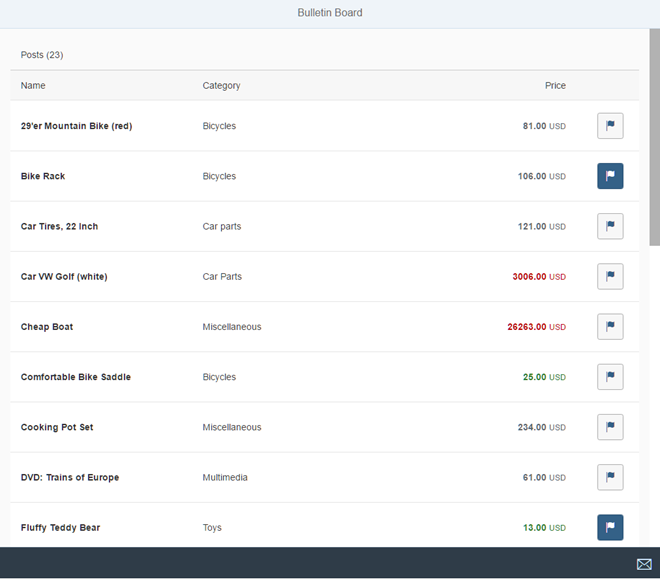

<!-- loio69a25bf2f8a2478cbda4b8bbe64039de -->

# Step 5: Adding a *Flag* Button

Now that we have implemented the conversion tests, we add the corresponding functionality and show the button to flag a post in the app. The design team has specified that the flag feature should be implemented with a toggle button that has a flag icon.


## Preview

  
  
**The Flag button is now added to the table**




## Coding

You can view and download all files in the *Samples* in the Demo Kit at [Testing - Step 5](https://ui5.sap.com/#/entity/sap.m.tutorial.testing/sample/sap.m.tutorial.testing.05).


## webapp/model/FlaggedType.js

```js
sap.ui.define([
	"sap/ui/model/SimpleType"
], function (SimpleType) {
	"use strict";
	return SimpleType.extend("sap.ui.demo.bulletinboard.model.FlaggedType", {
		/**
		 * Formats the integer value from the model to a boolean for the pressed state of the flagged button
		 *
		 * @public
		 * @param {number} iFlagged the integer value of the formatted property
		 * @returns {boolean} 1 means true, all other numbers means false
		 */
		formatValue: function (iFlagged) {
			return iFlagged === 1;
		},
		/**
		 * Parses a boolean value from the property to an integer
		 *
		 * @public
		 * @param {boolean} bFlagged true means flagged, false means not flagged
		 * @returns {number} true means 1 , false means 0
		 */
		parseValue: function (bFlagged) {
			if (bFlagged) {
				return 1;
			}

			return 0;
		},
		/**
		 * Validates the value to be parsed
		 *
		 * @public
		 * Since there is only true and false, no client side validation is required
		 * @returns {boolean} true
		 */
		validateValue: function () {
			return true;
		}

	});
});
```

Lets start with the implementation code for the `FlaggedType`. We now add the documentation in JSDoc format and the implementation of the three functions of the data type to the previously empty stub:

-   The `formatValue` function takes care of the conversion from the model to the UI. As specified in the tests, a model value of `1` will be converted to `true`, everything else to `false`. In the implementation code, this equals to `”iFlagged === 1”`.

-   Similarly, the `parseValue` function is called by SAPUI5 when the data is written back to the model. Here, we convert the Boolean value to an integer again.

-   The validation function always returns `true` in this simple case, we do not expect any validation errors for this data type.


We call these functions of the data type in the unit tests directly. So if you now run your unit tests by calling the `webapp/test/unit/unitTests.qunit.html` page, the tests should already run successfully.


## webapp/view/Worklist.view.xml

```xml
…
<Table …>
	…
	<columns>
		…
		<Column width="33%" id="unitNumberColumn" hAlign="End" vAlign="Middle">
			<Text text="{i18n>TableUnitNumberColumnTitle}" id="unitNumberColumnTitle"/>
		</Column>
		<Column width="80px" id="flaggedColumn" demandPopin="true" vAlign="Middle"/>

	</columns>
	<items>
		<ColumnListItem vAlign="Middle">
			<cells>
				…
				<ObjectNumber… />
				<ToggleButton
					id="flaggedButton"
					tooltip="{i18n>flaggedTooltip}"
					icon="sap-icon://flag"
					pressed="{
						path: 'Flagged',
						type: '.types.flagged'
					}"
					class="sapUiMediumMarginBeginEnd"/>

			</cells>
		</ColumnListItem>
	</items>
</Table>
…
```

In the view, we add a new column and a cell for the flag feature at the end of the table. We fill the cell with a `sap.m.ToggleButton` control that serves as our input control for the `Flagged` state. We define a `flag` icon in the button, a tooltip from the resource bundle, and a layouting class to make our example complete. The control's `pressed` property is bound to the `Flagged` field in the model. Here we also apply the custom data type that is part of the controller.


## webapp/controller/Worklist.controller.js

```js
sap.ui.define([
	'./BaseController',
	'sap/ui/model/json/JSONModel',
	'../model/formatter',
	'../model/FlaggedType',
	'sap/m/library'
], function (BaseController, JSONModel, formatter, FlaggedType, mobileLibrary) {
	"use strict";
	return BaseController.extend("sap.ui.demo.bulletinboard.controller.Worklist", {
		types : {
			flagged: new FlaggedType()
		},
		formatter: formatter,
		…
	});
});
```

The controller loads the custom data type as a dependency similar to the formatters. It is then provided as a property of the internal variable `types` so that it can be accessed as `.types.flagged` in the view as we have seen above.

The conversion functions that are made available when we create an instance of the type are called automatically by SAPUI5 when needed. However, by default the back conversion to the model is not enabled, so we still need a small change in the component.


## webapp/Component.js

```js
sap.ui.define([
	…
], function (UIComponent, ResourceModel, models) {
	"use strict";
	return UIComponent.extend("sap.ui.demo.bulletinboard.Component", {
	…
		init: function () {
			// call the base component's init function
			UIComponent.prototype.init.apply(this, arguments);

			// allow saving values to the OData model
			this.getModel().setDefaultBindingMode("TwoWay");

			…
		}
	});
});
```

To enable the propagation of the bound view properties to the model, we need to set the model's default binding mode to `TwoWay`. For an OData model the default mode is `OneWay` which means that properties are not written back to the model automatically. We want to propagate the state of the button automatically to the model, when the button for a post is clicked.


## webapp/i18n/i18n.properties

```ini
#~~~ Worklist View ~~~~~~~~~~~~~~~~~~~~~~~~~~

…
#XTOL: tooltip for the flagged button
flaggedTooltip=Mark this post as flagged

…
```

Finally, add the new string for the button tooltip to the resource bundle file. Now we can also test the application manually by calling the `webapp/test/mockServer.html` page and making sure some of the buttons are pressed initially as reflected in the model. When we flag an item by choosing the button, the property is written back to the model transparently.

> ### Note:  
> As this feature covers both conversion and interaction parts, we could also have written an integration test for it to test the interaction part also. Feel free to add an integration test for this feature if you like, we will skip it here to focus on unit testing in this step.

**Related Information**  


[Formatting, Parsing, and Validating Data](../04_Essentials/formatting-parsing-and-validating-data-07e4b92.md "Data that is presented on the UI often has to be converted so that is human readable and fits to the locale of the user. On the other hand, data entered by the user has to be parsed and validated to be understood by the data source. For this purpose, you use formatters and data types.")

