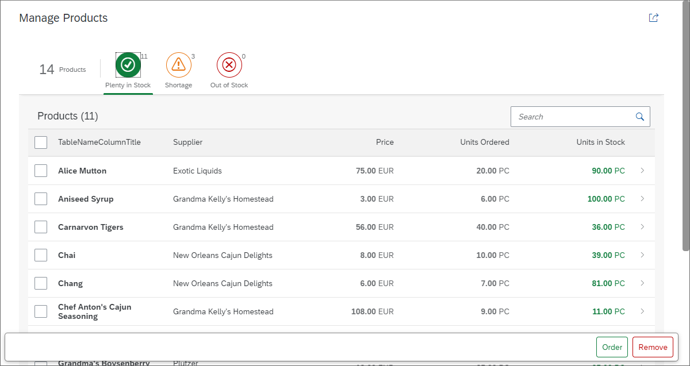

<!-- loio2da220ff496c4b0f9ce29208cbd089f3 -->

# Step 5: Adding Actions to the Worklist

Now we can easily spot shortages on our stock, but we would also like to take action and resolve it. Either we can decide to remove the product until the shortage is resolved or order new items of the product. In this step, we will add these actions to the footer of the worklist table.


## Preview

  
  
**Actions are now available in the footer bar**




## Coding

You can view and download all files in the *Samples* in the Demo Kit at [Worklist App - Step 5](https://ui5.sap.com/#/entity/sap.m.tutorial.worklist/sample/sap.m.tutorial.worklist.05).


### webapp/view/Worklist.view.xml \[MODIFY\]

```xml
...
<Table
	id="table"
	busyIndicatorDelay="{worklistView>/tableBusyDelay}"
	growing="true"
	growingScrollToLoad="true"
	noDataText="{worklistView>/tableNoDataText}"
	updateFinished=".onUpdateFinished"
	width="auto"
	mode="MultiSelect"

	items="{
		path: '/Products',
		sorter: {
			path: 'ProductName',
			descending: false
		},
		parameters: {
			'expand': 'Supplier'
		}
	}">
...
```

We change the table `mode` to `MultiSelect`. This allows you to select multiple items in the table. Below, we will add two buttons to the footer bar of the screen. The first button will add to the `UnitsInStock` property, and the second will remove the selected products.


### webapp/view/Worklist.view.xml \[MODIFY\]

```xml
<mvc:View
	 controllerName="mycompany.myapp.MyWorklistApp.controller.Worklist"
	 xmlns="sap.m"
	 xmlns:mvc="sap.ui.core.mvc"
	 xmlns:semantic="sap.f.semantic">

	 <semantic:SemanticPage
		  id="page"
		  headerPinnable="false"
		  toggleHeaderOnTitleClick="false"
		  showFooter="true">

		  <semantic:titleHeading>
				<Title text="{i18n>worklistTitle}"/>
		  </semantic:titleHeading>
		  ...
	 </semantic:headerContent>
	 <semantic:sendEmailAction>
		  <semantic:SendEmailAction id="shareEmail" press=".onShareEmailPress"/>
	 </semantic:sendEmailAction>
	 <semantic:positiveAction>
		  <semantic:PositiveAction text="{i18n>TableProductsReorder}" press=".onUpdateStockObjects"/>
	 </semantic:positiveAction>
	 <semantic:negativeAction>
		  <semantic:NegativeAction text="{i18n>TablePorductsUnlist}" press=".onUnlistObjects"/>
	 </semantic:negativeAction>
</semantic:SemanticPage>
...
```

Now we add the buttons to the footer bar of the page. The two semantic actions `Negative` and `Positive` will automatically be positioned in the footer bar. The first button will order new items of the selected products and the second one will remove them. The corresponding event handlers will be implemented in the controller.


### webapp/controller/Worklist.controller.js \[MODIFY\]

```js
sap.ui.define([
	"./BaseController",
	"sap/ui/model/json/JSONModel",
	"myCompany/myApp/model/formatter",
	"sap/ui/model/Filter",
	"sap/ui/model/FilterOperator",
	"sap/m/MessageToast",
	"sap/m/MessageBox"

], function(BaseController, JSONModel, formatter, Filter, FilterOperator, MessageToast, MessageBox) {
	"use strict";

	return BaseController.extend("myCompany.myApp.controller.Worklist", {

		formatter: formatter,

...

		/**
		 * Displays an error message dialog. The displayed dialog is content density aware.
		 * @param {string} sMsg The error message to be displayed
		 * @private
		 */
		_showErrorMessage: function(sMsg) {
			MessageBox.error(sMsg, {
				styleClass: this.getOwnerComponent().getContentDensityClass()
			});
		},

		/**
		 * Event handler when a filter tab gets pressed
		 * @param {sap.ui.base.Event} oEvent the filter tab event
		 * @public
		 */
		onQuickFilter: function(oEvent) {
			var oBinding = this._oTable.getBinding("items"),
				sKey = oEvent.getParameter("selectedKey");

			oBinding.filter(this._mFilters[sKey]);
		},

		/**
		 * Error and success handler for the unlist action.
		 * @param {string} sProductId the product ID for which this handler is called
		 * @param {boolean} bSuccess true in case of a success handler, else false (for error handler)
		 * @param {number} iRequestNumber the counter which specifies the position of this request
		 * @param {number} iTotalRequests the number of all requests sent
		 * @private
		 */
		_handleUnlistActionResult : function (sProductId, bSuccess, iRequestNumber, iTotalRequests){
			// we could create a counter for successful and one for failed requests
			// however, we just assume that every single request was successful and display a success message once
			if (iRequestNumber === iTotalRequests) {
				MessageToast.show(this.getModel("i18n").getResourceBundle().getText("StockRemovedSuccessMsg", [iTotalRequests]));
			}
		},

		/**
		 * Error and success handler for the reorder action.
		 * @param {string} sProductId the product ID for which this handler is called
		 * @param {boolean} bSuccess true in case of a success handler, else false (for error handler)
		 * @param {number} iRequestNumber the counter which specifies the position of this request
		 * @param {number} iTotalRequests the number of all requests sent
		 * @private
		 */
		_handleReorderActionResult : function (sProductId, bSuccess, iRequestNumber, iTotalRequests){
			// we could create a counter for successful and one for failed requests
			// however, we just assume that every single request was successful and display a success message once
			if (iRequestNumber === iTotalRequests) {
				MessageToast.show(this.getModel("i18n").getResourceBundle().getText("StockUpdatedSuccessMsg", [iTotalRequests]));
			}
		},

		/**
		 * Event handler for the unlist button. Will delete the
		 * product from the (local) model.
		 * @public
		 */
		onUnlistObjects: function() {
			var aSelectedProducts, i, sPath, oProduct, oProductId;

			aSelectedProducts = this.byId("table").getSelectedItems();
			if (aSelectedProducts.length) {
				for (i = 0; i < aSelectedProducts.length; i++) {
					oProduct = aSelectedProducts[i];
					oProductId = oProduct.getBindingContext().getProperty("ProductID");
					sPath = oProduct.getBindingContext().getPath();
					this.getModel().remove(sPath, {
						success : this._handleUnlistActionResult.bind(this, oProductId, true, i+1, aSelectedProducts.length),
						error : this._handleUnlistActionResult.bind(this, oProductId, false, i+1, aSelectedProducts.length)
					});
				}
			} else {
				this._showErrorMessage(this.getModel("i18n").getResourceBundle().getText("TableSelectProduct"));
			}
		},


		/**
		 * Event handler for the reorder button. Will reorder the
		 * product by updating the (local) model
		 * @public
		 */
		onUpdateStockObjects: function() {
			var aSelectedProducts, i, sPath, oProductObject;

			aSelectedProducts = this.byId("table").getSelectedItems();
			if (aSelectedProducts.length) {
				for (i = 0; i < aSelectedProducts.length; i++) {
					sPath = aSelectedProducts[i].getBindingContext().getPath();
					oProductObject = aSelectedProducts[i].getBindingContext().getObject();
					oProductObject.UnitsInStock += 10;
					this.getModel().update(sPath, oProductObject, {
						success : this._handleReorderActionResult.bind(this, oProductObject.ProductID, true, i+1, aSelectedProducts.length),
						error : this._handleReorderActionResult.bind(this, oProductObject.ProductID, false, i+1, aSelectedProducts.length)
					});
				}
			} else {
				this._showErrorMessage(this.getModel("i18n").getResourceBundle().getText("TableSelectProduct"));
			}
		}
	});
});
```

Let’s have a look at the implementation of the event handlers for the new actions. We first load the `sap.m.MessageToast` control as a new dependency to display a success message for the `unlist` and `reorder` actions.

Both actions are similar from an implementation perspective and the details are described below. They both loop over the selected items in the table and trigger a model update or deletion on the selected path. After that, a success message with the number of products processed is displayed. The table is updated automatically by the model change.

-   *Order*

    For each of the selected items the binding path in the model is retrieved by calling `getBindingContext().getPath()` on the selected item. Additionally, the data object from the model is fetched by calling `getBindingContext().getObject()` on the item. We update the data object and simply add `10` items to the stock to keep things simple in this example. Then we call the update function on the model with the product path and the new object. This will trigger an OData update request to the back end and a refresh of the model afterwards \(multiple requests are handled together in batch mode\). When the model refreshes, the table will be updated as well because of its binding.

-   *Remove*

    For each of the selected items the binding path in the model is retrieved by calling `getBindingContext().getPath()` on the selected item. Then, we call the `remove` function on the model with the product path. This triggers an OData `delete` request to the back end and a refresh of the OData model afterwards. Again, when the model is refreshed, the table will be updated as well because of its binding. The ODataModel v2 collects all these requests and only sends one batch request \(this default behavior can be changed\).


For each action we register both a `success` handler and an `error` handler. The `success` handler and `error` handler for each action is the same, but the function is called with different parameters. This allows us to use the same handler function for both the error and success case. Inside the corresponding handlers we simply display a success message once by comparing the current request number with the total number of requests. Furthermore, we assume that all of our requests always succeed.

In a real scenario, you could have a counter for error responses, and one for success responses. Finally, you could implement you own business logic for error and success cases, like displaying the number of failed and succeeded requests together with the corresponding product identified by the product ID parameter of the handlers. We don’t do this to keep things simple.

> ### Note:  
> In our example, the remove or order actions are only applied to items that are visible in the table, even if the *Select All* checkbox of the table is selected. Keep in mind that there may be more data on the back end that is currently not loaded, and therefore it is neither displayed and nor can it be selected by the user.
> 
> If you want to change this behavior, you might need to change both back-end and front-end code.


### webapp/i18n/i18n.properties \[MODIFY\]

```ini

...
#text of the button for Products reordering
TableProductsReorder=Order

#text for the button for Products unlisting
TablePorductsUnlist=Remove

#Text for no product selected
TableNoProductsSelected=No product selected

#Product successfully deleted
StockRemovedSuccessMsg=Product removed

#Product successfully updated
StockUpdatedSuccessMsg=Product stock level updated

#~~~ Object View ~~~~~~~~~~~~~~~~~~~~~~~~~~
...
```

Add the missing texts for the buttons and the message toast.

Save the changes and run the application again. Try the *Order* and *Remove* buttons with one or more products selected. The stock value will be increased or the product will be \(temporarily\) removed from the worklist table. Since all of our changes happen on a local mock server, we can simply reload the app to reset the data again.

