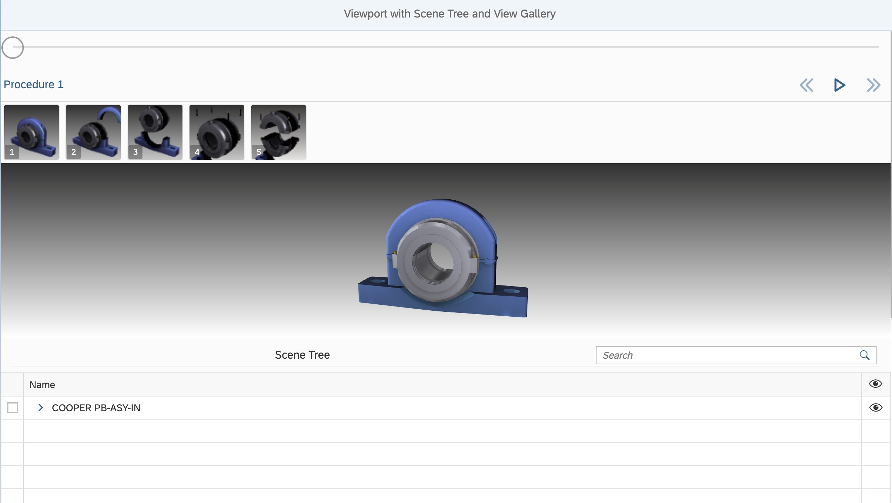

<!-- loioad2578a13a2e480185d973d8f55ff3d5 -->

# Step 5: Adding View Gallery

In this step, you will be adding the `sap.ui.vk.ViewGallery` control to a 3D Viewer application.

> ### Note:  
> The *sap.ui.vk.ViewGallery* control is the successor of the *sap.ui.vk.StepNavigation* control. The *sap.ui.vk.StepNavigation* control can only be used with the legacy DVL rendering engine. All new applications should switch to ThreeJs rendering engine and *sap.ui.vk.ViewGallery* control.

Sometimes, you may encounter a 3D model that has a sequence of animations associated with it. The `ViewGallery` control allows you to display the steps in the animation sequence, navigate to the individual steps in the animation sequence, and play the animation in a single step or in all of the steps.

The content in this step builds on the code from [Step 4: Adding a Scene Tree](step-4-adding-a-scene-tree-773a008.md), and code changes performed in this step of the tutorial are done in relation to the files in [Step 4: Adding a Scene Tree](step-4-adding-a-scene-tree-773a008.md).


## Preview

  
  
**Viewer application with a View Gallery, Viewport, and Scene Tree**




## Coding

You can view and download all files at [3D Viewer - Step 5 - Add Step Navigation control](https://ui5.sap.com/#/entity/sap.ui.vk.tutorial.VIT/sample/sap.ui.vk.tutorial.VIT.05).


### index.html

Update the `index.html` file to reference the `viewportScenetreeStepnav` namespace, which will be the namespace we'll use for the sample application in this step.

```html
<!DOCTYPE HTML>
<html>
    <head>
        <meta http-equiv="Content-Type" content="text/html;charset=UTF-8"/>
    <script id="sap-ui-bootstrap"
        src="https://ui5.sap.com/resources/sap-ui-core.js"
        data-sap-ui-theme="sap_horizon"
        data-sap-ui-compat-version="edge"
        data-sap-ui-async="true"
        data-sap-ui-libs="sap.ui.vk, sap.m, sap.ui.core"
        data-sap-ui-resource-roots='{
            "viewportScenetreeStepnav": "./"
        }'>
    </script>
    <script>
    sap.ui.getCore().attachInit(function(){
        new sap.m.Shell({
            app: new sap.ui.core.ComponentContainer({
                name : "viewportScenetreeStepnav"
            })
        }).placeAt("content");
    });
    </script>
    </head>
    <body id="content" class="sapUiBody">
    </body>
</html>
```


### Component.js

Update the `Component.js` file to reference the namespace specified for this application.

```js
sap.ui.define([
    "sap/ui/core/UIComponent"
], function (UIComponent) {
    "use strict";
    return UIComponent.extend("viewportScenetreeStepnav.Component", {
        metadata: {
            manifest: "json"
        },
        init: function () {
            // call the init function of the parent
            UIComponent.prototype.init.apply(this, arguments);
        }
    });
});
```


### i18n.properties

Because we are not creating any fields that a user can interact with, we only have one line of code which specifies what the label for the page title is.

```ini
# Page Descriptor
pageTitle=Viewport with Scene Tree and View Gallery
```


### manifest.json

Update the `manifest.json` file so that it references the correct files.

```js
{
    "_version": "1.8.0",
    "sap.app": {
        "id": "viewportScenetreeStepnav",
        "type": "application",
        "i18n": "i18n/i18n.properties",
        "title": "{{appTitle}}",
        "description": "{{appDescription}}",
        "applicationVersion": {
            "version": "1.0.0"
        }
    },
    "sap.ui": {
        "technology": "UI5",
        "deviceTypes": {
            "desktop": true,
            "tablet": true,
            "phone": true
        }
    },
    "sap.ui5": {
        "rootView": "viewportScenetreeStepnav.view.App",
        "dependencies": {
            "minUI5Version": "1.30",
            "libs": {
                "sap.m": {}
            }
        },
        "models": {
            "i18n": {
                "type": "sap.ui.model.resource.ResourceModel",
                "settings": {
                    "bundleName": "viewportScenetreeStepnav.i18n.i18n"
                }
            }
        }
    }

```


### App.view.xml

In this file, we have added a \`<vk:ViewGallery\>\` element to this file. We use this file to specify the width and height of the `ViewGallery` control on the screen.

```xml
<mvc:View
        controllerName="viewportScenetreeStepnav.controller.App"
        xmlns="sap.m"
        xmlns:mvc="sap.ui.core.mvc"
        xmlns:vk="sap.ui.vk"
        xmlns:l="sap.ui.layout"
        xmlns:f="sap.ui.layout.form"
        xmlns:u="sap.ui.unified"
        displayBlock="true">
    <App id="viewportScenetreeStepnav">
        <Page
                title="{i18n>pageTitle}">
                <vk:ViewGallery
                id="ViewGallery" />
            <vk:Viewport
                    id="viewport"
                    width="100%"
                    height="50%"/>
            <vk:SceneTree
                    id="scenetree" />
        </Page>
    </App>
</mvc:View>
```


### App.controller.js

The highlighted sections in the following code block indicate the additions and changes made in the code to incorporate step navigation in the 3D Viewer application.

```js
sap.ui.define([
    "sap/base/Log",
    "sap/ui/core/mvc/Controller",
    "sap/ui/vk/ContentResource",
    "sap/ui/vk/ContentConnector",
    "sap/ui/vk/ViewStateManager",
    "sap/ui/vk/AnimationPlayer",
    "sap/ui/vk/ViewManager"
], function (Log, Controller, ContentResource, ContentConnector, ViewStateManager, AnimationPlayer, ViewManager) {   
    "use strict";
    var contentResource = new ContentResource({
        source: "models/cooper.vds",
        sourceType: "vds4",
        id: "abc123"
    });
    return Controller.extend("viewportScenetreeStepnav.controller.App", {
        onInit: function() {
            var view = this.getView();
            var viewport = view.byId("viewport");
            var sceneTree = view.byId("scenetree");
            var viewGallery = view.byId ("ViewGallery");
            var contentConnector = new ContentConnector();
            var viewStateManager = new ViewStateManager({
                contentConnector: contentConnector
            
            });
            var animationPlayer = new AnimationPlayer({
                viewStateManager: viewStateManager
            });
    
            var viewManager = new ViewManager({
                contentConnector: contentConnector,
                animationPlayer: animationPlayer
            });
            viewStateManager.setViewManager(viewManager);
            viewport.setContentConnector(contentConnector);
            viewport.setViewStateManager(viewStateManager);
            sceneTree.setContentConnector(contentConnector);
            sceneTree.setViewStateManager(viewStateManager);
            viewGallery.setContentConnector(contentConnector);
            viewGallery.setHost(viewport);
            viewGallery.setViewManager(viewManager);
            contentConnector.addContentResource(contentResource);
        }
    });
});
```

Let us look at the changes in more detail.

The following line of code gets reference to a new `ViewGallery` object.

```js
var stepNavigation = view.byId ("ViewGallery");
```

We then wire several objects with the `ViewGallery` object, so that the animation sequences in the model are displayed in the `ViewGallery` control.

```js
var animationPlayer = new AnimationPlayer({
    viewStateManager: viewStateManager
});
var viewManager = new ViewManager({
    contentConnector: contentConnector,
    animationPlayer: animationPlayer
});
viewStateManager.setViewManager(viewManager);
```

The `ViewGallery` control also needs a reference to `ContentConnector` to be able to react on scene loading events. We also need to associate `ViewGallery` with `Viewport`:

```js
viewGallery.setContentConnector(contentConnector);
viewGallery.setHost(viewport);
viewGallery.setViewManager(viewManager);
```

Now we can run our application and see a model loaded in the Viewport, and now we can also see thumbnail images for animated views \(steps\) displayed in the View Gallery. By clicking on any of the thumbnails we can activate an animation from that view.


## API Reference

-   [`sap.ui.vk.ViewGallery`](https://ui5.sap.com/#/api/sap.ui.vk.ViewGallery)

**Related Information**  


[View Gallery](../10_More_About_Controls/view-gallery-4717af4.md "")

