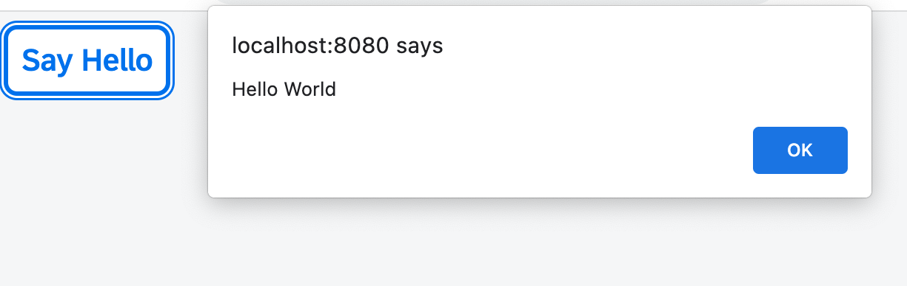

<!-- loio50579ddf2c934ce789e056cfffe9efa9 -->

# Step 5: Controllers

In this step, we replace the text with a button and show the "Hello World" message when the button is pressed. The handling of the button's `press` event is implemented in the controller of the view.


## Preview




<a name="loio50579ddf2c934ce789e056cfffe9efa9__section_yqd_crc_syb"/>

## Coding

You can view and download all files at [Walkthrough - Step 5](https://ui5.sap.com/#/entity/sap.m.tutorial.walkthrough/sample/sap.m.tutorial.walkthrough.05).


<a name="loio50579ddf2c934ce789e056cfffe9efa9__section_zqd_crc_syb"/>

## webapp/view/App.view.xml

```xml
<mvc:View
   controllerName="ui5.walkthrough.controller.App"
   xmlns="sap.m"
   xmlns:mvc="sap.ui.core.mvc">
   <Button
      text="Say Hello"
      press=".onShowHello"/>
</mvc:View>
```

We add a reference to the controller and replace the text control with a button with text "Say Hello". The button triggers the `.onShowHello` event handler function when being pressed. We also have to specify the name of the controller that is connected to the view and holds the `.onShowHello` function by setting the `controllerName` attribute of the view. The `controllerName` is a combination of the namespace of your application followed by the actual name of the controller. We'll also use it in the next step when defining the controller.

A view does not necessarily need an explicitly assigned controller. You do not have to create a controller if the view is just displaying information and no additional functionality is required. If a controller is specified, it is instantiated after the view is loaded.


## webapp/controller/App.controller.js \(New\)

```js
sap.ui.define([
   "sap/ui/core/mvc/Controller"
], (Controller) => {
   "use strict";

   return Controller.extend("ui5.walkthrough.controller.App", {
      onShowHello() {
         // show a native JavaScript alert
         alert("Hello World");
      }
   });
});
```

We create the folder `webapp/controller` and a new file `App.controller.js` inside. We define the app controller in its own file by extending the UI5-provided `sap/ui/core/mvc/Controller`. In the beginning, it holds only a single function called `onShowHello` that handles the button's `press` event by showing an alert.


## Conventions

-   Controller names are capitalized

-   Controllers carry the same name as the related view \(if there is a 1:1 relationship\)

-   Event handlers are prefixed with `on`

-   Controller names always end with `*.controller.js`


**Related Information**  


[Model View Controller \(MVC\)](../04_Essentials/model-view-controller-mvc-91f2334.md "The Model View Controller (MVC) concept is used in SAPUI5 to separate the representation of information from the user interaction. This separation facilitates development and the changing of parts independently.")

[Controller](../04_Essentials/controller-121b8e6.md "A controller contains methods that define how models and views interact.")

