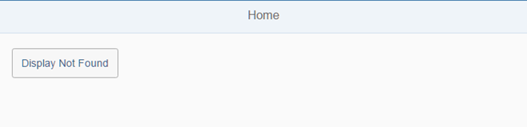

<!-- loiod9efab307ecc42b180b12cc8956e22d7 -->

# Step 5: Display a Target Without Changing the Hash

In this step, you will learn more about targets and how to display a target from the routing configuration manually.

We will display the *Not Found* target from the previous step without changing the hash to illustrate this navigation pattern. We will also consider a side-effect that prevents us from navigating back in this case.

Fortunately, we can extend our app and offer an easy solution. There are some use cases that should not be persisted in the URL but just be triggered by the application logic if needed. A target is a navigation-related configuration for a view and we can display targets manually without referencing them in a navigation route. Good examples for this are temporary errors, switching to an edit page for a business object, or going to a *Settings* page. Sometimes you will also have to implement a way back manually.


## Preview

  
  
**The new Home page with a navigation button**




## Coding

You can view and download all files in the *Samples* in the Demo -kit at [Routing and Navigation - Step 5](https://ui5.sap.com/#/entity/sap.ui.core.tutorial.navigation/sample/sap.ui.core.tutorial.navigation.05).


## webapp/view/Home.view.xml

```xml
<mvc:View
	controllerName="sap.ui.demo.nav.controller.Home"
	xmlns="sap.m"
	xmlns:mvc="sap.ui.core.mvc">
	<Page title="{i18n>homePageTitle}" class="sapUiResponsiveContentPadding">
		<content>
			<Button id="displayNotFoundBtn" text="{i18n>DisplayNotFound}" press=".onDisplayNotFound" class="sapUiTinyMarginEnd"/>
		</content>
	</Page>
</mvc:View>
```

We start by changing the `Button` control from the home view. When the button is pressed, the `onDisplayNotFound` handler is called.


## webapp/controller/Home.controller.js

```js
sap.ui.define([
	"sap/ui/demo/nav/controller/BaseController"
], function (BaseController) {
	"use strict";
	return BaseController.extend("sap.ui.demo.nav.controller.Home", {
		onDisplayNotFound : function () {
			//display the "notFound" target without changing the hash
			this.getRouter().getTargets().display("notFound");
		}
	});
});
```

Inside the `onDisplayNotFound` handler we get a reference to the `Targets` helper object of the router and simply call `display("notFound")`. The view associated to the target with the name `notFound` from the routing configuration will be displayed by the router without changing the hash.

The `sap.m.routing.Targets` object itself can be retrieved by calling `getTargets()` on the router. It provides a convenient way for placing views into the correct containers of your application. The main benefits of targets are structuring and lazy loading: you just configure the views in the routing configuration and you do not have to load the views until you really need them.

> ### Note:  
> In the example code we get a reference to the `sap.m.routing.Targets` object by calling `getTargets()` on `this.getRouter()` from the base controller. However, you could also get a reference to the `sap.m.routing.Targets` object by calling `this.getOwnerComponent().getRouter().getTargets()` or `this.getOwnerComponent().getTargets()`.

If you now call the app and press the *Display Not Found* button you see that the `notFound` target is displayed without changing the URL. That was easy, but suddenly our app's *Back* button does not work anymore. The bug we have just introduced illustrates an interesting navigation trap. The application hash is still empty since we just display the target and did not hit a route.

When pressing the app's *Back* button, the `onNavBack` from the previous step is called. It detects that there is no previous hash and therefore tries to navigate to the `appHome` route again. The router is smart enough to detect that the current hash did not change and therefore skips the navigation to the route. Fortunately, there is an easy workaround for us. However, we need to touch the `Home` controller again.


## webapp/controller/Home.controller.js \(Changed Again\)

```js
sap.ui.define([
	"sap/ui/demo/nav/controller/BaseController"
], function (BaseController) {
	"use strict";
	return BaseController.extend("sap.ui.demo.nav.controller.Home", {
		onDisplayNotFound : function () {
			//display the "notFound" target without changing the hash
			this.getRouter().getTargets().display("notFound", {
				fromTarget : "home"
			});
		}
	});
});

```

This time we pass on a data object as the second parameter for the display method which contains the name of the current target; the one from which we navigate to the `notFound` target. We decide to choose the key `fromTarget` but since it is a custom configuration object any other key would be fine as well.


## webapp/controller/NotFound.controller.js

```js
sap.ui.define([
	"sap/ui/demo/nav/controller/BaseController"
], function (BaseController) {
	"use strict";

	return BaseController.extend("sap.ui.demo.nav.controller.NotFound", {

		onInit: function () {
			var oRouter, oTarget;

			oRouter = this.getRouter();
			oTarget = oRouter.getTarget("notFound");
			oTarget.attachDisplay(function (oEvent) {
				this._oData = oEvent.getParameter("data");	// store the data
			}, this);
		},

		// override the parent's onNavBack (inherited from BaseController)
		onNavBack : function () {
			// in some cases we could display a certain target when the back button is pressed
			if (this._oData && this._oData.fromTarget) {
				this.getRouter().getTargets().display(this._oData.fromTarget);
				delete this._oData.fromTarget;
				return;
			}

			// call the parent's onNavBack
			BaseController.prototype.onNavBack.apply(this, arguments);
		}
	});
});
```

Next, we have to register an event listener to the `display` event of the `notFound` target. The best place for us to register an event listener for this is inside the `init` function of our `NotFound` controller. There we can access and store the custom data that we are passing on when displaying the target manually.

From the router reference we can fetch a reference to the `notFound` target. Each target configuration will create a runtime object that can be accessed through the router.

Similar to SAPUI5 controls, targets define API methods and events that can be attached. We attach a display event handler and save the data that was received as the event parameter `data` in an internal controller variable `_oData`. This data also includes the `fromTarget` information in case the caller passed it on. However, we now have to override the base controller's `onNavBack` implementation to change the behavior a bit. We add a special case for our target back functionality in case the `fromTarget` property has been passed on. If specified, we simply display the target defined as `fromTarget` manually the same way we actually called the `notFound` target manually. Otherwise we just call the base controller's `onNavBack` implementation.


## webapp/i18n/i18n.properties

```ini
...
DisplayNotFound=Display Not Found
```

Add the new property to the `i18n.properties` file.

When we now click the *Back* button, it works as expected and brings us back to the overview page, also when the *Not Found* view is displayed manually.


## Conventions

-   Display targets manually if you want to trigger a navigation without changing the hash

-   Think carefully about all navigation patterns in your application, otherwise the user might get stuck


**Related Information**  


[API Reference: `sap.m.routing.Targets`](https://ui5.sap.com/#/api/sap.m.routing.Targets)

[API Reference: `sap.ui.core.routing.Targets`](https://ui5.sap.com/#/api/sap.ui.core.routing.Targets)

[API Reference: `sap.ui.core.routing.Target`](https://ui5.sap.com/#/api/sap.ui.core.routing.Target)

