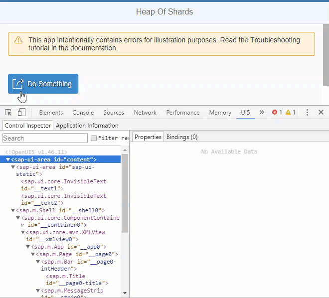

<!-- loio76e789ea418a48a1a27916b63a30fb72 -->

# Step 5: UI5 Inspector

In this tutorial step, we will have a closer look at UI5 Inspector - an open source Chrome DevTools extension specifically created for analyzing and debugging SAPUI5 code.

With UI Inspector, you can find answers to the following questions, for example:

-   What is the structure of your app?

-   How are the elements related to each other?

-   Which controls are involved when a function is performed?

-   Which data is bound to a specific control and how \(model and path\)?

> ### Note:  
> UI5 Inspector is only available for browsers, like Google Chrome and Microsoft Edge \(Chromium\), that support standard extensions from the Chrome Web Store.

<a name="loio76e789ea418a48a1a27916b63a30fb72__section_z4x_bdk_b1b"/>

## Preview

## Opening the Example App and the UI5 Inspector

1.  Add the UI5 Inspector as a standard extension to your Chromium-based browser from the [Chrome Web Store](https://chrome.google.com/webstore/detail/ui5-inspector/bebecogbafbighhaildooiibipcnbngo?hl=en).

2.  Download the example app with errors from the Demo Kitat [Troubleshooting](https://ui5.sap.com/#/entity/sap.ui.core.tutorial.troubleshooting/sample/sap.ui.core.tutorial.troubleshooting.01) and run the app.

3.  Open the *Developer Tools* in Google Chrome by pressing [F12\].

4.  Choose the *UI5* tab on the right side of the developer tools panel.

5.  Choose *Control Inspector*.

    You now see a list of all of the controls that are used in the current view of the app. When you select an entry, you see the properties and their values in the *Properties* area on the right. You can analyze line by line without being overwhelmed by too much information.

<a name="loio76e789ea418a48a1a27916b63a30fb72__section_plg_ffk_b1b"/>

## Simulating UI Changes

The app contains a *Do Something* button with meaningless icon \(`sap-icon://action`\) and text. We want to use the `sap-icon://activate` icon instead and change the text. With UI Inspector, we want to simulate how that will effect the UI change.

1.  Right-click the *Do Something* button and from the context menu select *Inspect UI5 Control*.

    The corresponding line in the *Control Inspector* is highlighted and you can view its properties.

2.  Double-click the value for the `icon` property, which is currently `sap-icon://action`.

3.  Replace `action` with `activate` and confirm with [Enter\].

    The icon on the button in the app is updated to show the new icon .

4.  Double-click the value for the `text` property and change the value to `Activate`.

5.  The changes that you make in the UI5 Inspector are only temporary, and the icon will be reset to the default when the page is reloaded. To make your change permanent, you have to change the app code.

**Related Information**  

[UI5 Inspector](../04_Essentials/ui5-inspector-b24e724.md "The UI5 Inspector is an open source Chrome DevTools extension that helps app developers to inspect, analyze, and support SAPUI5-based apps. It is supported for apps based on SAPUI5 version 1.28 and higher.")

