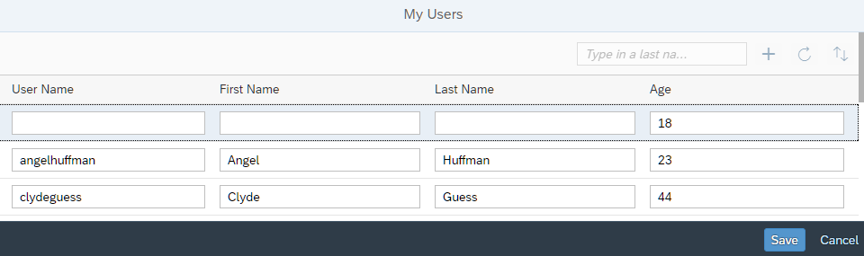

<!-- loiob4f12660538147f8839b05cb03f1d478 -->

# Step 6: Create and Edit

In this step, we will make it possible to create and edit \(update\) user data from the user interface and send the data to the back end.


<a name="loiob4f12660538147f8839b05cb03f1d478__section_bt4_fxc_z1b"/>

## Preview

   
  
**Data can now be edited and added.**

  


<a name="loiob4f12660538147f8839b05cb03f1d478__section_tsr_gxc_z1b"/>

## Coding

You can view and download all files at [OData V4 - Step 6](https://ui5.sap.com/#/entity/sap.ui.core.tutorial.odatav4/sample/sap.ui.core.tutorial.odatav4.06).


<a name="loiob4f12660538147f8839b05cb03f1d478__section_pvc_fyc_z1b"/>

## webapp/controller/App.controller.js

```js
...
		onInit : function () {
			var oMessageManager = sap.ui.getCore().getMessageManager(),
				oMessageModel = oMessageManager.getMessageModel(),
				oMessageModelBinding = oMessageModel.bindList("/", undefined, [],
					new Filter("technical", FilterOperator.EQ, true)),
				oViewModel = new JSONModel({
					busy : false,
					hasUIChanges : false,
					usernameEmpty : true,
					order : 0
				});
			this.getView().setModel(oViewModel, "appView");
			this.getView().setModel(oMessageModel, "message");

			oMessageModelBinding.attachChange(this.onMessageBindingChange, this);
			this._bTechnicalErrors = false;
},
...
```

We change the `onInit` method: The `appView` model receives two additional properties, which we will use to control whether certain controls in the view are enabled or visible during user entries. We also make the `MessageModel` available to the view and add a `ListBinding`. When the OData service reports errors while writing data, the OData Model adds them to the `MessageModel` as technical messages. Therefore we apply a filter to the `ListBinding`. We register our own handler to the `change` event of that `ListBinding` in order to capture any errors.

```js
...
		onSort : function () {
			...
		},
		_getText : function (sTextId, aArgs) {
			...
		},

		_setUIChanges : function (bHasUIChanges) {
			if (this._bTechnicalErrors) {
				// If there is currently a technical error, then force 'true'.
				bHasUIChanges = true;
			} else if (bHasUIChanges === undefined) {
				bHasUIChanges = this.getView().getModel().hasPendingChanges();
			}
			var oModel = this.getView().getModel("appView");
			oModel.setProperty("/hasUIChanges", bHasUIChanges);
		}
	});
});
```

We add the `_setUIChanges` private method that lets us set the property `hasUIChanges` of the `appView` model. Unless there are currently technical messages in the `MessageModel` or it is called with a given value for its `bHasUIChanges` parameter, the method uses `ODataModel.hasPendingChanges`. That method returns `true` if there are any changes that have not yet been written to the service.

```js
...
		onInit: function () {
			...
		},
		onCreate : function () {
			var oList = this.byId("peopleList"),
				oBinding = oList.getBinding("items"),
				oContext = oBinding.create({
					"UserName" : "",
					"FirstName" : "",
					"LastName" : "",
					"Age" : "18"
				});

			this._setUIChanges();
			this.getView().getModel("appView").setProperty("/usernameEmpty", true);

			oList.getItems().some(function (oItem) {
				if (oItem.getBindingContext() === oContext) {
					oItem.focus();
					oItem.setSelected(true);
					return true;
				}
			});
		},
		onRefresh
...
```

We add the `onCreate` event handler that responds to the `press` event of the *Add User* button. We use the `create` method of the `ODataListBinding` API to create a new user with some initial data and insert it at the top of the table. The `create` method returns the binding context of the new user. That context provides a `created` method which returns a `Promise`. The `Promise` is resolved when the new user is successfully transferred to the OData service.

We also use the binding context returned by the `create` method to focus and select the new row in which the new data can be entered.

```js
...
		onRefresh: function () {
			...
		},
		onSave : function () {
			var fnSuccess = function () {
				this._setBusy(false);
				MessageToast.show(this._getText("changesSentMessage"));
				this._setUIChanges(false);
			}.bind(this);

			var fnError = function (oError) {
				this._setBusy(false);
				this._setUIChanges(false);
				MessageBox.error(oError.message);
			}.bind(this);

			this._setBusy(true); // Lock UI until submitBatch is resolved.
			this.getView().getModel().submitBatch("peopleGroup").then(fnSuccess, fnError);
			this._bTechnicalErrors = false; // If there were technical errors, a new save resets them.
		},
		onSearch: function () {
			...
		},
		...
		_setUIChanges : function (bHasUIChanges) {
			...
		},
		_setBusy : function (bIsBusy) {
			var oModel = this.getView().getModel("appView");
			oModel.setProperty("/busy", bIsBusy);
		}
	});
});
```

We create the `onSave` event handler, in which we call the `submitBatch` method of the `ODataModel` API to submit our changes. Because the changes we submit refer to the table, we need to pass the update group `peopleGroup` that we declared in the table binding.

The `submitBatch` method returns a `Promise` that is rejected only if the batch request itself fails, for example, if the OData service is unavailable or if there were authorization problems. It is resolved in all other cases, also if the service returns errors for single requests that are contained in the batch request. Therefore, we have to implement the error handling for single requests differently.

We also define a `_setBusy` private function to lock the whole UI while the data is submitted to the back end.

```js
...
		onSort : function () {
			...
		},

		onMessageBindingChange : function (oEvent) {
			var aContexts = oEvent.getSource().getContexts(),
				aMessages,
				bMessageOpen = false;

			if (bMessageOpen || !aContexts.length) {
				return;
			}

			// Extract and remove the technical messages
			aMessages = aContexts.map(function (oContext) {
				return oContext.getObject();
			});
			sap.ui.getCore().getMessageManager().removeMessages(aMessages);

			this._setUIChanges(true);
			this._bTechnicalErrors = true;
			MessageBox.error(aMessages[0].message, {
				id : "serviceErrorMessageBox",
				onClose : function () {
					bMessageOpen = false;
				}
			});

			bMessageOpen = true;
		},
...
```

We implement the event handler for the `change` event of the `ListBinding` to the `MessageModel`. We created the `ListBinding` with a filter to only include technical messages. That means that the `change` event will be fired with every change but only technical messages will have a binding context. In case of technical messages, we get the first one and display it as an error. We also make sure that the toolbar for saving or discarding changes stays visible. We delete the technical messages so that they do not accumulate.

```js
...
		onRefresh: function () {
			...
		},
		onResetChanges : function () {
			this.byId("peopleList").getBinding("items").resetChanges();
			this._bTechnicalErrors = false; 
			this._setUIChanges();
		},
		onSearch: function () {
			...
		},
...
```

The `onResetChanges` method handles discarding pending changes. It uses the `resetChanges` method of the `ODataListBinding` API to remove any such changes. Then it calls the `_setUIChanges` private method to enable the elements of the header toolbar again and hide the footer.

```js
...
		onCreate: function () {
			...
		},
		onInputChange : function (oEvt) {
			if (oEvt.getParameter("escPressed")) {
				this._setUIChanges();
			} else {
				this._setUIChanges(true);
				if (oEvt.getSource().getParent().getBindingContext().getProperty("UserName")) {
					this.getView().getModel("appView").setProperty("/usernameEmpty", false);
				}
			}
		},
		onRefresh : function () {
			...
		},
...
```

The `onInputChange` event handler manages entries in any of the `Input` fields and triggers updates to the `appView` model as needed. It does an extra check on the `UserName` field to make sure that users cannot be saved without a `UserName`. Otherwise the OData service would return errors because `UserName` is a mandatory field.


<a name="loiob4f12660538147f8839b05cb03f1d478__section_pp2_mxc_z1b"/>

## webapp/view/App.view.xml

```xml
<mvc:View
	controllerName="sap.ui.core.tutorial.odatav4.controller.App"
	displayBlock="true"
	xmlns="sap.m"
	xmlns:mvc="sap.ui.core.mvc">
	<Shell>
		<App busy="{appView>/busy}" class="sapUiSizeCompact">
			<pages>
				<Page title="{i18n>peoplePageTitle}">
					<content>
						<Table
							id="peopleList"
							growing="true"
							growingThreshold="10"
							items="{
								path: '/People',
								parameters: {
								$count: true,
									$$updateGroupId : 'peopleGroup'
								}
							}">
							<headerToolbar>
								<OverflowToolbar>
									<content>
										<ToolbarSpacer/>
										<SearchField
											id="searchField"
											width="20%"
											placeholder="{i18n>searchFieldPlaceholder}"
											enabled="{= !${appView>/hasUIChanges}}"
											search=".onSearch"/>
										<Button
											id="addUserButton"
											icon="sap-icon://add"
											tooltip="{i18n>createButtonText}"
											press=".onCreate">
											<layoutData>
												<OverflowToolbarLayoutData priority="NeverOverflow"/>
											</layoutData>
										</Button>

										<Button
											id="refreshUsersButton"
											icon="sap-icon://refresh"
											enabled="{= !${appView>/hasUIChanges}}"
											tooltip="{i18n>refreshButtonText}"
											press=".onRefresh"/>
										<Button
											id="sortUsersButton"
											icon="sap-icon://sort"
											enabled="{= !${appView>/hasUIChanges}}"
											tooltip="{i18n>sortButtonText}"
											press=".onSort"/>
									</content>
								</OverflowToolbar>
							</headerToolbar>
							<columns>
								<Column id="userNameColumn">
									<Text text="{i18n>userNameLabelText}"/>
								</Column>
								<Column id="firstNameColumn">
									<Text text="{i18n>firstNameLabelText}"/>
								</Column>
								<Column id="lastNameColumn">
									<Text text="{i18n>lastNameLabelText}"/>
								</Column>
								<Column id="ageColumn">
									<Text text="{i18n>ageLabelText}"/>
								</Column>
							</columns>
							<items>
								<ColumnListItem>
									<cells>
										<Input
											value="{UserName}"
											valueLiveUpdate="true"
											liveChange=".onInputChange"/>

									</cells>
									<cells>
										<Input
											value="{FirstName}"
											liveChange=".onInputChange"/>
									</cells>
									<cells>
										<Input
											value="{LastName}"
											liveChange=".onInputChange"/>
									</cells>
									<cells>
										<Input
											value="{Age}"
											valueLiveUpdate="true"
											liveChange=".onInputChange"/>
									</cells>
								</ColumnListItem>
							</items>
						</Table>
					</content>
					<footer>
						<Toolbar visible="{appView>/hasUIChanges}">
							<ToolbarSpacer/>
							<Button
								id="saveButton"
								type="Emphasized"
								text="{i18n>saveButtonText}"
								enabled="{= ${message>/}.length === 0 &amp;&amp; ${appView>/usernameEmpty} === false }"
								press=".onSave"/>
							<Button
								id="doneButton"
								text="{i18n>cancelButtonText}"
								press=".onResetChanges"/>
						</Toolbar>
					</footer>

				</Page>
			</pages>
		</App>
	</Shell>
</mvc:View>

```

We add the `$$updateGroupId: 'peopleGroup'` parameter to the table. This means that changes in the table are not sent to the service immediately but instead are collected until we explicitly send them.

We add a new *Add User* button to the overflow toolbar in the table header, and define a footer toolbar that contains *Save* and *Cancel* buttons that we can display or hide through the `appView` model. We can disable the *Save* button separately, for example when a user enters invalid data.

Finally, we add the `liveChange="onInputChange"` event handler to the table cells to make it possible to react to user input. In addition, we set the `valueLiveUpdate` properties for the fields for `UserName` and `Age`. That makes sure that the SAPUI5 types validate the field content with each keystroke.

Creation via a form is demonstrated in our [Sales Orders sample app](https://ui5.sap.com/#/entity/sap.ui.model.odata.v4.ODataModel/sample/sap.ui.core.sample.odata.v4.SalesOrders).


<a name="loiob4f12660538147f8839b05cb03f1d478__section_kl4_d1x_4cb"/>

## webapp/i18n/i18n.properties

```ini
# Toolbar
#XBUT: Button text for save
saveButtonText=Save

#XBUT: Button text for cancel
cancelButtonText=Cancel

[/pandoc/div/div/horizontalrule/codeblock/strong/strong
     {"emphasis"}) #XBUT: Button text for add user
createButtonText=Add User
 (strong]


#XTOL: Tooltip for sort
sortButtonText=Sort by Last Name
...
# Messages
#XMSG: Message for user changes sent to the service
changesSentMessage=User data sent to the server
...
```

We add the new message texts.

**Related Information**  


[Model Instantiation and Data Access](../04_Essentials/model-instantiation-and-data-access-9613f1f.md "One OData V4 model instance can only cover one OData service. This section describes the creation of a model instance in more detail.")

[Batch Control](../04_Essentials/batch-control-74142a3.md "OData V4 allows you to group multiple operations into a single HTTP request payload, as described in the official OData V4 specification Part 1, Batch Requests (see the link under Related Information for more details).")

[OData Operations](../04_Essentials/odata-operations-b54f789.md "The OData V4 model supports OData operations (ActionImport, FunctionImport, bound Actions and bound Functions). Unbound parameters are limited to primitive values.")

[Creating an Entity](../04_Essentials/creating-an-entity-c9723f8.md "The sap.ui.model.odata.v4.ODataListBinding#create method creates a new entity. Users can interact with a newly created entity even before it has been sent to the server.")

[Message Model](../04_Essentials/message-model-8956f0a.md "The message model contains all messages and is used to bind to the messages to display them.")

[API Reference: `sap.ui.model.odata.v4.ODataContextBinding`](https://ui5.sap.com/#/api/sap.ui.model.odata.v4.ODataContextBinding)

