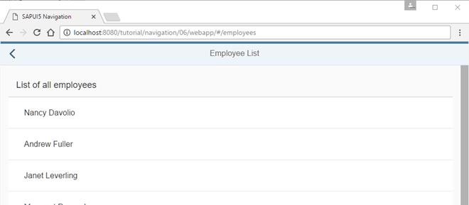
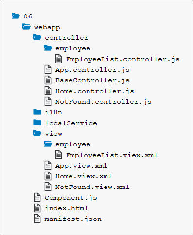

<!-- loio782aac08f2de4003a2fcbdd39d27f374 -->

# Step 6: Navigate to Routes with Hard-Coded Patterns

In this step, we'll create a second button on the home page, with which we can navigate to a simple list of employees. This example illustrates how to navigate to a route that has a hard-coded pattern.


## Preview

   
  
**Show Employee List button on the Home page**

  

   
  
**Employee list with Back button**

  


## Coding

You can view and download all files in the *Samples* in the Demo Kit at [Routing and Navigation - Step 6](https://ui5.sap.com/#/entity/sap.ui.core.tutorial.navigation/sample/sap.ui.core.tutorial.navigation.06).

   
  
**Folder structure for this step**

  


## webapp/view/Home.view.xml

```xml
<mvc:View
	controllerName="sap.ui.demo.nav.controller.Home"
	xmlns="sap.m"
	xmlns:mvc="sap.ui.core.mvc">
	<Page title="{i18n>homePageTitle}" class="sapUiResponsiveContentPadding">
		<content>
			<Button id="displayNotFoundBtn" text="{i18n>DisplayNotFound}" press=".onDisplayNotFound" class="sapUiTinyMarginEnd"/>
			<Button id="employeeListBtn" text="{i18n>ShowEmployeeList}" press=".onNavToEmployees" class="sapUiTinyMarginEnd"/>
		</content>
	</Page>
```

First, we change the `Home` view by adding the *Show Employee List* button. We register an event handler `onNavToEmployees` for the press event.


## webapp/controller/Home.controller.js

```js
sap.ui.define([
	"sap/ui/demo/nav/controller/BaseController"
], function (BaseController) {
	"use strict";
	return BaseController.extend("sap.ui.demo.nav.controller.Home", {
		onDisplayNotFound : function () {
			// display the "notFound" target without changing the hash
			this.getRouter().getTargets().display("notFound", {
				fromTarget : "home"
			});
		},
		onNavToEmployees : function (){
			this.getRouter().navTo("employeeList");
		}

	});
});
```

The new event handler `onNavToEmployees` calls `navTo("employeeList")` on the router instance. The parameter `employeeList` is the name of the route that we want to navigate to.


## webapp/manifest.json

```js
{
	"_version": "1.12.0",
	"sap.app": {
		...
	},
	"sap.ui": {
		...
	},
	"sap.ui5": {
		...
		"routing": {
			"config": {
				"routerClass": "sap.m.routing.Router",
				"type": "View",
				"viewType": "XML",
				"path": "sap.ui.demo.nav.view",
				"controlId": "app",
				"controlAggregation": "pages",
				"transition": "slide",
				"bypassed": {
					"target": "notFound"
				}
			},
			"routes": [{
				"pattern": "",
				"name": "appHome",
				"target": "home"
			}, {
				"pattern": "employees",
				"name": "employeeList",
				"target": "employees"
			}],
			"targets": {
				"home": {
					"id": "home",
					"name": "Home",
					"level" : 1
				},
				"notFound": {
					"id": "notFound",
					"name": "NotFound",
					"transition": "show"
				},
				"employees": {
					"id": "employeeList",
					"path": "sap.ui.demo.nav.view.employee",
					"name": "EmployeeList",
					"level" : 2
				}

			}
		}
	}
}
```

To make the navigation work, we have to extend the routing configuration of the app in the descriptor file. We add a new pattern called `employeeList`; this is the name we used in the controller to trigger the navigation.

The pattern of the route is the hard-coded value `employees`, meaning the matching hash for this route is `/#/employees` in the address bar of the browser. The target `employees` should be displayed when this URL pattern is matched.

The `employees` entry in the `targets` section references the `sap.ui.demo.nav.view.employee.EmployeeList` view. As you can see, we added a new namespace `employee` for all views related to employees with the property `path`. This overrides the default settings in the `config` section for the current target.

The view that we are about to create has to be placed in the `webapp/view/employee` folder accordingly. This approach helps to structure the views of the app according to business objects and to better understand the navigation patterns of the app in larger projects.

> ### Note:  
> We could also have left out the `path` property to use the default `path` defined in the `config` section. In that case, we would have to change the `name` to `employee.EmployeeList` to achieve the same effect.

Setting the `level` to `2` helps the router to determine how to animate the \(in our case\) `slide` transition. For us, this means that a navigation from the home page to the `employees` target will be animated with a “Slide to Left” animation. In contrast to that, the back navigation from the `employees` target to the home page will be animated with a “Slide to Right” animation. This behavior is due to the fact that the home page has a lower `level` than the `employees` target.


## webapp/view/employee/EmployeeList.view.xml \(New\)

```xml
<mvc:View
	controllerName="sap.ui.demo.nav.controller.employee.EmployeeList"
	xmlns="sap.m"
	xmlns:mvc="sap.ui.core.mvc">
	<Page
		id="employeeListPage"
		title="{i18n>EmployeeList}"
		showNavButton="true"
		navButtonPress=".onNavBack"
		class="sapUiResponsiveContentPadding">
		<content>
			<List id="employeeList" headerText="{i18n>ListOfAllEmployees}" items="{/Employees}">
				<items>
					<StandardListItem
						title="{FirstName} {LastName}"
						iconDensityAware="false"
						iconInset="false"/>
				</items>
			</List>
		</content>
	</Page>
</mvc:View>
```

We now create a subfolder `employee` below `webapp/view` and a file `EmployeeList.view.xml`.

We name the folder after the business object, to make it obvious from looking at the hash \(included in the browser's address bar\) where a view file for a certain business object is located. For example, we can determine from the URL `/#/employee` that the corresponding view must be somewhere in the folder `./employee` \(in our case: `webapp/view/employee`\) just by looking at the URL.

In the view, we use a `sap.m.List` control and bind its items to the data from our simulated OData service. Note that we have also registered the `onNavBack` handler from the base controller again to be able to navigate back to the overview.

This view can be referenced by `sap.ui.demo.nav.view.employee.EmployeeList`.


## webapp/controller/employee/EmployeeList.controller.js \(New\)

```js
sap.ui.define([
	"sap/ui/demo/nav/controller/BaseController"
], function (BaseController) {
	"use strict";
	return BaseController.extend("sap.ui.demo.nav.controller.employee.EmployeeList", {
	});
});
```

Finally, we will add a new controller. Create a subfolder `employee` inside `webapp/controller` folder and place the file `EmployeeList.controller.js` there. As you can see, the folder structure of the controllers is in sync with the folder structure of the views.


## webapp/i18n/i18n.properties

```ini
...
ShowEmployeeList=Show Employee List
EmployeeList=Employee List
ListOfAllEmployees=List of all employees
```

Add the new texts to the `i18n.properties` file.

Now you can open the app and press the *Show Employee List* button to navigate to the employee list. From there, you can press either the browser’s or the app’s *Back* button to get back to the home page.

**Related Information**  


[Methods and Events for Navigation](../04_Essentials/methods-and-events-for-navigation-516e477.md "SAPUI5 provides a method and events for navigation.")

[API Reference: `sap.ui.core.routing.Route`](https://ui5.sap.com/#/api/sap.ui.core.routing.Route)

