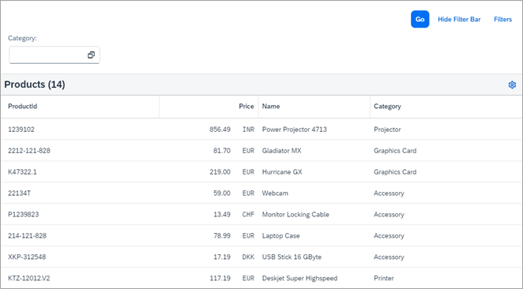
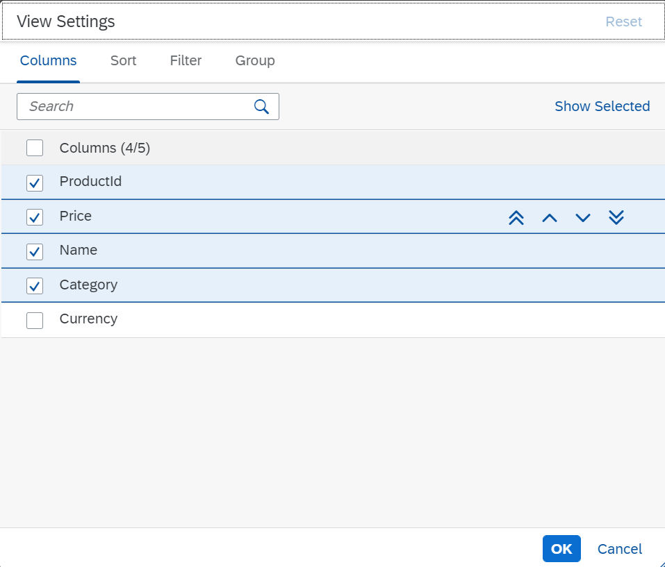
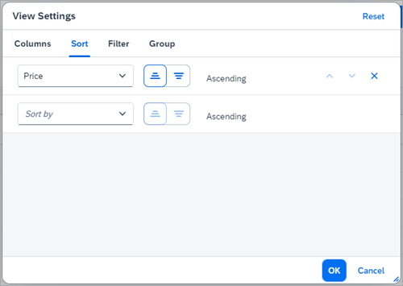
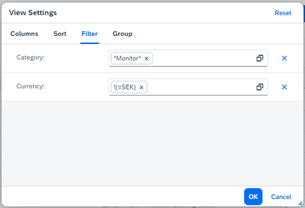
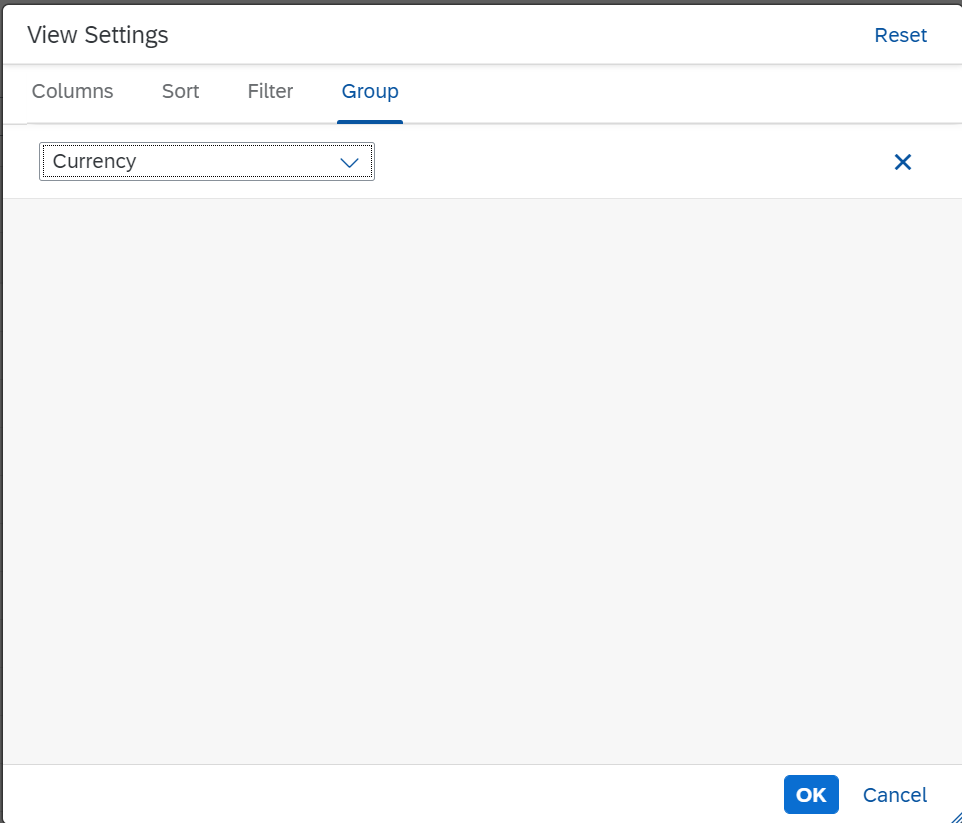
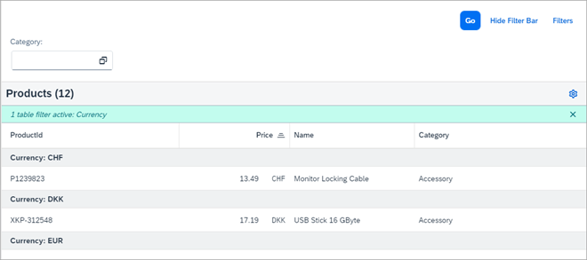

<!-- loio19531496ec144fa1bc4adab5bc08527c -->

# Step 6: Table Personalization

Table personalization offers you a dedicated dialog to specify which columns in the table are visible and in which order, how the data is sorted, whether grouping of the data is active, and whether table entries are filtered.

The settings in the dialog can also be persisted as you will see in the next step. In this step, we will use the same setup as in step 5 except that we enable table personalization in the `view.xml`.


## Preview

Starting from the main UI, we can enter the different personalization possibilities by pressing the *Settings* icon in the upper right-hand corner of the toolbar:

   
  
<a name="loio19531496ec144fa1bc4adab5bc08527c__fig_r1j_pst_mr"/>Table Personalization

  

After doing this, you see a popup with four different tabs:

   
  
<a name="loio19531496ec144fa1bc4adab5bc08527c__fig_ywq_yzj_js"/>Settings Dialog: Column Visibility and Order

  

   
  
<a name="loio19531496ec144fa1bc4adab5bc08527c__fig_y3r_yzj_js"/>Settings Dialog: Sorting

  

   
  
<a name="loio19531496ec144fa1bc4adab5bc08527c__fig_zrr_yzj_js"/>Settings Dialog: Filtering

  

   
  
<a name="loio19531496ec144fa1bc4adab5bc08527c__fig_ezr_yzj_js"/>Settings Dialog: Grouping

  

   
  
<a name="loio19531496ec144fa1bc4adab5bc08527c__fig_zgs_yzj_js"/>Resulting View with Personalization Applied

  


## Coding

You can view and download all files in the *Samples* in the Demo Kit at [Smart Controls - Step 6 - Table Personalization](https://ui5.sap.com/#/entity/sap.ui.comp.tutorial.smartControls/sample/sap.ui.comp.tutorial.smartControls.06).

As mentioned above, we use the same content as in the previous step, so we refrain from any code listings except for the `view.xml`. We should mention, however, that fields that are not specifically marked as `sap:sortable="false"`, `sap:filterable="false"` or `sap:groupable="false"` in the metadata will all be sortable, filterable, or groupable, respectively, and thus be available in the tabs of the personalization dialog.


## Personalization.view.xml

```xml
<mvc:View 
	xmlns="sap.m"
	xmlns:mvc="sap.ui.core.mvc"
	controllerName="sap.ui.demo.smartControls.Personalization"
	xmlns:smartFilterBar="sap.ui.comp.smartfilterbar"
	xmlns:smartTable="sap.ui.comp.smarttable">
	<smartFilterBar:SmartFilterBar 
		id="smartFilterBar"
		entitySet="Products">
		<smartFilterBar:controlConfiguration>
			<smartFilterBar:ControlConfiguration
				key="Category" visibleInAdvancedArea="true"
				preventInitialDataFetchInValueHelpDialog="false">
			</smartFilterBar:ControlConfiguration>
		</smartFilterBar:controlConfiguration>
	</smartFilterBar:SmartFilterBar>
	<smartTable:SmartTable 
		id="smartTable_ResponsiveTable"
		smartFilterId="smartFilterBar" 
		tableType="ResponsiveTable" 
		editable="false"
		entitySet="Products" 
		useVariantManagement="false"
		useTablePersonalisation="true" 
		header="Products" 
		showRowCount="true"
		useExportToExcel="false" 
		enableAutoBinding="true">
	</smartTable:SmartTable>
</mvc:View>
```

To enable table personalization, we set `useTablePersonalisation` to `true`. As will become clear in the next section, you would typically use the table personalization together with view management since you can then also persist any changes done to the table.

**Related Information**  


[Personalization](../10_More_About_Controls/personalization-a3c3c5e.md "The sap.m.p13n.Popup control in the sap.m.p13n namespace provides a dialog or popover for personalizing table content, such as selecting columns and adapting their order.")

