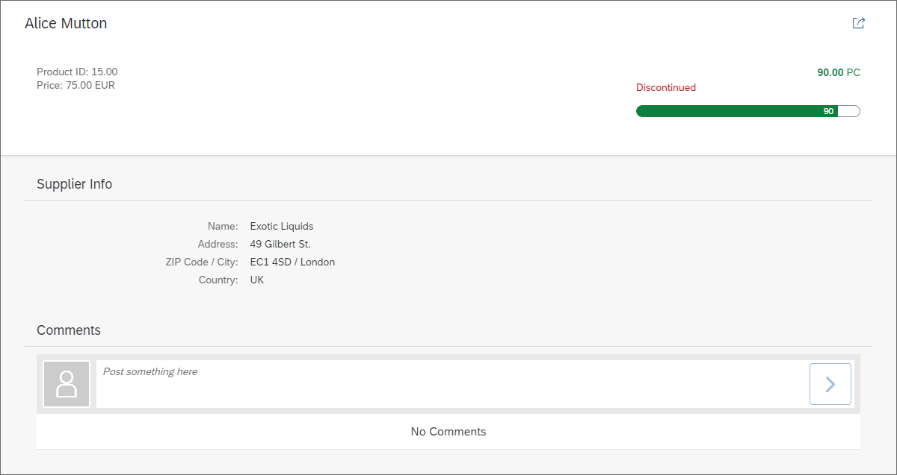

<!-- loioc73dfe312f104664954749c5c36faf27 -->

# Step 7: Adding a Comments Section

In this step, we extend the product detail view by adding a feature allowing to add comments to the product.


## Preview

   
  
**Comments section added to the detail page**

  


## Coding

You can view and download all files in the *Samples* in the Demo Kit at [Worklist App - Step 7](https://ui5.sap.com/#/entity/sap.m.tutorial.worklist/sample/sap.m.tutorial.worklist.07) .


### webapp/view/Object.view.xml \[MODIFY\]

```xml

<mvc:View
    controllerName="mycompany.myapp.MyWorklistApp.controller.Object"
    xmlns="sap.m"
    xmlns:mvc="sap.ui.core.mvc"
    xmlns:semantic="sap.f.semantic"
    xmlns:form="sap.ui.layout.form"
    xmlns:l="sap.ui.layout">

...

        <semantic:content>
            <l:VerticalLayout width="100%">
            <Panel
                backgroundDesign="Transparent"
                headerText="{i18n>ObjectSupplierTabTitle}">

...
            </Panel>
                <Panel
                    backgroundDesign="Transparent"
                    headerText="{i18n>ObjectCommentsTabTitle}">
                    <content>
                        <FeedInput post=".onPost"/>
                        <List
                            id="idCommentsList"
                            noDataText="{i18n>ObjectCommentNoData}"
                            showSeparators="Inner"
                            items="{
                                path: 'productFeedback>/productComments',
                                sorter: {
                                    path: 'date',
                                    descending: true
                                }
                            }">
                            <FeedListItem
                                info="{productFeedback>type}"
                                text="{productFeedback>comment}"
                                timestamp="{productFeedback>date}"/>
                        </List>
                    </content>
                </Panel>
            </l:VerticalLayout>
        </semantic:content>
```

Below the already existing panel, we add another panel that will serve as a container for our comments section. We put both panels inside a vertical layout, because `sap.f.semanticPage` allows only one control for content aggregation. Within the new panel, we add a `sap.m.FeedInput` control and attach an event handler `onPost` for the `post` event. This control will render an input field and a button, which allow users to post comments. The event handler we registered will be implemented below.

Below the `FeedInput` control, we add a list with all existing comments. The `items` aggregation of the list is bound to the `/productComments` property of the named model `productFeedback` that we will create below. All comments shall be displayed in descending order based on their publishing date. Therefore, we also configure a sorter for our items in the list.

The template for each row is a `FeedListItem` control. We configure the `FeedListItem` to simply display the date of the post, the text of the post itself, and the type of the post.


### webapp/controller/Object.controller.js \[MODIFY\]

```js
...
/*global location*/
sap.ui.define([
   "myCompany/myApp/controller/BaseController",
   "sap/ui/model/json/JSONModel",
   "sap/ui/core/routing/History",
   "myCompany/myApp/model/formatter",
   "sap/ui/core/date/UI5Date",
   "sap/ui/core/format/DateFormat",
   "sap/ui/model/Filter",
   "sap/ui/model/FilterOperator"
], function(BaseController, JSONModel, History, formatter, UI5Date, DateFormat, Filter, FilterOperator) {
   "use strict";
   return BaseController.extend("myCompany.myApp.controller.Object", {
      formatter: formatter,
      ...
      _onBindingChange: function(oEvent) {
         ...
         // Update the comments in the list
         var oList = this.byId("idCommentsList");
         var oBinding = oList.getBinding("items");
         oBinding.filter(new Filter("productID", FilterOperator.EQ, sObjectId));
      },
      /**
      * Updates the model with the user comments on Products.
      * @function
      * @param {sap.ui.base.Event} oEvent object of the user input
      */
      onPost: function (oEvent) {
         var oFormat = DateFormat.getDateTimeInstance({style: "medium"});
         var sDate = oFormat.format(UI5Date.getInstance());
         var oObject = this.getView().getBindingContext().getObject();
         var sValue = oEvent.getParameter("value");
         var oEntry = {
             productID: oObject.ProductID,
             type: "Comment",
             date: sDate,
             comment: sValue
         };        
         // update model
         var oFeedbackModel = this.getModel("productFeedback");
         var aEntries = oFeedbackModel.getData().productComments;
         aEntries.push(oEntry);
         oFeedbackModel.setData({
            productComments : aEntries
         });
      }
   });
});
```

First, we add three new dependencies to the controller. We need these dependencies because we want to create a filter for the list and because we format the date and time of each post.

Whenever the binding of the detail view changes, we want to make sure that the comments for the current product are displayed. Therefore, we change the private function `_onBindingChange` and update the filter of the list that displays the comments by getting a reference to the binding of the `items` aggregation of our list and calling the `filter()` API afterwards. The filter is passed on to the `filter()` API. We use the `productID` as filter criterion, because we only want comments for a specific product.

Next, the event handler for the `post` event of the `FeedInput` is implemented. In the `onPost` handler, we create a new `entry` object that contains all data we want to store in our model. This data is the `productId`, the `type` of the post \(hard-coded in our example\), the current `date` in a medium date format, and the `comment` itself. The comment is retrieved from the event object. The `productId` is determined by calling `getObject()` on the view’s binding context.

Finally, the new entry is added to the named model called `productFeedback`. This model does not exist yet, so let’s create it next.


### webapp/model/models.js \[MODIFY\]

```js
sap.ui.define([
   "sap/ui/model/json/JSONModel",
   "sap/ui/Device"
], function(JSONModel, Device) {
   "use strict";
   return {
      createDeviceModel: function() {
         var oModel = new JSONModel(Device);
         oModel.setDefaultBindingMode("OneWay");
         return oModel;
      },   
      createCommentsModel: function() {
         return new JSONModel({ productComments : [] });
      }
   };
});
```

In both the object view \(detail page\) as well as in the corresponding controller we used a named model called `productFeedback`. In our example this model is a simple `JSONModel`. It is created in the function `createCommentsModel()` in the`model.js` file. As you can see above, the function simply returns a new instance of a `JSONModel` with a simple data object. The property `productComments` is an empty array and it will be updated every time someone posts a new comment.

However, this model is not yet accessible throughout our app. Let’s fix this next.


### webapp/Component.js \[MODIFY\]

```js
sap.ui.define([
   "sap/ui/core/UIComponent",
   "sap/ui/Device",
   "./model/models",
   "./controller/ErrorHandler"
], function(UIComponent, Device, models, ErrorHandler) {
   "use strict";
   return UIComponent.extend("myCompany.myApp.Component", {
      ...
      init: function() {
         // call the base component's init function
         UIComponent.prototype.init.apply(this, arguments);

         // initialize the error handler with the component
         this._oErrorHandler = new ErrorHandler(this);

         // set the device model
         this.setModel(models.createDeviceModel(), "device");
         
         // set the product feedback model
         this.setModel(models.createCommentsModel(), "productFeedback");


         // create the views based on the url/hash
         this.getRouter().initialize();
      },
      ...
   });
});
```

Now it’s time to make the named model `productFeedback` available to our app. Therefore, just change the `init` function of our `Component.js` file by calling our `createCommentsModel()` method and setting the returned model on the component. After this, our model is accessible in our app.


### webapp/i18n/i18n.properties \[MODIFY\]

```ini
...
#Comments tab title
ObjectCommentsTabTitle=Comments

#No comments text
ObjectCommentNoData=No Comments


#~~~ Footer Options ~~~~~~~~~~~~~~~~~~~~~~~
...
```

Now add the new texts to our `i18n.properties` file and you’re done.

You can test the new features by navigating to the details page of any given product. After that, just create a new comment for that product and post it.


<a name="loioc73dfe312f104664954749c5c36faf27__section_jvq_kgt_qbb"/>

## Summary

Based on the initial app you have seen how easy it can be to generate or download initial code and to extend it according to your own requirements. This tutorial also illustrated how to communicate easily with an OData back end using the OData V2 model. Furthermore, it illustrated how to use the mock server with both generated mock data and more realistic data.

