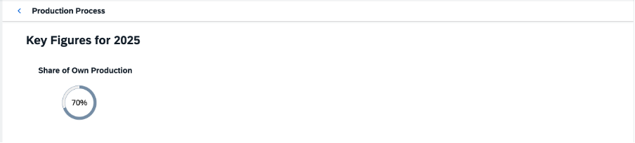

<!-- loio59015909859848f896ebbfa2831470da -->

# Step 7: Header Container and Radial Micro Chart

In this step, you use the `HeaderContainer` and `RadialMicroChart`. Click the *Production Process* tile to trigger the navigation.


<a name="loio59015909859848f896ebbfa2831470da__section_mnp_4rk_l1b"/>

## Preview




<a name="loio59015909859848f896ebbfa2831470da__section_zkt_nsk_l1b"/>

## `HeaderContainer` with `RadialMicroChart`

In the header area, you can display additional values for the business logic of the production process. You can use charts to visualize the information. To distinguish this part from the `ProcessFlow`, we use the `ObjectHeader` in the header area. You can add further charts in the following steps and therefore, you can create an instance of the `HeaderContainer` that contains your charts.

The first chart contains the share of own production that is included in the final product. This value is already available in the data model. You can visualize the percentage value by using a `RadialMicroChart`. First, create a `HeaderContainer` with a single `RadialMicroChart`.


### `ProcessFlow.view.xml`

You can view and download this step in the Demo Kit from the [Ice Cream Machine - Step 7 - Header Container and Radial Micro Chart](https://ui5.sap.com/#/entity/sap.suite.ui.commons.tutorial.icecream/sample/sap.suite.ui.commons.tutorial.icecream.07).

```xml
<mvc:View
    xmlns:mvc="sap.ui.core.mvc"
    xmlns="sap.suite.ui.commons"
    xmlns:m="sap.m"
    xmlns:mc="sap.suite.ui.microchart"
    controllerName="sap.suite.ui.commons.demokit.tutorial.icecream.07.controller.ProcessFlow">
    <m:Page
        title="{i18n>processFlowTitle}"
        showNavButton="true"
        navButtonPress=".onNavButtonPressed"

        backgroundDesign="Solid">
        <m:content>
            <m:ObjectHeader
                responsive="true"
                title="{
                    parts: [
                        'i18n>processFlowChartsTitle',
                        'business>/year'
                    ],
                    formatter: '.formatMessage'
                }">
                <m:headerContainer>
                    <m:HeaderContainer
                        scrollStep="200"
                        scrollTime="500"
                        showDividers="true"
                        class="sapUiSmallMargin">
                        <m:FlexBox
                            width="12rem"
                            height="10rem"
                            alignItems="Center"
                            justifyContent="Center"
                            direction="Column">
                            <m:Title
                                text="{i18n>processFlowChartsShareOwnProduction}"
                                class="sapUiSmallMargin"/>
                            <m:FlexBox width="6rem" height="6rem">
                                <mc:RadialMicroChart percentage="{business>/shareOwnProduction}" valueColor="Critical"/>
                            </m:FlexBox>
                        </m:FlexBox>
                    </m:HeaderContainer>
                </m:headerContainer>

            </m:ObjectHeader>
        </m:content>
    </m:Page>
</mvc:View>

```

The `HeaderContainer` has `scrollStep` and `scrollTime` properties that are used to change the scroll step and the animation speed of the `HeaderContainer`. The `showDividers` default value is kept as is to split each chart in the `HeaderContainer`.

The `FlexBox` is used as a container for the title and the inner `FlexBox` for the `RadialMicroChart`. This ensures correct sizing. To visualize the share of your own production, the value is set in the `percentage` property of the `RadialMicroChart`. With the *Size* enumeration, you can use the chart in one of the fixed sizes. If not set, the default *Responsive* size is used, and the width and height adapt to the surrounding container. You can set the *width* and *height* of the `FlexBox` instance.


### `ProcessFlow.controller.js`

```js

sap.ui.define([
    "sap/ui/core/mvc/Controller",
    "sap/base/strings/formatMessage"
], function (Controller, formatMessage) {
    "use strict";

    return Controller.extend("sap.suite.ui.commons.demokit.tutorial.icecream.07.controller.ProcessFlow", {
        formatMessage: formatMessage,

        onNavButtonPressed: function () {
            this.getOwnerComponent().getRouter().navTo("home");
        }
    });
});

```

When you click on the **Back** button, `onNavButtonPressed` is called and it triggers the navigation back to the start page view.

