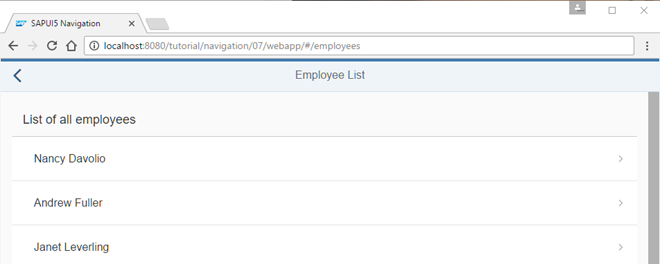
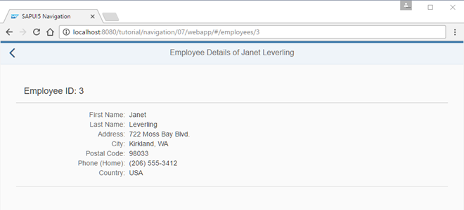
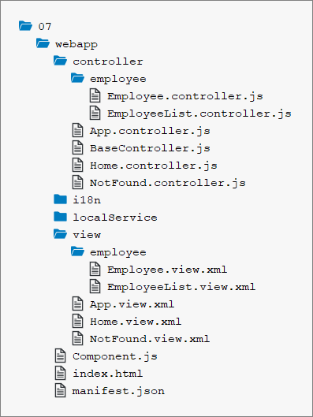

<!-- loiof96d2522a5ca4382a274ae3c6d002ca0 -->

# Step 7: Navigate to Routes with Mandatory Parameters

In this step, we implement a feature that allows the user to click on an employee in the list to see additional details of the employee. A route pattern can have one or more mandatory parameters to identify objects in an app.

The detail page has to read the ID of the employee from the URL to fetch and display the employee data from the server. If the employee was not found, for example, because an invalid employee ID was passed on, we want to inform the user by displaying the `notFound` target. Of course, the back navigation has to work as well for this page.


## Preview

  
  
**Employee list with navigation option for items**



  
  
**Detail Page for a selected employee**



  
  
**Not Found page for an invalid EmployeeID**


## Coding

You can view and download all files in the *Samples* in the Demo Kit at [Routing and Navigation - Step 7](https://ui5.sap.com/#/entity/sap.ui.core.tutorial.navigation/sample/sap.ui.core.tutorial.navigation.07).

  
  
**Folder structure for this step**




## webapp/manifest.json

```js
{
	"_version": "1.12.0",
	"sap.app": {
		...
	},
	"sap.ui": {
		...
	},
	"sap.ui5": {
		...
		"routing": {
			"config": {
				"routerClass": "sap.m.routing.Router",
				"type": "View",
				"viewType": "XML",
				"path": "sap.ui.demo.nav.view",
				"controlId": "app",
				"controlAggregation": "pages",
				"transition": "slide",
				"bypassed": {
					"target": "notFound"
				}
			},
			"routes": [{
				"pattern": "",
				"name": "appHome",
				"target": "home"
			}, {
				"pattern": "employees",
				"name": "employeeList",
				"target": "employees"
			}, {
				"pattern": "employees/{employeeId}",
				"name": "employee",
				"target": "employee"
			}],
			"targets": {
				"home": {
					"id": "home",
					"name": "Home",
					"level" : 1
				},
				"notFound": {
					"id": "notFound",
					"name": "NotFound",
					"transition": "show"
				},
				"employees": {
					"id": "employeeList",
					"path": "sap.ui.demo.nav.view.employee",
					"name": "EmployeeList",
					"level" : 2
				},
				"employee": {
					"id": "employee",
					"name": "employee.Employee",
					"level" : 3
				}
			}
		}
	}
}
```

From our data model \(`webapp/localService/metadata.xml` or `webapp/localService/mockdata/Employees.json`\), you can see that each employee entity is identified by an `EmployeeID`. We define a new route that expects a mandatory `employeeId` in its pattern to address an employee. Unlike the patterns we used before, this pattern has a dynamic part. We create a new route `employee` and use `employees/{employeeId}` as its pattern.

The `{employeeId}` part of the pattern is a mandatory parameter as indicated by the curly brackets. The hash that contains an actual employee ID is matched against that pattern at runtime.

The following hashes would match in our case: `employees/2`, `employees/7`, `employees/anInvalidId,` and so on. However, the hash `employees/` will not match as it does not contain an ID at all. The target of our route is `employee`. We create the target `employee` with `level` `3`. With that, we make sure that we have the correct slide animation direction.

Next, we have to create the view `employees.Employee`; for better illustration the `path` is not specified this time.


## webapp/view/employee/Employee.view.xml \(New\)

```xml
<mvc:View
	controllerName="sap.ui.demo.nav.controller.employee.Employee"
	xmlns="sap.m"
	xmlns:mvc="sap.ui.core.mvc"
	xmlns:f="sap.ui.layout.form"
	busyIndicatorDelay="0">
	<Page
		id="employeePage"
		title="{i18n>EmployeeDetailsOf} {FirstName} {LastName}"
		showNavButton="true"
		navButtonPress=".onNavBack"
		class="sapUiResponsiveContentPadding">
		<content>
			<Panel
				id="employeePanel"
				width="auto"
				class="sapUiResponsiveMargin sapUiNoContentPadding">
				<headerToolbar>
					<Toolbar>
						<Title text="{i18n>EmployeeIDColon} {EmployeeID}" level="H2"/>
						<ToolbarSpacer />
					</Toolbar>
				</headerToolbar>
				<content>
					<f:SimpleForm
						minWidth="1024"
						editable="false"
						layout="ResponsiveGridLayout"
						labelSpanL="3" labelSpanM="3" emptySpanL="4" emptySpanM="4"
						columnsL="1" columnsM="1">
						<f:content>
							<Label text="{i18n>formFirstName}"/>
							<Text text="{FirstName}"/>
							<Label text="{i18n>formLastName}"/>
							<Text text="{LastName}"/>
							<Label text="{i18n>formAddress}"/>
							<Text text="{Address}"/>
							<Label text="{i18n>formCity}"/>
							<Text text="{City}, {Region}"/>
							<Label text="{i18n>formPostalCode}"/>
							<Text text="{PostalCode}"/>
							<Label text="{i18n>formPhoneHome}"/>
							<Text text="{HomePhone}"/>
							<Label text="{i18n>formCountry}"/>
							<Text text="{Country}"/>
						</f:content>
					</f:SimpleForm>
				</content>
			</Panel>
		</content>
	</Page>
</mvc:View>
```

Create the file `Employee.view.xml` inside the `webapp/view/employee` folder. This employee view displays master data for an employee in a panel with a `SimpleForm` control: first name, last name and so on. The data comes from a relative data binding that is set on the view level as we can see in the controller later. As we are focusing on the navigation aspects in this tutorial, we won’t go into detail on the controls of the view. Just copy the code.


## webapp/controller/employee/Employee.controller.js \(New\)

```js
sap.ui.define([
	"sap/ui/demo/nav/controller/BaseController"
], function (BaseController) {
	"use strict";
	return BaseController.extend("sap.ui.demo.nav.controller.employee.Employee", {
		onInit: function () {
			var oRouter = this.getRouter();
			oRouter.getRoute("employee").attachMatched(this._onRouteMatched, this);
			// Hint: we don't want to do it this way
			/*
			oRouter.attachRouteMatched(function (oEvent){
				var sRouteName, oArgs, oView;
				sRouteName = oEvent.getParameter("name");
				if (sRouteName === "employee"){
					this._onRouteMatched(oEvent);
				}
			}, this);
			*/
		},
		_onRouteMatched : function (oEvent) {
			var oArgs, oView;
			oArgs = oEvent.getParameter("arguments");
			oView = this.getView();

			oView.bindElement({
				path : "/Employees(" + oArgs.employeeId + ")",
				events : {
					change: this._onBindingChange.bind(this),
					dataRequested: function (oEvent) {
						oView.setBusy(true);
					},
					dataReceived: function (oEvent) {
						oView.setBusy(false);
					}
				}
			});
		},
		_onBindingChange : function (oEvent) {
			// No data for the binding
			if (!this.getView().getBindingContext()) {
				this.getRouter().getTargets().display("notFound");
			}
		}
	});
});
```

Now we create the file `Employee.controller.js` in the `webapp/controller/employee` folder. In this controller file, we want to detect which employee shall be displayed in order to show the employee’s data in the view. Therefore, we query the router for the route `employee` and attach a private event listener function `_onRouteMatched` to the matched event of this route.

In the event handler, we can access the `arguments` parameter from the `oEvent` parameter that contains all parameters of the pattern. Since this listener is only called when the route is matched, we can be sure that the mandatory parameter `employeeId` is always available as a key in `arguments`; otherwise the route would not have matched. The name of the mandatory parameter `employeeId` correlates to the `{employeeId}` from our pattern definition of the route `employee` and thus to the value in the URL.

In `_onRouteMatched` we call `bindElement()` on the view to make sure that the data of the specified employee is available in the view and its controls. The `ODataModel` will handle the necessary data requests to the back end in the background. While the data is loading, it would be nice to show a busy indicator by simply setting the view to `busy`. Therefore, we pass an events object to `bindElement()` to listen to the events `dataRequested` and `dataReceived`. The attached functions handle the busy state by calling `oView.setBusy(true)` and `oView.setBusy(false)` respectively.

We also add an event handler to the `change` event as a private function `_onBindingChange`. It checks if the data could be loaded by querying the binding context of the view. As seen in the previous steps, we will display the `notFound` target if the data could not be loaded.

> ### Note:  
> Instead of calling `attachMatched(…)` on a route we could also call `attachRouteMatched(…)` directly on the router. However, the event for the latter is fired for every matched event of any route in the whole app. We don’t use the latter because we would have to implement an additional check for making sure that current route is the route that has been matched. We want to avoid this extra overhead and register on the route instead.


## webapp/view/employee/EmployeeList.view.xml

```xml
<mvc:View
	controllerName="sap.ui.demo.nav.controller.employee.EmployeeList"
	xmlns="sap.m"
	xmlns:mvc="sap.ui.core.mvc">
	<Page
		id="employeeListPage"
		title="{i18n>EmployeeList}"
		showNavButton="true"
		navButtonPress=".onNavBack"
		class="sapUiResponsiveContentPadding">
		<content>
			<List id="employeeList" headerText="{i18n>ListOfAllEmployees}" items="{/Employees}">
				<items>
					<StandardListItem
						title="{FirstName} {LastName}"
						iconDensityAware="false"
						iconInset="false"
						type="Navigation"
						press=".onListItemPressed"/>
				</items>
			</List>
		</content>
	</Page>
</mvc:View>
```

It’s time to change the `EmployeeList` view so that we can navigate to the new view. We set the attribute type of the `StandardListItem` template to `Navigation` to make the item clickable and indicate a navigation feature to the user. Additionally, we add an event handler for the `press` event that is called when the user clicks on an employee list item.


## webapp/controller/employee/EmployeeList.controller.js

```js
sap.ui.define([
	"sap/ui/demo/nav/controller/BaseController"
], function (BaseController) {
	"use strict";
	return BaseController.extend("sap.ui.demo.nav.controller.employee.EmployeeList", {
		onListItemPressed : function(oEvent){
			var oItem, oCtx;
			oItem = oEvent.getSource();
			oCtx = oItem.getBindingContext();
			this.getRouter().navTo("employee",{
				employeeId : oCtx.getProperty("EmployeeID")
			});
		}
	});
});
```

Finally, we add the handler `onListItemPressed` for the `press` event to the `EmployeeList` controller. In the handler, we determine the `EmployeeID` of the list item by querying the binding context and accessing the property `EmployeeID` from the data model.

Then we navigate to the `employee` route and pass a configuration object on to the `navTo` method with the mandatory parameter `employeeId` filled with the correct `EmployeeID`. The router always makes sure that mandatory parameters as specified in the route’s pattern are set; otherwise an error is thrown.


## webapp/i18n/i18n.properties

```ini
...
EmployeeDetailsOf=Employee Details of
EmployeeIDColon=Employee ID:
formFirstName=First Name
formLastName=Last Name
formAddress=Address
formCity=City
formPostalCode=Postal Code
formPhoneHome=Phone (Home)
formCountry=Country
```

Add the new texts to the `i18n.properties` file.

That’s it. You can go to `webapp/index.html#/employees` and click on any list item to be redirected to corresponding employee’s details. Check also what happens when you directly navigate to the following files:

-   `webapp/index.html#/employees/3`

-   `webapp/index.html#/employees/33`


**Related Information**  


[API Reference: `sap.ui.model.Binding`](https://ui5.sap.com/#/api/sap.ui.model.Binding)

