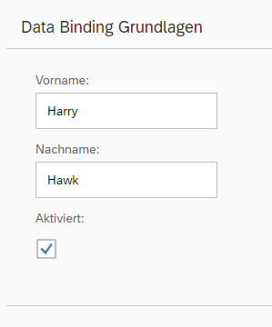

<!-- loio4e593b44e78a431e8b21be6b3915fb55 -->

# Step 7: \(Optional\) Resource Bundles and Multiple Languages

The reason we have resource bundles is to allow an app to run in multiple languages without the need to change any code. To demonstrate this feature, we will create a German version of the app – in fact all we need to do is create a German version of the resource bundle file. In our code, the German locale needs to be activated for the ResourceModel.


## Preview

   
  
**German version of our UI**

  


## Coding

You can view and download all files in the Demo Kit at [Data Binding - Step 7](https://ui5.sap.com/#/entity/sap.ui.core.tutorial.databinding/sample/sap.ui.core.tutorial.databinding.07).


<a name="loio4e593b44e78a431e8b21be6b3915fb55__section_stj_zdp_2mb"/>

## webapp/i18n/i18n\_de.properties \(New\)

```ini
# Field labels
firstName=Vorname
lastName=Nachname
enabled=Aktiviert

# Screen titles
panelHeaderText=Data Binding Grundlagen
```

In the `i18n` folder, make a copy of the file `i18n.properties` and call it <code>i18n<b>_de</b>.properties</code>. The suffix `de` is the locale for German language. Change the English text to the German text. Then, add the new locale `de` to the `supportedLocales` configuration, so that it will be taken into account:


<a name="loio4e593b44e78a431e8b21be6b3915fb55__section_ttj_zdp_2mb"/>

## webapp/index.js

```js
sap.ui.require([
	"sap/ui/model/json/JSONModel",
	"sap/ui/core/mvc/XMLView",
	"sap/ui/model/resource/ResourceModel"
], function (JSONModel, XMLView, ResourceModel) {
	"use strict";

	// Attach an anonymous function to the SAPUI5 'init' event
	sap.ui.getCore().attachInit(function () {
		// Create a JSON model from an object literal
		var oModel = new JSONModel({
			firstName: "Harry",
			lastName: "Hawk",
			enabled: true
		});

		// Assign the model object to the SAPUI5 core
		sap.ui.getCore().setModel(oModel);

		// Create a resource bundle for language-specific texts
		// the configured supportedLocales represent the i18n files present:
		// * "" - i18n/i18n.properties
		// * "de" - i18n/i18n_de.properties
		// a configured fallbackLocale should represent one of these files
		// * "" - according to the fallback chain, the root bundle is the last fallback
		//   which means that if "de" was requested here, the root bundle would never be loaded.
		//   Configuring it explicitly avoids side effects when additional resource files are added.
		// @see https://ui5.sap.com/#/topic/ec753bc539d748f689e3ac814e129563
		var oResourceModel = new ResourceModel({
			bundleName: "sap.ui.demo.db.i18n.i18n",
			supportedLocales: ["", "de"],
			fallbackLocale: ""
		});

		// Assign the model object to the SAPUI5 core using the name "i18n"
		sap.ui.getCore().setModel(oResourceModel, "i18n");

		// Display the XML view called "App"
		new XMLView({
			viewName: "sap.ui.demo.db.view.App"
		}).placeAt("content");
	});
});

```

To test the outcome, change the default language of your browser to German and refresh your preview.

**Related Information**  


[Localization](../04_Essentials/localization-91f217c.md "The framework concepts for text localization in SAPUI5 are aligned with the general concepts of the Java platform.")

