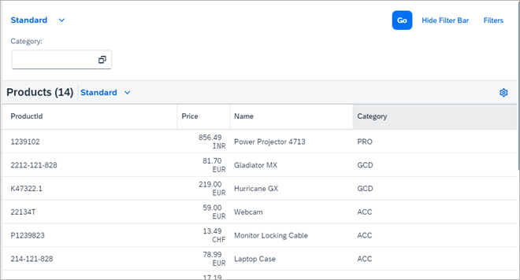
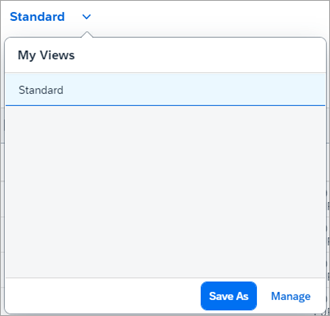
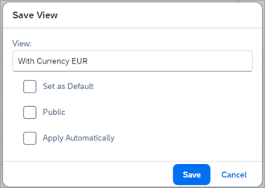
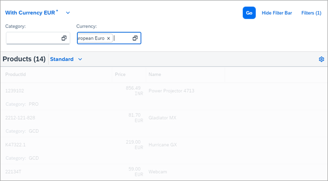
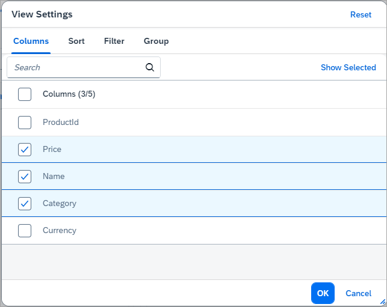
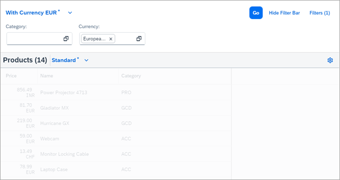
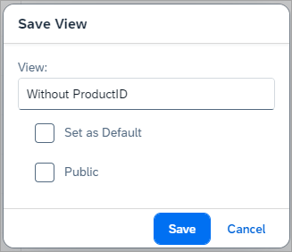
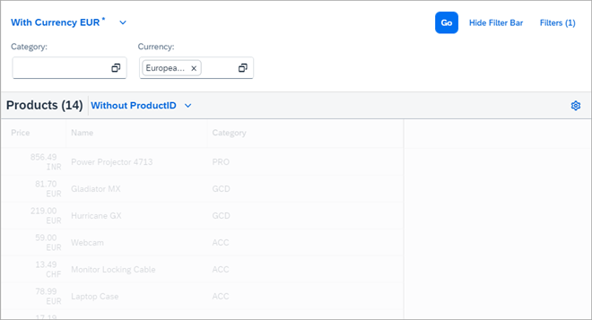

<!-- loio97fc0eaaf8b045779878ea829586da1a -->

# Step 7: View Management

The `VariantManagement` control allows you to handle views and makes it possible for the user to persist changes carried out on the UI and then later retrieve these changes.

For the smart controls, changes that are persisted include definitions of the filter used to query the results for the table and all changes done to the table with table personalization, visibility of columns and so on. Since we want to provide stand-alone examples that can run on a local Web server, we do not connect to a real server on which the changes can be persisted so they can be retrieved later. Consequently, in our examples, changes are only kept in the current user session.


## Preview

Initially, the UI looks as in the previous steps:

  
  
**Initial UI Without Personalization**



We define filters in the *Filters* dialog as shown in step 5 and then select *Save As* in the related dialog of the view management:

  
  
**Specifying the Filter**



After that, the following dialog is shown:

  
  
**Defining the View Name**



In this dialog, we specify the name under which this view is persisted, in our case `With Currency EUR`. With *Set as Default*, we can also specify whether this view is always used initially when navigating to this particular UI \(since in our example we only persist within one browser session, this setting has no effect\). With *Apply Automatically* we define that the query is fired automatically. The idea behind *Public* is that some popular but perhaps fairly complicated query settings that are used by several users can be automatically provided to all users. This *Public* option only has an effect when running on a real server and not on the mock server as in our example. If you choose *Public*, additional information regarding this function is required.

We verify these settings now and return to our main UI:

  
  
**UI with Active View**



We notice that the *Currency* field is available in the filter bar and that we have already specified *EUR* as the currency.

Finally we now customize the table so that we do not see the `ProductId` column anymore. To do that, we press the *Settings* icon in the upper right-hand corner of the table and deselect `ProductId` in the dialog:

  
  
**Remove ProductId**



Returning to the main UI, we see that only the three columns required are now shown:

  
  
**Personalized Table**



  
  
****


The *\** right next to the *Standard* view indicates that a change has been made. We save this change by choosing the down-arrow symbol and *Save As* in the dialog, which takes us to the following dialog as before:

  
  
**Specifying the View Name**



Also, here we have the possibility to set this as default and to share the view. The latter is similar to the view for the `SmartFilterBar` control. After confirming the specified name, you return directly to the main UI.

  
  
**View for the Filter Bar and View for the Table**




## Coding

You can view and download all files in the *Samples* in the Demo Kit at [Smart Controls - Step 7 - Variant Management](https://ui5.sap.com/#/entity/sap.ui.comp.tutorial.smartControls/sample/sap.ui.comp.tutorial.smartControls.07).

Since the coding is essentially identical with step 5 and step 6, we do not make any listing apart from the `view.xml` in which one property value has been changed and `persistencyKeys` have been specified.


## VariantManagement.view.xml

```xml
<mvc:View 
	xmlns="sap.m"
	xmlns:mvc="sap.ui.core.mvc"
	controllerName="sap.ui.demo.smartControls.VariantManagement"
	xmlns:smartFilterBar="sap.ui.comp.smartfilterbar"
	xmlns:smartTable="sap.ui.comp.smarttable">
	<smartFilterBar:SmartFilterBar 
		id="smartFilterBar"
		entitySet="Products"
		persistencyKey="SmartFilterPKey">
		<smartFilterBar:controlConfiguration>
			<smartFilterBar:ControlConfiguration
				key="Category" 
				visibleInAdvancedArea="true"
				preventInitialDataFetchInValueHelpDialog="false">
			</smartFilterBar:ControlConfiguration>
		</smartFilterBar:controlConfiguration>
	</smartFilterBar:SmartFilterBar>
	<smartTable:SmartTable 
		id="smartTable_ResponsiveTable"
		smartFilterId="smartFilterBar" 
		tableType="ResponsiveTable" 
		editable="false"
		entitySet="Products" 
		useVariantManagement="true"
		useTablePersonalisation="true" 
		header="Products" 
		showRowCount="true"
		enableExport="false" 
		enableAutoBinding="true"
		persistencyKey="SmartTablePKey">
	</smartTable:SmartTable>
</mvc:View>
```


<a name="loio97fc0eaaf8b045779878ea829586da1a__section_vwt_g1g_l3b"/>

## Component.js

```js

sap.ui.define([
        "sap/ui/core/UIComponent"
], function(UIComponent) {
    "use strict";
    return UIComponent.extend("sap.ui.demo.smartControls.Component", {
        metadata: {
            manifest: "json"
        },
        init: function () {
            UIComponent.prototype.init.apply(this, arguments);
        },
        destroy: function () {
                UIComponent.prototype.destroy.apply(this, arguments);
        }
    });
});
```


<a name="loio97fc0eaaf8b045779878ea829586da1a__section_pmf_hln_ppb"/>

## index.html

```html

<html>
<head>
	<meta charset="utf-8">
	<meta name="viewport" content="width=device-width, initial-scale=1.0">
	<title>Smart Controls Tutorial</title>

	<script id="sap-ui-bootstrap"
		src="../../../../../../../../../resources/sap-ui-core.js"
		data-sap-ui-flexibility-services='[{"connector": "LocalStorageConnector"}]'
		data-sap-ui-resource-roots='{
			"sap.ui.demo.smartControls": "./"
		}'
		data-sap-ui-on-init="module:sap/ui/demo/smartControls/initMockServer"
		data-sap-ui-compat-version="edge"
		data-sap-ui-async="true"
		data-sap-ui-frame-options="trusted">
	</script>
</head>
```

**Related Information**  


[Smart Variant Management](../10_More_About_Controls/smart-variant-management-06a4c3a.md "The sap.ui.comp.smartvariants.SmartVariantManagement control provides access to the SAPUI5 flexibility back end for easy communication.")

