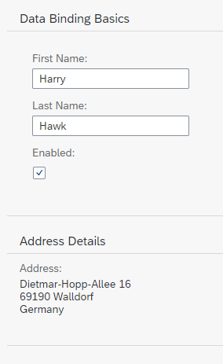

<!-- loio9373793b290d429ba1bc6aea1ce5482f -->

# Step 8: Binding Paths: Accessing Properties in Hierarchically Structured Models

In step 6 , we stated that the fields in a resource model are arranged in a flat structure; in other words, there can be no hierarchy of properties; however, this is true only for resource models. The properties within JSON and OData models almost always are arranged in a hierarchical structure. Therefore, we should take a look at how to reference fields in a hierarchically structured model object.


## Preview

   
  
<a name="loio9373793b290d429ba1bc6aea1ce5482f__fig_r1j_pst_mr"/>Second panel with additional data

  


## Coding

You can view and download all files in the Demo Kit at [Data Binding - Step 8](https://ui5.sap.com/#/entity/sap.ui.core.tutorial.databinding/sample/sap.ui.core.tutorial.databinding.08).


## webapp/index.js

```js
sap.ui.require([
	"sap/ui/model/json/JSONModel",
	"sap/ui/core/mvc/XMLView",
	"sap/ui/model/resource/ResourceModel"
], function (JSONModel, XMLView, ResourceModel) {
	"use strict";

	// Attach an anonymous function to the SAPUI5 'init' event
	sap.ui.getCore().attachInit(function () {
		var oModel = new JSONModel({
			firstName: "Harry",
			lastName: "Hawk",
			enabled: true,
			address: {
				street: "Dietmar-Hopp-Allee 16",
				city: "Walldorf",
				zip: "69190",
				country: "Germany"
			}

		});

		// Assign the model object to the SAPUI5 core
		sap.ui.getCore().setModel(oModel);

		var oResourceModel = new ResourceModel({
			bundleName: "sap.ui.demo.db.i18n.i18n",
			supportedLocales: ["", "de"],
			fallbackLocale: ""
		});

		sap.ui.getCore().setModel(oResourceModel, "i18n");

		// Display the XML view called "App"
		new XMLView({
			viewName: "sap.ui.demo.db.view.App"
		}).placeAt("content");
	});
});

```

The JSON model object now contains an additional sub-object called `address`. Within this object are four properties: `street`, `city`, `zip`, and `country`.


## webapp/view/App.view.xml

```xml
<mvc:View
	xmlns="sap.m"
	xmlns:form="sap.ui.layout.form"
	xmlns:l="sap.ui.layout"
	xmlns:mvc="sap.ui.core.mvc">
	<Panel headerText="{i18n>panel1HeaderText}" class="sapUiResponsiveMargin" width="auto">
		<form:SimpleForm editable="true" layout="ColumnLayout">
			<Label text="{i18n>firstName}"/>
			<Input value="{/firstName}" valueLiveUpdate="true" width="200px" enabled="{/enabled}"/>
			<Label text="{i18n>lastName}"/>
			<Input value="{/lastName}" valueLiveUpdate="true" width="200px" enabled="{/enabled}"/>
			<Label text="{i18n>enabled}"/>
			<CheckBox selected="{/enabled}"/>
		</form:SimpleForm>
	</Panel>
	<Panel headerText="{i18n>panel2HeaderText}" class="sapUiResponsiveMargin" width="auto">
		<content>
			<l:VerticalLayout>
				<Label labelFor="address" text="{i18n>address}:"/>
				<FormattedText class="sapUiSmallMarginBottom"
					htmlText="{/address/street}&lt;br&gt;{/address/zip} {/address/city}&lt;br&gt;{/address/country}"
					id="address" 
					width="200px"/>
			</l:VerticalLayout>
		</content>
	</Panel>
</mvc:View>
```

We add a new panel to the XML view with a new `Label` and `Text` pair of elements.

The text property of the `Label` element is bound to the i18n resource bundle field `address`.

The text property of the `Text` element is bound to four i18n properties: `/address/street`, `/address/zip`, `/address/city`, and `/address/country`. The resulting address format is achieved by separating each one of these model property references with a hard-coded newline character while `zip` and `city` are separated by a space.


## webapp/i18n/i18n.properties

```ini
# Field labels
firstName=First Name
lastName=Last Name
enabled=Enabled
address=Address


# Screen titles
panel1HeaderText=Data Binding Basics 
panel2HeaderText=Address Details
```


## webapp/i18n/i18n\_de.properties

```ini
# Field labels
firstName=Vorname
lastName=Nachname
enabled=Aktiviert
address=Adresse


# Screen titles
panel1HeaderText=Data Binding Grundlagen
panel2HeaderText=Adressdetails
```

> ### Note:  
> The resource bundle files now contain new properties for the **Address** and a new panel header text. Both panel properties have been numbered.
> 
> In the XML view, inside the curly brackets for the binding path of the `Text` element, notice that the first character is a forward slash. This is required for binding paths that make absolute references to properties in JSON and OData models, but must not be used for resource models. After the first forward slash character, the binding path syntax uses the object names and the property name separated by forward slash characters \(`{/address/street}`\).
> 
> As has been mentioned previously, all binding path names are case-sensitive.

**Related Information**  


[JSON Model](../04_Essentials/json-model-96804e3.md#loio96804e3315ff440aa0a50fd290805116 "The JSON model can be used to bind controls to JavaScript object data, which is usually serialized in the JSON format.")

