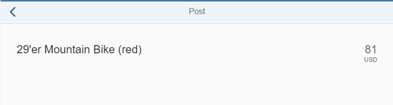

<!-- loio4a9f063d4a4143d5b5c10416677f04b6 -->

# Step 9: Adding the *Post* Page

Now that we have covered all kinds of tests for navigation, we introduce our *Post* page that shows details of a post in the bulletin board. To achieve this, we have to introduce a new view/controller pair and adjust the routing of the application.


## Preview

   
  
<a name="loio4a9f063d4a4143d5b5c10416677f04b6__fig_r1j_pst_mr"/>The *Post* page with more details about the post

  


## Coding

You can view and download all files in the *Samples* in the Demo Kit at [Testing - Step 9](https://ui5.sap.com/#/entity/sap.m.tutorial.testing/sample/sap.m.tutorial.testing.09).


## webapp/manifest.json

```js
{
	"_version": "1.12.0",
	…
	"sap.ui5": {
	…
		"routing": {
			"config": {
				"routerClass": "sap.m.routing.Router",
				"type": "View",
				"viewType": "XML",
				"path": "sap.ui.demo.bulletinboard.view",
				"controlId": "app",
				"controlAggregation": "pages",
				"async": true
			},
			"routes": [
				{
					"pattern": "",
					"name": "worklist",
					"target": "worklist"
				},
				{
					"pattern": "Post/{postId}",
					"name": "post",
					"target": "post"
				}

			],
			"targets": {
				"worklist": {
					"name": "Worklist",
					"id": "worklist",
					"level": 1
				},
				"post": {
					"name": "Post",
					"id": "post",
					"level": 2
				}

			}
		}
	}
}
```

We have already used the `#/Posts/{postId}` hash in our tests and a view called the *Post* page, so we will now add a route and a target to the routing configuration of the descriptor with these patterns. It is simply defining a mandatory routing parameter `postId` that we fill with the ID from the model when navigating. The target configuration references a view called `Post` with a view level deeper than the home page. For more information, see the [Navigation and Routing](navigation-and-routing-1b6dcd3.md) tutorial.


## webapp/view/Worklist.view.xml

```xml
<mvc:View
	controllerName="sap.ui.demo.bulletinboard.controller.Worklist"
	xmlns="sap.m"
	xmlns:mvc="sap.ui.core.mvc"
	xmlns:core="sap.ui.core"
	xmlns:semantic="sap.m.semantic">
	<semantic:FullscreenPage
		id="page"
		title="{i18n>worklistViewTitle}">
		<semantic:content>
			<Table …>
				…
				<items>
					<ColumnListItem
						vAlign="Middle"
						type="Navigation"
						press=".onPress">
						…
					</ColumnListItem>
				</items>
			</Table>
		</semantic:content>
		…
	</semantic:FullscreenPage>
</mvc:View>
```

We configure the table items to be of type `Navigation`, so a user can trigger the navigation by choosing an item. When a `press` event is triggered, the `onPress` handler is called to navigate to the *Post* page.


## webapp/controller/Worklist.controller.js

```js
sap.ui.define([
    './BaseController',
    'sap/ui/model/json/JSONModel',
    '../model/formatter',
    '../model/FlaggedType',
    'sap/m/library'
], function(BaseController, JSONModel, formatter, FlaggedType, mobileLibrary) {
	"use strict";

	return BaseController.extend("sap.ui.demo.bulletinboard.controller.Worklist", {
		…
		/* =========================================================== */
		/* event handlers                                              */
		/* =========================================================== */
		…
				/**
		 * Event handler when a table item gets pressed
		 * @param {sap.ui.base.Event} oEvent the table selectionChange event
		 * @public
		 */
		onPress: function (oEvent) {
			this.getRouter().navTo("post", {
				// The source is the list item that got pressed
				postId: oEvent.getSource().getBindingContext().getProperty("PostID")
			});

		},
		…
	});
});
```

The `press` handler function instructs the `router` to navigate to the `post` pattern with the `PostID` from the binding context of the currently selected item. This fills the mandatory URL parameter, navigates to the `post` page, and updates the hash automatically.


## webapp/view/Post.view.xml \(New\)

```xml
<mvc:View
		controllerName="sap.ui.demo.bulletinboard.controller.Post"
		xmlns="sap.m"
		xmlns:mvc="sap.ui.core.mvc"
		xmlns:semantic="sap.m.semantic">
	<semantic:FullscreenPage
			id="page" 
			busy="{postView>/busy}"
			busyIndicatorDelay="0"
			navButtonPress=".onNavBack"
			showNavButton="true"
			title="{i18n>objectTitle}">
		<semantic:content>
			<ObjectHeader
					id="objectHeader"
					title="{Title}"
					number="{
						path: 'Price',
						formatter: '.formatter.numberUnit'
					}"
					numberUnit="{Currency}"
					backgroundDesign="Translucent">
			</ObjectHeader>
		</semantic:content>
	</semantic:FullscreenPage>
</mvc:View>
```

We provide a minimalistic detail page showing only some fields of the selected post for now. In the test we use the following information:

-   Control with the ID `page` on this view

-   `title` of the post we navigate to

-   *Back* button to navigate back to the home page


## webapp/controller/Post.controller.js \(New\)

```js
sap.ui.define([
	'./BaseController',
	'sap/ui/model/json/JSONModel',
	'../model/formatter'
], function (BaseController, JSONModel, formatter) {
	"use strict";
	return BaseController.extend("sap.ui.demo.bulletinboard.controller.Post", {
		formatter: formatter,
		/* =========================================================== */
		/* lifecycle methods                                           */
		/* =========================================================== */
		/**
		 * Called when the worklist controller is instantiated.
		 * @public
		 */
		onInit: function () {
			// Model used to manipulate control states. The chosen values make sure,
			// detail page is busy indication immediately so there is no break in
			// between the busy indication for loading the view's meta data
			var oViewModel = new JSONModel({
					busy: false
				});
			this.getRouter().getRoute("post").attachPatternMatched(this._onPostMatched, this);
			this.setModel(oViewModel, "postView");
		},
		/* =========================================================== */
		/* event handlers                                              */
		/* =========================================================== */
		/**
		 * Navigates back to the worklist
		 * @function
		 */
		onNavBack: function () {
			this.myNavBack("worklist");
		},
		/* =========================================================== */
		/* internal methods                                            */
		/* =========================================================== */
		/**
		 * Binds the view to the post path.
		 *
		 * @function
		 * @param {sap.ui.base.Event} oEvent pattern match event in route 'object'
		 * @private
		 */
		_onPostMatched: function (oEvent) {
			var oViewModel = this.getModel("postView"),
				oDataModel = this.getModel();
			this.getView().bindElement({
				path: "/Posts('" + oEvent.getParameter("arguments").postId + "')",
				events: {
					dataRequested: function () {
						oDataModel.metadataLoaded().then(function () {
							// Busy indicator on view should only be set if metadata is loaded,
							// otherwise there may be two busy indications next to each other on the
							// screen. This happens because route matched handler already calls '_bindView'
							// while metadata is loaded.
							oViewModel.setProperty("/busy", true);
						});
					},
					dataReceived: function () {
						oViewModel.setProperty("/busy", false);
					}
				}
			});
		}
	});
});
```

The controller of the `Post` page needs to take care of the data binding when a navigation event has happened. In the `init` function of the controller we define a local view model and attach to the `routing` event. When the `routing` event is triggered, we bind the view to the post with the specified ID.

