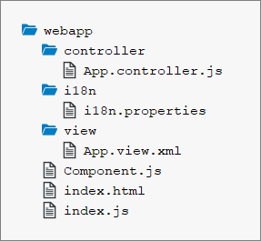

<!-- loio4cfa60872dca462cb87148ccd0d948ee -->

# Step 9: Component Configuration

After we have introduced all three parts of the Model-View-Controller \(MVC\) concept, we now come to another important structural aspect of SAPUI5.

In this step, we will encapsulate all UI assets in a component that is independent from our `index.html` file. Components are independent and reusable parts used in SAPUI5 applications. Whenever we access resources, we will now do this relatively to the component \(instead of relatively to the `index.html`\). This architectural change allows our app to be used in more flexible environments than our static `index.html` page, such as in a surrounding container like the SAP Fiori launchpad.


## Preview

  
  
**An input field and a description displaying the value of the input field \(No visual changes to last step\)**

")


## Coding

You can view and download all files at [Walkthrough - Step 9](https://ui5.sap.com/#/entity/sap.m.tutorial.walkthrough/sample/sap.m.tutorial.walkthrough.09).

  
  
**Folder Structure for this Step**



After this step your project structure will look like the figure above. We will create the `Component.js` file now and modify the related files in the app.


## webapp/Component.js \(New\)

```js
sap.ui.define([
   "sap/ui/core/UIComponent"
], (UIComponent) => {
   "use strict";

   return UIComponent.extend("", {
      init() {
         // call the init function of the parent
         UIComponent.prototype.init.apply(this, arguments);
      }
   });
});

```

We create an initial `Component.js` file in the `webapp` folder that will hold our application setup. The init function of the component is automatically invoked by SAPUI5 when the component is instantiated. Our component inherits from the base class `sap/ui/core/UIComponent`, and it is obligatory to make the super call to the `init` function of the base class in the overridden `init` method.


## webapp/Component.js

```js
sap.ui.define([
   "sap/ui/core/UIComponent",
   "sap/ui/model/json/JSONModel",
   "sap/ui/model/resource/ResourceModel"
], (UIComponent, JSONModel, ResourceModel) => {
   "use strict";

   return UIComponent.extend("ui5.walkthrough.Component", {
      metadata : {
         "interfaces": ["sap.ui.core.IAsyncContentCreation"],
         "rootView": {
            "viewName": "ui5.walkthrough.view.App",
            "type": "XML",
            "id": "app"
         }
      },

      init() {
         // call the init function of the parent
         UIComponent.prototype.init.apply(this, arguments);
         // set data model
         const oData = {
            recipient : {
               name : "World"
            }
         };
         const oModel = new JSONModel(oData);
         this.setModel(oModel);

         // set i18n model
         const i18nModel = new ResourceModel({
            bundleName: "ui5.walkthrough.i18n.i18n"
         });
         this.setModel(i18nModel, "i18n");
      }
   });
});

```

The `Component.js` file now consists of two parts: The new `metadata` section and the previously introduced `init` function that is called when the component is initialized.

The `metadata` section defines a reference to the root view, so that instead of displaying the root view directly in the `index.js` file as we did previously, the component now manages the display of the app view. It also implements the `sap.ui.core.IAsyncContentCreation` interface, which allows the component to be created fully asynchronously.

> ### Note:  
> The `sap.ui.core.IAsyncContentCreation` interface implicitly sets both the component's `rootView` and its router configuration to `"async": true`; the latter will be described in [Step 30: Routing and Navigation](step-30-routing-and-navigation-e5200ee.md).

In the `init` function we instantiate our data model and the `i18n` model like we did before in the app controller. Be aware that the models are set directly on the component and not on the root view of the component. However, as nested controls automatically inherit the models from their parent controls, the models are available on the view as well.


## webapp/controller/App.controller.js

```js
sap.ui.define([
   "sap/ui/core/mvc/Controller",
   "sap/m/MessageToast"
], (Controller, MessageToast) => {
   "use strict";

   return Controller.extend("ui5.walkthrough.controller.App", {
      onShowHello() {
         // read msg from i18n model
         const oBundle = this.getView().getModel("i18n").getResourceBundle();
         const sRecipient = this.getView().getModel().getProperty("/recipient/name");
         const sMsg = oBundle.getText("helloMsg", [sRecipient]);

         // show message
         MessageToast.show(sMsg);
      }
   });
});

```

Delete the `onInit` function and the required modules; this is now done in the component. You now have the code shown above.


<a name="loio4cfa60872dca462cb87148ccd0d948ee__section_ok2_4n5_zgb"/>

## webapp\\index.js

```js
sap.ui.define([
	"sap/ui/core/ComponentContainer"
], (ComponentContainer) => {
	"use strict";

	new ComponentContainer({
		name: "ui5.walkthrough",
		settings : {
			id : "walkthrough"
		},
		async: true
	}).placeAt("content");
});
```

We now create a component container instead of the view in our `index.js` that instantiates the view for us according to the component configuration.


## Conventions

-   The component is named `Component.js`.

-   Together with all UI assets of the app, the component is located in the `webapp` folder.

-   The `index.html` file is located in the `webapp` folder if it is used productively.


**Related Information**  


[Components](../04_Essentials/components-958ead5.md "Components are independent and reusable parts used in SAPUI5 applications.")

[API Reference: `sap.ui.core.mvc.ViewType`](https://ui5.sap.com/#/api/sap.ui.core.mvc.ViewType)

[Samples: `sap.ui.core.mvc.ViewType` ](https://ui5.sap.com/#/entity/sap.ui.core.mvc.ViewType)

[Declarative API for Initial Components](../04_Essentials/declarative-api-for-initial-components-82a0fce.md "The declarative API enables you to define the initially started component directly in the HTML markup.")

[Methods Controlling the Initial Instantiation](../04_Essentials/methods-controlling-the-initial-instantiation-b430345.md "SAPUI5 provides two methods for the initial instantiation of the component.")

[Advanced Concepts for SAPUI5 Components](../04_Essentials/advanced-concepts-for-sapui5-components-ecbc417.md "Advanced concepts for components include routing and navigation and component data as well as the event bus.")

[Make Your App CSP Compliant](make-your-app-csp-compliant-1f81a09.md "CSP stands for Content Security Policy and is a security standard to prevent cross-site scripting or other code injection attacks.")

