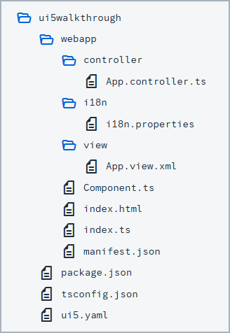

<!-- loiof9d0e2fcd2134ff7923fcdcba8bded96 -->

# Step 9: Component Configuration \(TypeScript\)

After we have introduced all three parts of the Model-View-Controller \(MVC\) concept, we now come to another important structural aspect of SAPUI5.

In this step, we will encapsulate all UI assets in a component that is independent from our `index.html` file. Components are independent and reusable parts used in SAPUI5 applications. Whenever we access resources, we will now do this relatively to the component \(instead of relatively to the `index.html`\). This architectural change allows our app to be used in more flexible environments than our static `index.html` page, such as in a surrounding container like the SAP Fiori launchpad.


## Preview

  
  
**An input field and a description displaying the value of the input field \(No visual changes to last step\)**

")


## Coding

You can view all files at [OpenUI5 TypeScript Walkthrough - Step 9: Component Configuration](https://github.com/sap-samples/ui5-typescript-walkthrough/tree/main/steps/09) and [download the solution as a zip file](https://sap-samples.github.io/ui5-typescript-walkthrough/ui5-typescript-walkthrough-step-09.zip).

  
  
**Folder Structure for this Step**



After this step your project structure will look like the figure above. We'll create the `Component.ts` file now and modify the related files in the app.


## webapp/Component.ts \(New\)

We navigate to the `webapp` folder and place the `Component.ts` file into it. This file is commonly referred to as the **component controller**. A component is organized in a unique namespace \(which is synonymous with the application namespace\). All required and optional resources of the component have to be organized in the namespace of the component.

We define the component by extending `sap/ui/core/UIComponent` and supplement the component with additional metadata. Within the `interfaces` settings, we specify that the component should implement the `sap/ui/core/IAsyncContentCreation` interface. This allows the component to be generated asynchronously, which in turn sets the component's rootView and router configuration to async.

When the component is instantiated, SAPUI5 automatically calls the `init` function of the component. It's important to include a call to the `init` function of the base class by using the `super` keyword. In this section, we also instantiate our data model and the `i18n` model, similar to what we did earlier in the `onInit` function of our app controller.

Finally we call the `createContent` hook method of the component. This method creates the content \(UI control tree\) of this component. Here, we create the view as we did in the `index.ts` file to set our app view as the root view of the component.

```js
import Control from "sap/ui/core/Control";
import UIComponent from "sap/ui/core/UIComponent";
import XMLView from "sap/ui/core/mvc/XMLView";
import JSONModel from "sap/ui/model/json/JSONModel";
import ResourceModel from "sap/ui/model/resource/ResourceModel";

/**
* @namespace ui5.walkthrough
*/
export default class Component extends UIComponent {
public static metadata = {
"interfaces": ["sap.ui.core.IAsyncContentCreation"]
};
    init(): void {
        // call the init function of the parent
        super.init();

        // set data model
        const data = {
            recipient: {
                name: "World"
            }
        };
        const dataModel = new JSONModel(data);
        this.setModel(dataModel);

        // set i18n model
        const i18nModel = new ResourceModel({
            bundleName: "ui5.walkthrough.i18n.i18n"
        });
        this.setModel(i18nModel, "i18n");
    };

    createContent(): Control | Promise<Control | null> | null {
        return XMLView.create({
            "viewName": "ui5.walkthrough.view.App",
            "id": "app"
        });
    };
};
```

Be aware that the models are set directly on the component and not on the root view of the component. However, as nested controls automatically inherit the models from their parent controls, the models are available on the view as well.


## webapp/controller/App.controller.ts

We delete the `onInit` function and the required modules; this is now done in the component.

```js
import MessageToast from "sap/m/MessageToast";
import Controller from "sap/ui/core/mvc/Controller";
import JSONModel from "sap/ui/model/json/JSONModel";
import ResourceModel from "sap/ui/model/resource/ResourceModel";
import ResourceBundle from "sap/base/i18n/ResourceBundle";

/**
 * @name ui5.walkthrough.controller.App
 */
export default class AppController extends Controller {
    onShowHello(): void {
        // read msg from i18n model
        const recipient = (<JSONModel> this.getView()?.getModel())?.getProperty("/recipient/name");
        const resourceBundle = <ResourceBundle> (<ResourceModel> this.getView()?.getModel("i18n"))?.getResourceBundle();
        const msg = resourceBundle.getText("helloMsg", [recipient]) || "no text defined";
        // show message
        MessageToast.show(msg);
    }
};
```


<a name="loiof9d0e2fcd2134ff7923fcdcba8bded96__section_ok2_4n5_zgb"/>

## webapp\\index.ts

We'll replace the view with a UI component. To do this, we use a control called `ComponentContainer`. This control allows us to wrap a UI Component and place it in our HTML document. We configure this instance by providing the following options:

-   We assign the `id` property to `"container"` so that we can refer to it later if needed.

-   We set the `name` property to the namespace of the component. This tells the `ComponentContainer` control which UI component it should load and show.

-   We pass `id: "walkthrough"` to our component through the `ComponentContainer` constructor's `settings` argument. This ID helps us identify our component among others that may be created during the application's runtime.

-   To ensure the ID of our component is unique and avoid any mix-ups, we set the `autoPrefixId` property to `true`. This automatically adds a prefix to the ID of the Component, which is the ID of the ComponentContainer followed by a single dash \("`-`"\).

-   For better loading performance, we set the `async` property to `true`. This allows the component and its dependencies to load in the background without blocking other parts of the application.


Finally, we position our newly created `ComponentContainer` control within the HTML element with the id `content`.

```js
import ComponentContainer from "sap/ui/core/ComponentContainer";

new ComponentContainer({
    id: "container",
    name: "ui5.walkthrough",
    settings: {
        id: "walkthrough"
    },
    autoPrefixId: true,
    async: true
}).placeAt("content");
```


## Conventions

-   The component is named `Component.js` \(JavaScript\) or `Component.ts` \(in TypeScript\).

-   Together with all UI assets of the app, the component is located in the `webapp` folder.

-   The `index.html` file is located in the `webapp` folder if it is used productively.


**Related Information**  


[Components](../04_Essentials/components-958ead5.md "Components are independent and reusable parts used in SAPUI5 applications.")

[Content Creation in Components](../04_Essentials/content-creation-in-components-b430345.md "SAPUI5 provides two methods for creating the content controls of a component.")

[Advanced Concepts for SAPUI5 Components](../04_Essentials/advanced-concepts-for-sapui5-components-ecbc417.md "Advanced concepts for components include routing and navigation and component data as well as the event bus.")

[API Reference: `sap.ui.core.ComponentContainer`](https://ui5.sap.com/#/api/sap.ui.core.ComponentContainer)

