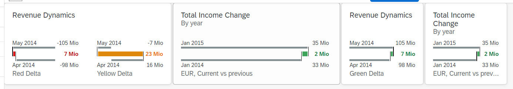

<!-- loio39733723e42b4a43b040427caaa94a73 -->

# Step 9: Delta Micro Chart

In this step, we will create the `DeltaMicroChart` on the **Production Process** page.


<a name="loio39733723e42b4a43b040427caaa94a73__section_cqy_3rl_l1b"/>

## Preview

  


<a name="loio39733723e42b4a43b040427caaa94a73__section_es4_5rl_l1b"/>

## DeltaMicroChart

We are going to add a chart to visualize the difference between the time required for production compared with the estimated time. You use the `DeltaMicroChart` to compare two separate values.


### ProcessFlow.view.xml

You can view and download this step in the Demo Kit at [Ice Cream Machine - Step 9 - Delta Micro Chart](https://ui5.sap.com/#/entity/sap.suite.ui.commons.tutorial.icecream/sample/sap.suite.ui.commons.tutorial.icecream.09).

```xml
mvc:View
    ...
        <m:headerContainer>
            <m:HeaderContainer
                scrollStep="200"
                scrollTime="500"
                showDividers="true"
                class="sapUiSmallMargin">
                ...
                <m:FlexBox
                    width="12rem"
                    height="10rem"
                    alignItems="Center"
                    justifyContent="Center"
                    direction="Column">
                    <m:Title
                        text="{
                            parts: [
                                'i18n>processFlowChartsProductionTime',
                                'business>/timeMeasure'
                            ],
                            formatter: '.formatMessage'
                        }"
                        class="sapUiSmallMargin" />
                    <m:FlexBox width="12rem" height="6rem" renderType="Bare">
                        <mc:DeltaMicroChart
                            size="Responsive"
                            color="{business>/productionTimeComparisonCriticality}"
                            value1="{business>/expectedProductionTime}"
                            value2="{business>/currentProductionTime}"
                            title1="{i18n>processFlowChartsExpected}"
                            title2="{i18n>processFlowChartsCurrent}"
                            displayValue1="{business>/expectedProductionTime}"
                            displayValue2="{business>/currentProductionTime}"
                            deltaDisplayValue="{
                                parts: [
                                    'business>/expectedProductionTime',
                                    'business>/currentProductionTime'
                                ],
                                formatter: '.getValuesDelta'
                        }" />
                    </m:FlexBox>
                </m:FlexBox>
            </m:HeaderContainer>
        </m:headerContainer>
    ...
</mvc:View>
```

The `DeltaMicroChart` is used in the responsive mode embedded in the *Flexbox* that sets the dimensions. We are simply using the respective values from the data model for binding the *displayValue1* and *displayValue2* properties. For the *deltaDisplayValue*, we need to perform an advanced calculation based on the values before we can set them as a property. This is why we will be using the *.getValuesDelta* formatter function.


### ProcessFlow.controller.js

```js
 
sap.ui.define([
    "sap/ui/core/mvc/Controller",
    "sap/base/strings/formatMessage"
], function(Controller) {
    "use strict";

    return Controller.extend("sap.suite.ui.commons.demokit.tutorial.icecream.09.controller.ProcessFlow", {
        ...
        getValuesDelta: function(fFirstValue, fSecondValue) {
            return fSecondValue - fFirstValue;
        }
    });
});
```

This formatter takes the respective values and returns a string that will then be set as a property of the `DeltaMicroChart`.

**Parent topic:** [Ice Cream Machine](ice-cream-machine-e5b7f8a.md "In this tutorial, we will show you how to use SAPUI5 controls like Generic Tiles, Micro Charts, and Process Flow.")

**Next:** [Step 8: Comparison Micro Chart](step-8-comparison-micro-chart-3f586aa.md "In this step, we will create the ComparisonMicroChart on the Production Process page.")

**Previous:** [Step 10: Line Micro Chart](step-10-line-micro-chart-819beea.md "In this step, we will create the LineMicroChart on the Production Process page.")

