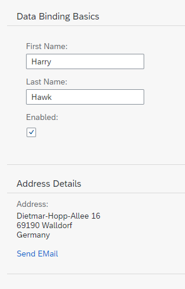

<!-- loio6fdf0acd0bc24ffdad327cf7e6f9e7e0 -->

# Step 9: Formatting Values

We also want to provide our users a way of contacting Harry Hawk. Therefore we will add a link that sends an e-mail to Harry. To achieve that we will convert our data in the model to match the `sap.m.URLHelper.normalizeEmail` API. As soon as the user changes the name, the e-mail will also change. We will need a custom formatter function for this.


## Preview

  
  
**An e-mail link is added to the address panel**




## Coding

You can view and download all files in the Demo Kit at [Data Binding - Step 9](https://ui5.sap.com/#/entity/sap.ui.core.tutorial.databinding/sample/sap.ui.core.tutorial.databinding.09).

1.  Create a new folder `controller` within your `webapp` folder as a general location for all controller files for this app and create a new file `App.controller.js` with the following content:

    **webapp/controller/App.controller.js \(New\)**

    ```js
    sap.ui.define([
    	"sap/m/library",
    	"sap/ui/core/mvc/Controller"
    ], (mobileLibrary, Controller) => {
    	"use strict";
    
    	return Controller.extend("ui5.databinding.controller.App", {
    		formatMail(sFirstName, sLastName) {
    			const oBundle = this.getView().getModel("i18n").getResourceBundle();
    
    			return mobileLibrary.URLHelper.normalizeEmail(
    				`${sFirstName}.${sLastName}@example.com`,
    				oBundle.getText("mailSubject", [sFirstName]),
    				oBundle.getText("mailBody"));
    		}
    	});
    });
    ```

    In our custom formatter, we define the first and last name that are currently in the model as function parameters. When a user changes the data in the model by entering a different name in the input fields, our formatter will be invoked automatically by the framework. This makes sure that the UI is in sync with the data model.

    In the `formatMail` function, we use the `sap.m.URLHelper.normalizeEmail` function that expects an e-mail address, a mail subject and a text body. When a user chooses the link, the default email client will open with these parameters.For more information, see [API Reference: `sap.m.URLHelper.normalizeEmail`](https://ui5.sap.com/#/api/sap.m.URLHelper/methods/normalizeEmail). The `mailSubject` resource bundle text will contain a placeholder for the first name of the recipient \(see below\). Therefore, we provide the name with `[sFirstName]`.

    > ### Note:  
    > For a detailed description of the e-mail link format, see [https://developer.mozilla.org/de/docs/Web/Guide/HTML/Email\_links](https://developer.mozilla.org/de/docs/Web/Guide/HTML/Email_links).

2.  Enhance the `App.view.xml` file as shown below:

    **webapp/view/App.view.xml**

    ```xml
    <mvc:View
    	controllerName="ui5.databinding.controller.App"
    	xmlns="sap.m"
    	xmlns:form="sap.ui.layout.form"
    	xmlns:l="sap.ui.layout"
    	xmlns:mvc="sap.ui.core.mvc">
    	...
    	<Panel headerText="{i18n>panel2HeaderText}" class="sapUiResponsiveMargin" width="auto">
    		<content>
    			<l:VerticalLayout>
    				<Label labelFor="address" text="{i18n>address}:"/>
    				<FormattedText class="sapUiSmallMarginBottom"
    					htmlText="{/address/street}&lt;br&gt;{/address/zip} {/address/city}&lt;br&gt;{/address/country}"
    					id="address" width="200px"/>
    				<Link href="{
    						parts: [
    							'/firstName',
    							'/lastName'
    						],
    						formatter: '.formatMail'
    					}"
    					text="{i18n>sendEmail}"/>
    			</l:VerticalLayout>
    		</content>
    	</Panel>
    </mvc:View>
    ```

    For more complex bindings we cannot use the simple binding syntax with the curly braces anymore. The `href` property of the `Link` element now contains an entire object inside the string value. In this case, the object has two properties:

    -   `parts`

        This is a JavaScript array in which each element is a string representing a `path` property. The number and order of the elements in this array corresponds directly to the number and order of parameters expected by the `formatMail` function.

    -   `formatter`

        A reference to the function that receives the parameters listed in the `parts` array. Whatever value is returned by the formatter function becomes the value set for the `href` property. The dot \(<code><b></b>formatMail</code>\) at the beginning of the formatter tells SAPUI5 to look for a `formatMail` function on the controller instance of the view. If you do not use the dot, the function will be resolved by looking into the global namespace.


    > ### Note:  
    > When using formatter functions, the binding is automatically switched to "one-way". So you can’t use a formatter function for "two-way" scenarios, but you can use data types \(which will be explained in the following steps\).

3.  Add the `# E-mail` section to the `i18n.properties` and `i18n_de.properties` files as shown below.

    **webapp/i18n/i18n.properties**

    ```ini
    …
    # Screen titles
    panel1HeaderText=Data Binding Basics 
    panel2HeaderText=Address Details
    
    # E-mail
    sendEmail=Send Mail
    mailSubject=Hi {0}!
    mailBody=How are you?
    ```

    **webapp/i18n/i18n\_de.properties**

    ```ini
    …
    # Screen titles
    panel1HeaderText=Data Binding Grundlagen
    panel2HeaderText=Adressdetails
    
    # E-mail
    sendEmail=E-mail versenden
    mailSubject=Hallo {0}!
    mailBody=Wie geht es dir?
    ```


**Related Information**  


[Formatting, Parsing, and Validating Data](../04_Essentials/formatting-parsing-and-validating-data-07e4b92.md "Data that is presented on the UI often has to be converted so that is human readable and fits to the locale of the user. On the other hand, data entered by the user has to be parsed and validated to be understood by the data source. For this purpose, you use formatters and data types.")

