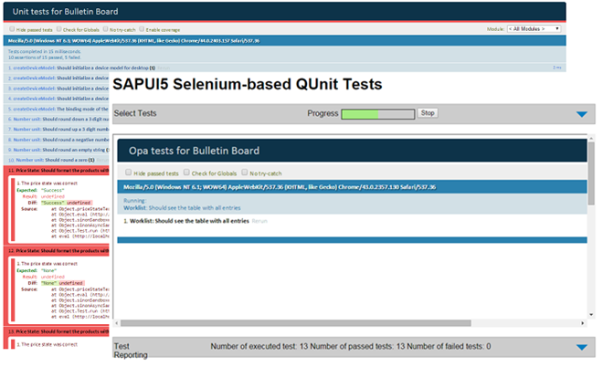

<!-- loio291c9121e6044ab381e0b51716f97f52 -->

# Testing Tutorial

In this tutorial we will test application functionality with the testing tools that are delivered with SAPUI5. At different steps of this tutorial you will write tests using QUnit, OPA5, and the OData V2 mock server. Additionally, you will learn about testing strategies, Test Driven Development \(TDD\), and much more.

For the application features that we add, we focus on writing clean and testable code with the goal of having good test coverage and a high quality app. We will create a simple full screen app that we will extend with more tests and features throughout the tutorial.

Imagine the following situation: You and your development team take over a bulletin board prototype that will be shipped as a product soon. A bulletin board typically consists of functionality to browse posts and add own offers to the board. However, the prototype only covers a minimum set of features and tests so far.

With this very minimalistic app as a starting point, we have a good foundation and we can inspect the most important testing functionality. Furthermore, we want to implement new features for the app that were requested by the product team using Test Driven Development and best practices for writing testable code and testing SAPUI5 apps.

So why do we do all this? Obviously, writing tests and testable code does not come without effort. Well, we want to ensure the implementation of a high quality app by having decent test coverage of our application logic. And we check that our code does not break by running the automated tests whenever we change something or when we upgrade to a newer version of the SAPUI5 framework or other external libraries. Additionally, we can find bugs proactively and do not need excessive manual testing anymore so the efforts definitely pay off. Also, when we decide to refactor something in the future, we can easily verify that the features of the app are still working as expected.

There are a lot more reasons and many small details that we will address throughout this tutorial. You can work yourself through the steps by applying the code deltas individually or by downloading the samples for each step and playing around with it.

## Preview

  

## Prerequisites

In addition to the prerequisites that are presupposed for all our tutorials \(see [Prerequisites](get-started-setup-tutorials-and-demo-apps-8b49fc1.md#loio8b49fc198bf04b2d9800fc37fecbb218__tutorials_prerequisites)\), you should also be familiar with the basics of JavaScript unit testing with QUnit. Have a look at the official QUnit documentation to make yourself familiar with basic testing knowledge. Steps 27 to 29 of the Walkthrough tutorial also cover the test setup in an app that is used throughout this tutorial.

If you want to automate the test execution using a test runner, you can set this up as described under [Test Automation](../04_Essentials/test-automation-ae44824.md#loioae448243822448d8ba04b4784f4b09a0).

> ### Tip:  
> You don't have to do all tutorial steps sequentially, you can also jump directly to any step you want. Just download the code from the previous step, and start there.
> 
> You can view and download the files for all steps in the Demo Kit at [Testing Apps](https://ui5.sap.com/#/entity/sap.m.tutorial.testing). Copy the code to your workspace and make sure that the application runs by calling the `webapp/test/test.html` file. Depending on your development environment you might have to adjust resource paths and configuration entries.
> 
> For more information check the following sections of the tutorials overview page \(see [Get Started: Setup, Tutorials, and Demo Apps](get-started-setup-tutorials-and-demo-apps-8b49fc1.md)\):
> 
> -   [Downloading Code for a Tutorial Step](get-started-setup-tutorials-and-demo-apps-8b49fc1.md#loio8b49fc198bf04b2d9800fc37fecbb218__tutorials_download)
> 
> -   [Adapting Code to Your Development Environment](get-started-setup-tutorials-and-demo-apps-8b49fc1.md#loio8b49fc198bf04b2d9800fc37fecbb218__tutorials_adaptation)

**Related Information**  

[Testing](../04_Essentials/testing-7cdee40.md "SAPUI5 provides several testing options, like to unit and integration tests and the OData V2 mock server.")

[QUnit Home Page](https://qunitjs.com/)

