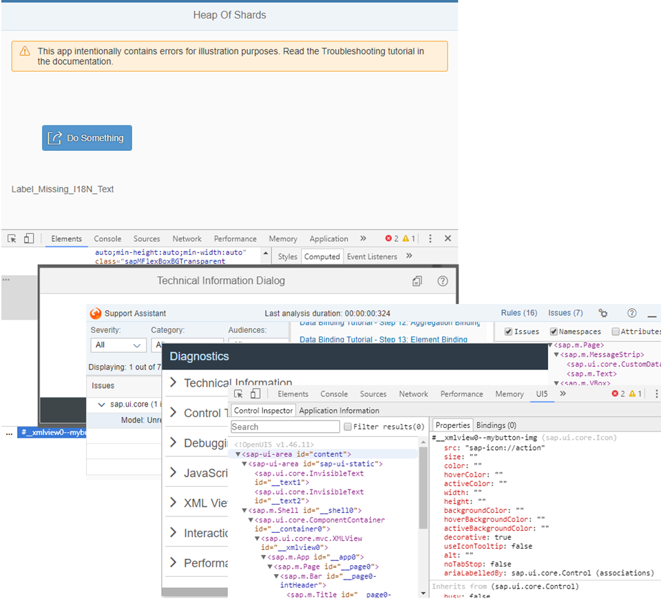

<!-- loio5661952e72df471b932eddc10350c081 -->

# Troubleshooting Tutorial

In this tutorial, we will show you some tools that will help you if you run into problems with your SAPUI5 app.

We will introduce you to the browser developer tools and show you the various tools that SAPUI5 offers.

For example, the SAPUI5 tools can help you with the following tasks:

-   Inspect and debug apps

-   Examine bugs and analyze errors

-   Simulate UI changes

-   Find out how to improve performance

To help you practice using the tools, we created an app with errors that we will use throughout the tutorial. You can view and download the app in the Demo Kitat [Troubleshooting](https://ui5.sap.com/#/entity/sap.ui.core.tutorial.troubleshooting/sample/sap.ui.core.tutorial.troubleshooting.01).

<a name="loio5661952e72df471b932eddc10350c081__section_Troubleshooting_Get_Help"/>

## Get Help

If you're stuck and need help with a development task, you can also post a question in the SAPUI5-related forums, for example in the [SAP Community](https://www.sap.com/community/topic/ui5.html) or on [Stack Overflow](https://stackoverflow.com/search?q=sapui5).

