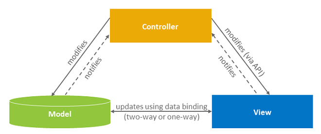

<!-- loio07afcf400eb344c2916e4eb3a400ff7b -->

# Use the MVC Concept

MVC \(Model-View-Controller\) is a concept for structuring your software. Separating the representation of information from the user interaction makes it easier to maintain and to extend your apps.

The MVC concept is used in SAPUI5 to separate the definition of the user interface \(view\), the data used by the application \(model\), and the code for the business logic for processing the data \(controller\). This separation of the representation of information from the user interaction has the following advantages: It provides better readability, maintainability, and extensibility, and it allows you to change the view without touching the underlying business logic, and to define several views of the same data. There are some best practices for each of these parts.

This image is interactive. Hover over each area for a description. Click the highlighted areas for more information.

-   [Models](../04_Essentials/models-e1b6259.md)
-   [Controller](../04_Essentials/controller-121b8e6.md)
-   [Views](../04_Essentials/views-91f27e3.md)

<a name="loio07afcf400eb344c2916e4eb3a400ff7b__section_b4d_djb_1gb"/>

## Data Model: Consider Your Data Source

The model holds the application data and provides methods to retrieve the data, usually from a server, and to set and update data. Depending on which data source you use \(local or remote\), you can choose between different model types to represent it. Among others, SAPUI5 supports OData V4, OData V2 \(both suitable for remote data services\), and JSON models. Make sure to define your model in the [`sap.ui5/models` ](../04_Essentials/manifest-descriptor-for-applications-components-and-libraries-be0cf40.md#loiobe0cf40f61184b358b5faedaec98b2da__section_sap_ui5) section of your app’s `manifest.json`. If you create a new project involving a remote data source, use an OData V4 service with the [OData V4 Model](../04_Essentials/odata-v4-model-5de13cf.md).

-   Learn how: Walkthrough tutorial [Step 25: Remote OData Service](step-25-remote-odata-service-4406244.md)
-   Find out more: [Models](../04_Essentials/models-e1b6259.md)

<a name="loio07afcf400eb344c2916e4eb3a400ff7b__section_y5f_y4b_1gb"/>

## View: Use XML Views

The view is responsible for defining and rendering the UI. SAPUI5 supports various view types \(XML, Typed View\). XML provides the most readable files and forces us to separate the view declaration from the controller logic. Views are composed of controls; the tags in XML views are mapped to individual controls, and the tag attributes are mapped to properties of the control. We strongly recommend that you use XML for your views and fragments. XML clearly separates the view and the application logic, is easy to manipulate and can be parsed by tools like the layout editor in SAP Business Application Studio. That's why we also use XML views in all our tutorials, demo apps, and guides.

Data binding defines how models and views communicate with each other. In a view, you bind data by specifying a binding path for your control. You can use data types and formatters to validate and format the data on the UI.

-   Learn how: Walkthrough Tutorial [Step 4: XML Views](step-4-xml-views-1409791.md)
-   Find out more: [XML View](../04_Essentials/xml-view-91f2928.md)

<a name="loio07afcf400eb344c2916e4eb3a400ff7b__section_ubl_3qb_1gb"/>

## Controller: Keep Your Application Logic Separate

Most of the application's logic resides in the code of controller files, or in separate modules which are called by controller code. Controllers interact with controls, so they usually do not directly work with HTML, although they could do so if something cannot be done using the controls themselves. The controller reacts to view events and to user interaction by modifying the view and model. For example, the handling of a button's `press` event is implemented in the controller of a view.

Every view you create should have its own controller with a corresponding file name. For example: If your view is called `App.view.xml`, then the matching controller should be named `App.controller.js` \(in JavaScript\) or `App.controller.ts` \(in TypeScript\).

There is one special case: The so-called `BaseController` is not directly related to a view. It is quite common that several controllers use the same functions. You can place these shared functions in the `BaseController` from which all other instantiated controllers will inherit. In other words: Every function you place in the `BaseController` is available for all your controllers. This makes your app code definitely easier to maintain, and you save some lines of code.

The controllers are written in JavaScript or TypeScript and should be placed in the `controller` folder. However, not all relevant code belongs in the `controller` folder. Consider formatter logic, for example, which has mainly the function to format data. If you cannot use [Expression Binding](../04_Essentials/expression-binding-daf6852.md) and need a separate formatter, you should rather place it in the `models` folder of your application.

-   Learn how: Walkthrough Tutorial [Step 5: Controllers](step-5-controllers-50579dd.md)
-   Find our more: [Controller](../04_Essentials/controller-121b8e6.md)

**Related Information**  

[Folder Structure: Where to Put Your Files](../05_Developing_Apps/folder-structure-where-to-put-your-files-003f755.md "The details described here represent a best practice for structuring an application that features one component, one OData service and less than 20 views. If you're building an app that has more components, OData services and views, you may have to introduce more folder levels than described here.")

